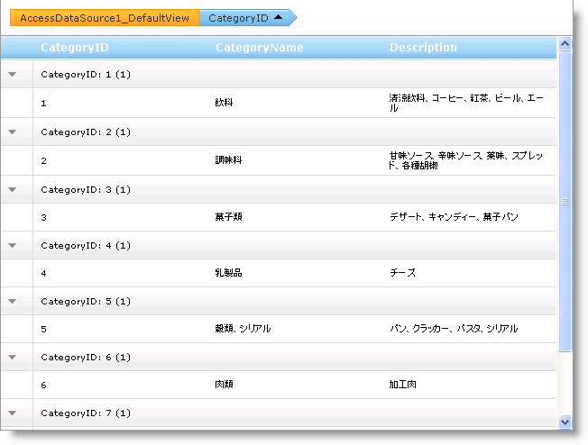

////

|metadata|
{
    "name": "webhierarchicaldatagrid-group-columns-from-code-behind",
    "controlName": ["WebHierarchicalDataGrid"],
    "tags": ["Grids","Grouping"],
    "guid": "{A22B176A-88A2-407A-B6B9-81FA76F79FF6}",  
    "buildFlags": [],
    "createdOn": "0001-01-01T00:00:00Z"
}
|metadata|
////

= コード ビハインドから列をグループ化

WebHierarchicalDataGrid™ で GroupBy 機能を使用すると、エンドユーザーにデータを整理して提示することができます。列を link:{ApiPlatform}web{ApiVersion}~infragistics.web.ui.gridcontrols.groupedcolumns.html[GroupedColumns] コレクションに追加することによって、コードビハインドから列をグループ化できます。

以下のコードは、CategoryName 列でグループ化する方法を示します。

*Visual Basic の場合：*

----
Me.WebHierarchicalDataGrid1.GroupingSettings.EnableColumnGrouping = True
Me.WebHierarchicalDataGrid1.GroupingSettings.GroupedColumns.Add("CategoryID")
----

*C# の場合：*

----
this.WebHierarchicalDataGrid1.GroupingSettings.EnableColumnGrouping = true;
this.WebHierarchicalDataGrid1.GroupingSettings.GroupedColumns.Add("CategoryID");
----

*JavaScript の場合：*

----
var grid = $find("WebHierarchicalDataGrid1");
grid.get_groupingSettings().get_groupedColumns().add("CategoryID");
----

== 関連トピック

link:webhierarchicaldatagrid-about-outlook-groupby.html[Outlook GroupBy について]

link:webhierarchicaldatagrid-custom-group-by-name.html[名前によるカスタム グループ]

link:webhierarchicaldatagrid-custom-text-in-group-row.html[グループ行のカスタム テキスト]

link:webhierarchicaldatagrid-outlook-groupby-with-behaviors.html[動作による Outlook GroupBy]

link:webhierarchicaldatagrid-referencing-rows-when-using-outlook-groupby.html[Outlook GroupBy を使用する時に行を参照]