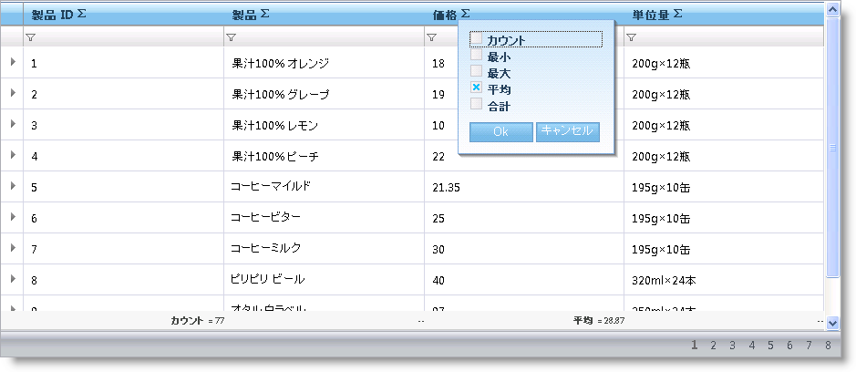

////

|metadata|
{
    "name": "webhierarchicaldatagrid-summary-row",
    "controlName": ["WebHierarchicalDataGrid"],
    "tags": ["Grids","Summaries"],
    "guid": "095a6e5e-c66b-450c-a2f2-92b541b6d87c",  
    "buildFlags": [],
    "createdOn": "2010-09-30T07:07:59.1446544Z"
}
|metadata|
////

= 集計行

WebDataGrid™ の集計行機能は WebHierarchicalDataGrid™ で使用できます。この動作によってカスタム集計だけでなく標準的な集計（Count、Sum、Average、Min、Max）を追加できます。

WebHierarchicalDataGrid 内の各バンドは集計行動作を指定できます。子バンドが設定を継承できるようにバンドの <a href="">EnableInheritance</a> プロパティを設定できます。これにより、データの各バンドで集計動作をカスタマイズできます。たとえば、WebHierarchicalDataGrid のすべてのバンドに対して集計が必要な場合には、ルート レベルで SummaryRow 動作を有効にして、EnableInheritance を True に設定するだけです。特定の子バンドに対して動作を無効にしたい場合には、その特定のバンドの動作を無効にします。

有効の時には、この動作によって集計ボタンが各ヘッダーに追加されます。ボタンが押されると、使用可能な集計を含んだドロップダウンが表示します。

*注：* 標準的な集計が使用できるのは数値データのみです。例外は Count 集計タイプでこれを常に使用できます。

== 集計行を有効にする

WebHierarchicalDataGrid で集計を有効にして、エンド ユーザーが列の集計を追加するために、以下の手順を実行します。

[start=1]
. WebHierarchicalDataGrid を WebHierarchicalDataSource コンポーネントにバインドし、Northwind の Products および Orders テーブルからデータを取得します。実行についての詳細は、「WebHierarchicalDataGrid を WebHierarchicalDataSource にバインド」を参照してください。
[start=2]
. Microsoft® Visual Studio™ プロパティ ウィンドウで、 link:{ApiPlatform}web{ApiVersion}~infragistics.web.ui.gridcontrols.webhierarchicaldatagrid~behaviors.html[Behaviors] プロパティを指定して、省略記号 (...) ボタンをクリックし、[動作エディタ] ダイアログを起動します。
[start=3]
. link:{ApiPlatform}web{ApiVersion}~infragistics.web.ui.gridcontrols.summaryrow.html[Summary Row] 動作をチェックし、Enable および link:{ApiPlatform}web{ApiVersion}~infragistics.web.ui.gridcontrols.summaryrow~enableinheritance.html[EnableInheritance] を True に設定します。
[start=4]
. Products バンド（UnitPrice 列）の平均集計を追加します。

.. link:{ApiPlatform}web{ApiVersion}~infragistics.web.ui.gridcontrols.summaryrow~columnsummaries.html[ColumnSummaries] プロパティを指定して、省略記号 (...) ボタンをクリックし、 link:{ApiPlatform}web{ApiVersion}~infragistics.web.ui.gridcontrols.columnsummaryinfo.html[ColumnSummaryInfo] ダイアログを起動します。
.. [項目の追加] ボタンをクリックすることで列集計を追加します。
.. 集計の link:{ApiPlatform}web{ApiVersion}~infragistics.web.ui.gridcontrols.columnsummaryinfo~columnkey.html[ColumnKey] プロパティを UnitPrice に設定します。
.. link:{ApiPlatform}web{ApiVersion}~infragistics.web.ui.gridcontrols.summaries.html[Summaries] プロパティを指定して、省略記号 (...) ボタンをクリックし、[ link:{ApiPlatform}web{ApiVersion}~infragistics.web.ui.gridcontrols.summary.html[Summary] コレクション エディター] ダイアログを起動します。
.. link:{ApiPlatform}web{ApiVersion}~infragistics.web.ui.gridcontrols.summary~summarytype.html[SummaryType] プロパティを Average に設定します。
.. [適用] を、次に [OK] をクリックして、[Summary コレクション エディター] ダイアログを閉じ、同じ操作を行って ColumnSummaryInfo ダイアログを閉じます。
.. [適用] 、次に [OK] をクリックして、[動作エディター] ダイアログを閉じます。

[start=5]
. 子 Orders バンド（Quantity 列）の Sum 集計を追加します。

.. link:{ApiPlatform}web{ApiVersion}~infragistics.web.ui.gridcontrols.band.html[Band] プロパティを指定し、省略記号ボタン (...) をクリックします。[バンドの編集] ダイアログが表示します。
.. [子を追加] ボタンをクリックして子バンドをルート バンドに追加します。
.. link:{ApiPlatform}web{ApiVersion}~infragistics.web.ui.gridcontrols.band~key.html[Key] を Orders に変更します。
.. link:{ApiPlatform}web{ApiVersion}~infragistics.web.ui.gridcontrols.band~datamember.html[DataMember] を AccessDataSource2_Orders に設定します。
.. link:{ApiPlatform}web{ApiVersion}~infragistics.web.ui.gridcontrols.band~datakeyfields.html[DataKeyFields] を OrderID に設定します。
.. Behaviors プロパティの省略記号ボタン (...) をクリックします。
.. 集計行動作のチェックボックスをチェックします。
.. ColumnSummaries プロパティの省略記号ボタン (...) をクリックします。
.. 以前の手順で行ったように列集計を追加しますが、今回は ColumnKey を Quantity に、SummaryType を Sum に設定します。
[start=10]
.. [OK] をクリックして [動作を編集] ダイアログを閉じます。
[start=11]
.. [適用] 、次に [OK] をクリックして、[動作エディター] ダイアログを閉じます。

以下のコードを使用して上記の手順を実行することも可能です。

*HTML の場合:*

----
<ig:WebHierarchicalDataGrid ID="WebHierarchicalDataGrid1" runat="server" DataSourceID="WebHierarchicalDataSource1"
            Height="400px" Width="750px" DataKeyFields="ProductID">
            <Bands>
                <ig:Band Height="100" DataMember="AccessDataSource1_Orders" DataKeyFields="OrderID">
                    <Behaviors>
                        <ig:SummaryRow>
                            <ColumnSummaries>
                                <ig:ColumnSummaryInfo ColumnKey="Quantity">
                                    <Summaries>
                                        <ig:Summary SummaryType="Sum"></ig:Summary>
                                    </Summaries>
                                </ig:ColumnSummaryInfo>
                            </ColumnSummaries>
                        </ig:SummaryRow>
                    </Behaviors>
                </ig:Band>
            </Bands>
            <Behaviors>
                <ig:SummaryRow EnableInheritance="true">
                    <ColumnSummaries>
                        <ig:ColumnSummaryInfo ColumnKey="UnitPrice">
                            <Summaries>
                                <ig:Summary SummaryType="Average"></ig:Summary>
                            </Summaries>
                        </ig:ColumnSummaryInfo>
                    </ColumnSummaries>
                </ig:SummaryRow>
            </Behaviors>
        </ig:WebHierarchicalDataGrid>
----

*C# の場合：*

----
protected void WebHierarchicalDataGrid1_InitializeBand(object sender, BandEventArgs e)
{
    if (e.Band.Key == "Products")
    {
        e.Band.Behaviors.CreateBehavior();
        e.Band.Behaviors.SummaryRow.EnableInheritance = true;
        ColumnSummaryInfo unitPriceSummary = new ColumnSummaryInfo();
        unitPriceSummary.ColumnKey = "UnitPrice";
        unitPriceSummary.Summaries.Add(SummaryType.Average);
        e.Band.Behaviors.SummaryRow.ColumnSummaries.Add(unitPriceSummary);
        this.WebHierarchicalDataGrid1.RefreshBehaviors();
    }
    else if (e.Band.Key == "Orders")
    {
        e.Band.Behaviors.CreateBehavior();
        e.Band.Behaviors.SummaryRow.EnableInheritance = true;
        ColumnSummaryInfo quantitySummary = new ColumnSummaryInfo();
        quantitySummary.ColumnKey = "Quantity";
        quantitySummary.Summaries.Add(SummaryType.Sum);
        quantitySummary.Summaries.Add(SummaryType.Max);
        e.Band.Behaviors.SummaryRow.ColumnSummaries.Add(quantitySummary);
        this.WebHierarchicalDataGrid1.RefreshBehaviors();
    }
}
----

[start=6]
. アプリケーションを実行します。WebHierarchicalDataGrid は UnitPrice 列の Average 集計と、子バンドの Quantity 列の Sum 集計を表示します。列のヘッダーの集計ボタンをクリックし、ドロップダウン オプションから集計タイプを選択することによって追加集計を追加できます。

== 関連トピック

link:webdatagrid-adding-custom-summary.html[カスタム集計の追加]

link:webdatagrid-summary-settings.html[集計の設定]

link:webdatagrid-compact-rendering.html[コンパクトな描画]