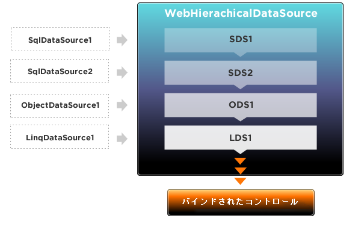

////

|metadata|
{
    "name": "webhierarchicaldatasource-about-webhierarchicaldatasource",
    "controlName": ["WebHierarchicalDataSource"],
    "tags": ["Data Presentation","Getting Started","Sample Data Source"],
    "guid": "{CCAD9E90-C8A2-4A4C-8DDC-F8CD8AD2423C}",  
    "buildFlags": [],
    "createdOn": "0001-01-01T00:00:00Z"
}
|metadata|
////

= WebHierarchicalDataSource について

WebHierarchicalDataSource™ コンポーネントは、データ バインドされたコントロールと標準的な Microsoft® データ ソース コントロールなどのデータ ソース間の仲介です。WebHierarchicalDataSource を使用して、データ バインドされたコントロールが関係する限り表示されるデータ ソースがひとつだけであるように、データ ソース コントロールを結合し、一緒にリンクすることができます。

WebHierarchicalDataSource を使用して、IHierarchicalDataSource インタフェースを実装しないデータ ソースからデータの階層ビューを表示できます。

使用されるデータ ソースは、データ関係を使用して一緒にリンクできます。WebHierarchicalDataSource は以下の関係をサポートします:

* ひとつの親対ひとつの子
* ひとつの親対 N の子
* 複合キー
* 自己関係

WebHierarchicalDataSource は複数のオブジェクト型をサポートします。自動作成, 読み込み, 更新, および削除 (CRUD) 操作もデータ ソース型に基づいてサポートされます。以下の表は、サポートされるデータ ソースを表示し、特定のデータ操作のサポート状態を表示します。サポートの状態:

* はい - 自動サポート。
* 構成 - サポートするには、データ ソースを構成する必要があります。
* 実装 - サポートするには、データ ソースがインターフェイスを実装する必要があります。

[options="header", cols="a,a,a"]
|====
|オブジェクト タイプ|サポートされるかどうか|自動 CRUD

|SqlDataSource
|はい
|構成

|LinqDataSource
|はい
|構成

|ObjectDataSource
|はい
|構成

|XmlDataSource
|いいえ
|いいえ

|AccessDataSource
|はい
|構成

|SitemapDataSource
|いいえ
|いいえ

|DataSet
|はい
|いいえ

|IEnumerable
|はい
|いいえ

|ICollection
|はい
|いいえ

|====