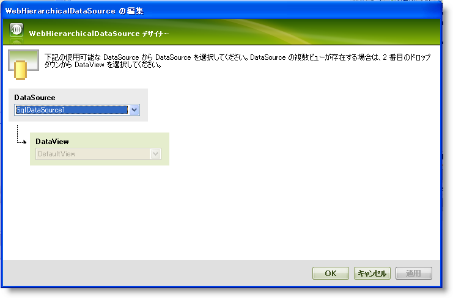
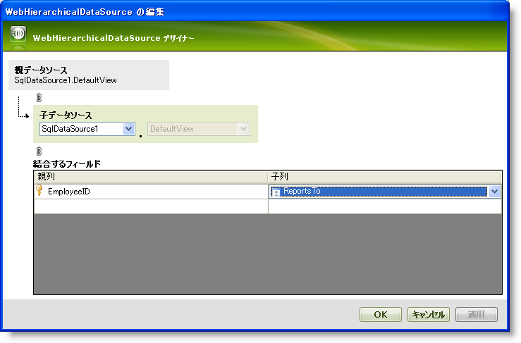
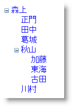

////

|metadata|
{
    "name": "webhierarchicaldatasource-creating-a-self-related-data-relation",
    "controlName": ["WebHierarchicalDataSource"],
    "tags": ["Data Presentation","Sample Data Source"],
    "guid": "{7C43A2CC-003D-40FE-99A5-1357E73F10A9}",  
    "buildFlags": [],
    "createdOn": "0001-01-01T00:00:00Z"
}
|metadata|
////

= 自己関係的なデータ関係の作成

== 始める前に

WebHierarchicalDataSource™ を使用して自己関係的なデータ モデルを表すことができます。データ エンティティが相互に関係するフィールドを含む場合、WebHierarchicalDataSource を使用して階層ビューとして自己関係的なデータ モデルを表示できます。

たとえば、Northwind データベースの Employees テーブルには従業員が直属する従業員 ID を指定する ReportTo フィールドが含まれています。WebHierarchicalDataSource を使用して自己関係的な関係を定義することにより、従業員の序列の階層を表示できます。

*注:* 自己関係的なデータ関係を作成する時、関係が無限に反復しないことを確認してください。無限に反復するとデータは表示されません。

== 達成すること

従業員が誰に直属するのかを示すために階層で Employees テーブルを表示します。WebHierarchicalDataSource コンポーネントを使用して自己関係的なデータ関係を使用してこれを実行します。データの階層は TreeView コントロールで表示されます。

== 以下の手順を実行します。

[start=1]
. ASP.NET Web ページを作成します。
[start=2]
. ScriptManager コンポーネントをフォームにドラッグします。
[start=3]
. TreeView コントロールをフォームにドラッグします。
[start=4]
. WebHierarchicalDataSource コンポーネントをフォームにドラッグします。
[start=5]
. SqlDataSource コンポーネントをフォームにドラッグします。
[start=6]
. Northwind データベースの Employees テーブルに接続するように SqlDataSource コンポーネントを構成します。EmployeeID、LastName、および ReportTo フィールドを取得します。
[start=7]
. WebHierarchicalDataSource のクイック デザイナーで、[ビューの追加] をクリックします。
[start=8]
. SqlDataSource1 をデータ ソースとして選択します。

[start=9]
. [OK] をクリックします。
[start=10]
. [子の追加] をクリックして子データを追加します。
[start=11]
. 同じデータ ソース、SqlDataSource1 を子データ ソースとして選択します。
[start=12]
. Specify Fields to Join セクションで、EmployeeID フィールドを親列のままにしておき、ReportsTo フィールドを子列として選択します。

[start=13]
. [OK] をクリックします。クイック デザインのメイン画面に戻ります。
[start=14]
. [適用]、そして [OK] をクリックします。WebHierarchicalDataSource は、SQL データを階層表示するように構成されています。
[start=15]
. TreeView コントロールのスマート タグをクリックします。

.. データ ソースに WebHierarchicalDataSource を選択します。
.. [TreeNode Databindings の編集] リンクをクリックします。TreeView DataBindings エディターが表示します。
.. [使用可能なデータ バインド] のセクションで SqlDataSource1_DefaultView を選択し、[追加] をクリックします。
.. [プロパティ] ウィンドウで、SqlDataSource1_DefaultView が DataMember になっており、TextField プロパティが LastName に設定されていることを確認します。
.. [適用]、そして [OK] をクリックします。

[start=16]
. アプリケーションを実行します。誰に直属しているのかの序列に従ってネストされる従業員名を表示する階層ツリー表示を確認します。

== 関連トピック

link:webhierarchicaldatasource-add-a-parent-to-multiple-child-relationship.html[単一の親対複数の子の関係を追加]

link:webhierarchicaldatasource-add-a-composite-key-relationship.html[複合キーの関係を追加]

link:webhierarchicaldatasource-add-a-single-parent-to-single-child-relationship.html[単一の親対単一の子の関係を追加]