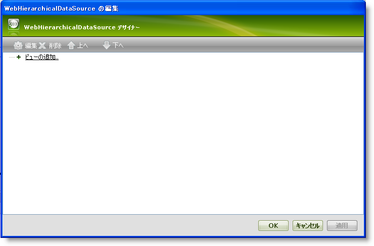
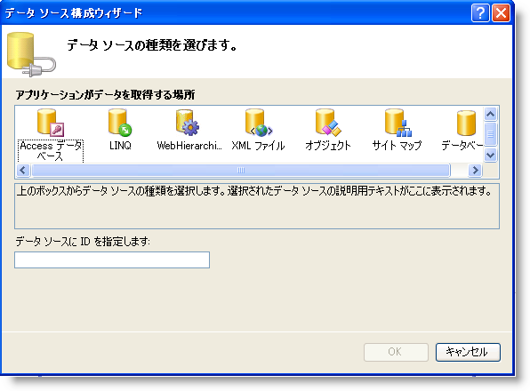
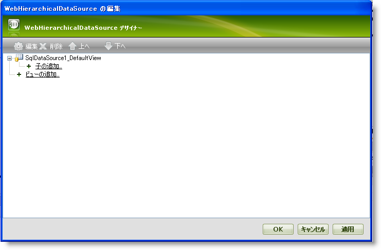
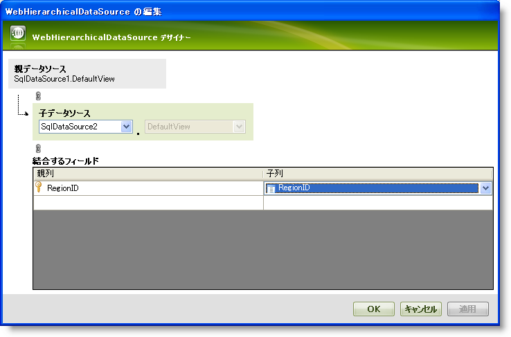

////

|metadata|
{
    "name": "webhierarchicaldatasource-getting-started-with-webhierarchicaldatasource",
    "controlName": ["WebHierarchicalDataSource"],
    "tags": [],
    "guid": "{058F5265-7714-49E5-B2C8-0794351F448A}",  
    "buildFlags": [],
    "createdOn": "2008-05-05T10:23:54Z"
}
|metadata|
////

= WebHierarchicalDataSource を使用した作業の開始

== 始める前に

WebHierarchicalDataSource™ コンポーネントによって、WebHierarchicalDataGrid™ などのデータ バインドされたコントロールのデータ ソースとして様々なデータ ソースを使用できます。WebHierarchicalDataSource にデータ関係を追加できます。これは階層データを表示または異なるデータ ソースを結合するための強力で柔軟な技法です。

== 達成すること

WebHierarchicalDataSource コンポーネントと 2 つの SQL データ ソースを使用して、WebHierarchicalDataGrid で階層ビューを表示する方法を学習します。

== 以下の手順を実行します。

[start=1]
. ASP.NET Web ページを作成します。
[start=2]
. ツールボックスからページに ScriptManager コンポーネントをドラッグします。
[start=3]
. ツールボックスからページに WebHierarchicalDataGrid コントロールをドラッグします。
[start=4]
. ツールボックスからページに WebHierarchicalDataSource コンポーネントをドラッグします。
[start=5]
. WebHierarchicalDataSource のスマート タグをクリックして「DataSource の構成」を選択します。クイック デザインが表示します。

[start=6]
. [ビューの追加] オプションをクリックします。
[start=7]
. 表示するドロップダウン リストから [新しいデータ ソース] を選択します。

*注:* この時点でページにおいてデータ ソースがすぐに使用可能になっている場合には、これらのデータ ソースはドロップダウン リストに表示されます。データ ソースに複数のビューがある場合には、DataView ドロップダウン リストで選択可能です。

[データ ソース構成] ウィザードが表示します。

[start=8]
. [データベース] を選択します。
[start=9]
. [OK] をクリックします。
[start=10]
. WebHierarchicalDataSource は SqlDataSource コンポーネントをフォームに追加すると、[データソースの構成] ウィザードが SqlDataSource コンポーネントのために表示します。
[start=11]
. データソースを構成して、すべての列が Northwind データベースから選択されて Regions テーブルを取得します。
[start=12]
. [OK] をクリックして、クイック デザインに戻ります。追加したばかりの SqlDataSource を確認します。

[start=13]
. SqlDataSource1 ノードの真下にある Add Child ノードをクリックします。子の構成画面が表示します。

*注:* 追加されたデータ ソースと同じレベルにある Add View リンクをクリックすることによって、この時点で既存のデータ ソースの兄弟ノードを追加することも可能です。

[start=14]
. [子データ ソース] ドロップダウン リストで [新しいデータ ソース] を選択します。

*注:* この時点で、最初のデータ ソースを選択して自己関係的なビューを作成することもできます。詳細は、 link:webhierarchicaldatasource-creating-a-self-related-data-relation.html[自己関係的なデータ関係の作成]を参照してください。

[start=15]
. 二番目の SqlDataSource で手順 8-12 を繰り返しますが、今回はすべての列を選択して Territory テーブルを選択します。
[start=16]
. 関係のための列を選択することによって、2 つのデータ ソースの間の関係を追加します。

.. [親列] ドロップダウン リストで [RegionID] を選択します。
.. [子列] ドロップダウン リストで [RegionID] を選択します。

*注:* 複合キーに基づいて追加の列を選択することによって、テーブルを関連付けることができます。詳細は、 link:webhierarchicaldatasource-add-a-composite-key-relationship.html[複合キーの関係を追加]を参照してください。

* [OK] をクリックして、クイック デザイン ビューに戻ります。
* この時点で、WebHierarchicalDataSource は 2 つの SQL データ ソースを使用して階層データを表示する準備ができました。[適用]、そして [OK] をクリックします。
* WebHierarchicalDataGrid のプロパティ ウィンドウで、DataSourceId を WebHierarchicalDataSource の ID に設定します。
* アプリケーションを実行します。WebHierarchicalDataGrid は 各 Region の関連する Territory データと共に Region データの階層ビューを表示します。 