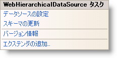

////

|metadata|
{
    "name": "webhierarchicaldatasource-webhierarchicaldatasource-smart-tag",
    "controlName": ["WebHierarchicalDataSource"],
    "tags": [],
    "guid": "{081407C0-445E-4BF7-B490-873C163175C9}",  
    "buildFlags": [],
    "createdOn": "2008-02-05T14:30:19Z"
}
|metadata|
////

= WebHierarchicalDataSource スマート タグ

Visual Studio 2005/2008（.NET Framework 2.0/3.5）では、{ProductName} の個々のコントロール/コンポーネントにはスマート タグがあります。コントロールやコンポーネントを選択するだけで、スマート タグのアンカーが表示されます。このアンカーをクリックするとポップアップ パネルが表示され、そこからコントロール/コンポーネントの最もよく使うプロパティや設定にすばやく簡単にアクセスできます。

WebHierarchicalDataSource™ のスマート タグには次のリンクがあります。

* データ ソースの構成 - データ ソース構成ウィザードへのリンクによって、WebHierarchicalDataSource にバインドするようにデータ ソースを構成できます。
* スキーマの更新 - これをクリックして WebHierarchicalDataSource を更新すれば、データ ソースまたはスキーマへの変更はデザイナーに表示されます。
* バージョン情報 - コンポーネントについての情報を表示します。
* エクステンダーを追加 - これをクリックすると、WebHierarchicalDataSource と使用可能なすべてのコントロール エクステンダーを表示するダイアログを表示します。コントロール エクステンダーは、ページに既に宣言されている既存のコントロールに追加機能（通常は AJAX または JavaScript のサポート）を追加するために使用でき、UI behavior をカプセル化したり、より豊かな機能をアプリケーションに簡単に追加することもできます。

|====
|====