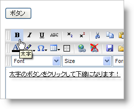

////

|metadata|
{
    "name": "webhtmleditor-change-the-default-action-of-a-button",
    "controlName": ["WebHtmlEditor"],
    "tags": ["Editing"],
    "guid": "{FD2B9316-8F8E-402E-BDFA-C374745E72ED}",  
    "buildFlags": [],
    "createdOn": "2007-10-09T14:28:23Z"
}
|metadata|
////

= ボタンのデフォルトのアクションを変更

WebHtmlEditor™ の  pick:[asp-net="link:{ApiPlatform}webui.webhtmleditor{ApiVersion}~infragistics.webui.webhtmleditor.clientsideevents~beforeaction.html[BeforeAction]"]  クライアント側イベントには、"act" パラメータが含まれており、このパラメータによって、エンド ユーザーのアクションに関連して WebHtmlEditor が実行しようとするアクションを取得または設定できます。デフォルトのアクションを無効にする、またはアクションを変更したい場合にこれは役に立ちます。

以下の JavaScript はエンド ユーザーが [太字] ボタンをクリックするときに下線を付けるデフォルトの太字アクションを変更します。

*JavaScript の場合*

----
function WebHtmlEditor1_BeforeAction
    (oEditor, actID, oEvent, p4, p5, p6, p7, p8, act){
	// 実行されようとするアクションが bold の場合...
	if(act == "bold")
	{
	    // ...下線を付けるイベントのアクションを変更します。
	    // ボタンを無効にするには、‘underline’ を ‘none’ に
	    // 変更します。
	    oEvent.act = "underline";
	}
}
----