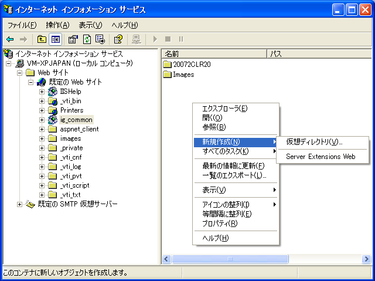
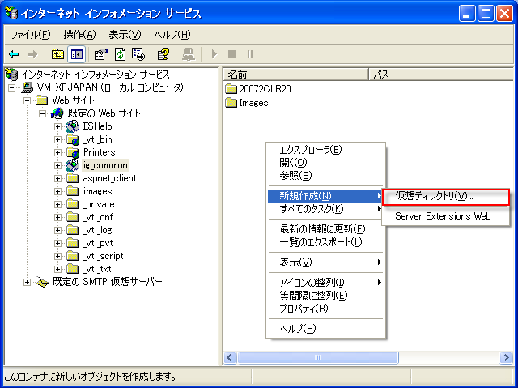
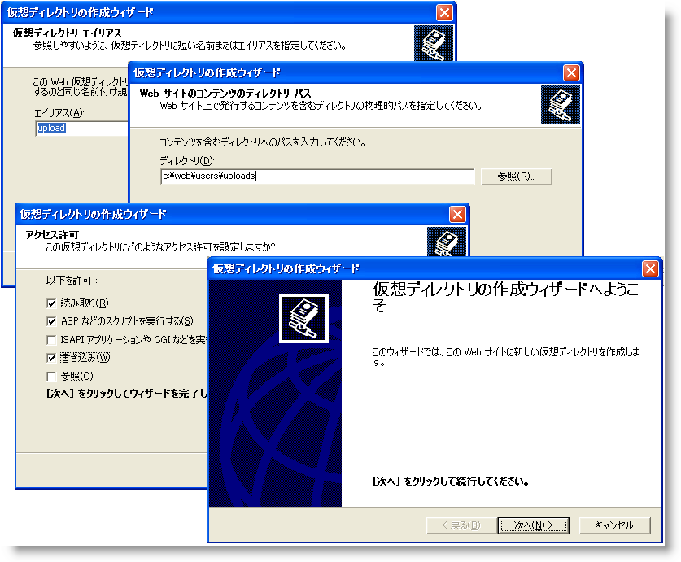

////

|metadata|
{
    "name": "webhtmleditor-configuring-the-upload-area-in-iis",
    "controlName": ["WebHtmlEditor"],
    "tags": ["Editing"],
    "guid": "{C4C2949C-6559-4AD4-A2BA-27E757F9A87C}",  
    "buildFlags": [],
    "createdOn": "2006-11-01T00:00:00Z"
}
|metadata|
////

= IIS のアップロード領域の構成

WebHtmlEditor コントロールでは、ユーザーがデスクトップからファイル（画像ファイル、ストリーミング メディア ファイルなど）を Web サーバーにアップロードし、それを編集中のドキュメントにリンクするための強力な機能を備えています。このトピックでは、Microsoft® Internet Information Services（IIS）を使用して Web サーバーを、アップロード機能を持った WebHtmlEditor アプリケーションを展開するために必要な構成手順について説明します。この手順を完了すると、エンド ユーザーは Web サーバーのストレージにファイルをアップロードし、WebHtmlEditor の画像とメディアを添付する機能を活用できます。

*注：* WebHtmlEditor アプリケーションで [画像の挿入]、[フラッシュの挿入]、および [Windows メディアの挿入] ボタンを使用する場合は、アップロード領域を添付ファイルを受け取れるように適切に構成する必要があります。この領域が正しく構成されていないと、ユーザーがファイルを Web サーバーにアップロードしようとしてこれらのボタンを使用すると、エラーが発生します。アプリケーションが添付ファイルを求めない場合、 link:webhtmleditor-remove-toolbar-buttons-of-webhtmleditor.html[「ツールバーボタンの削除」]で説明しているように、これらのボタンを削除できます。

上記の手順を開始する前に、基本的な Web サイト管理タスクを習得してください。以下で説明するタスクの中には、IIS を管理し、NTFS ファイルとフォルダのセキュリティ権限を調整するための管理者権限を必要とするものがあります（または、Web サイト管理者の協力を仰いでください）。

[start=1]
. IIS Microsoft Management Console（MMC）のスナップインを起動します（[スタート] メニュー、[コントロール パネル]、[管理ツール]、[Internet Information Services] をクリックします）。
[start=2]
. 自分の Web サイトに行き 'ig_common' フォルダを探します。これは、通常 {ProductName} とともにインストールされる仮想ディレクトリの名前で、ここには JavaScript ファイルや画像ファイルなどの共通リソースファイルが格納されています。アップロードしたファイルは、仮想ディレクトリにも、そのサブフォルダにも格納できます。

== アップロード ファイルのサブフォルダへの格納

デフォルトでは、 pick:[asp-net="link:{ApiPlatform}webui.webhtmleditor{ApiVersion}~infragistics.webui.webhtmleditor.webhtmleditor~uploadedfilesdirectory.html[UploadedFilesDirectory]"]  プロパティは、すべてのアップロード ファイルは、"upload" という名前の "ig_common" サブフォルダに格納されることを想定します。アップロード ファイルのディレクトリを 'ig_common' 仮想ディレクトリの下に置くためには、IIS を使用して 'ig_common' の下に物理フォルダを作成する必要があります。UploadedFilesDirectory プロパティは Web アプリケーションごとに設定を変えることができるので、すべての Web アプリケーションでこの物理フォルダをアップロードのために共有する必要はありません。

"ig_common" フォルダを右クリックして "Explore" を選択します。通常は、右側のペインに仮想ディレクトリの下に IIS のサブフォルダ管理ビューが表示されますが、このビューでは仮想ディレクトリしか追加することができません。"Explore" を使用して右ペインに標準の Windows Explorer シェルを開きます。このペインで [新規 － フォルダ] をクリックして選択すると、'ig_common'（またはその他の希望する仮想ディレクトリ）の下に物理フォルダを作成できます。

新しいフォルダに "upload" という名前を付け、UploadedFilesDirectory プロパティの設定が "/ig_common/upload" のまま変わっていないことを確認します。これでアップロードされたファイルを受け取ることができます。

== アップロード ファイルの仮想ディレクトリへの格納

アップロードされたファイルを仮想ディレクトリ（"ig_common"、または Web アプリケーションをホストする仮想ディレクトリ）の下のサブフォルダ以外の場所に格納したいのであれば、新しい仮想ディレクトリを作成する必要があります（"ig_common" サブフォルダを右クリックして、[新規] をポイントし、[仮想ディレクトリ] をクリックします）。次に、IIS でこの仮想ディレクトリをアップロード ファイルを格納する物理フォルダに関連付けるように指定します。

*注：* [仮想ディレクトリ作成] ウィザードの [アクセス権限] ページにはキーポイントがあります。IIS では、デフォルトで仮想ディレクトリの「読み取り」と「スクリプトの実行」権限しか与えられません。ユーザーがアップロードファイルを、ウィザードの前のページで指定した Web Site Content ディレクトリ（物理フォルダ パス）に書き込めるようにするには、[書き込み] チェックボックスを選択する必要があります。

[start=3]
. （推奨事項） いずれの場合でも、アップロード ファイルを格納する物理サブフォルダに NTFS セキュリティ権限を設定して、アップロード ディレクトリのセキュリティを強化することができます。ASP.NET の ID およびセキュリティ サイトでロックダウンする Windows ユーザー アカウントを決定するための偽装の使用については、.NET Framework のマニュアルを参照してください。

これでアップロード領域を WebHtmlEditor と Web アプリケーションのユーザーのために構成する準備ができました。"/ig_common/upload" 以外のアップロード ファイル パスを使用する方法については、 link:webhtmleditor-set-where-upload-files-are-stored.html[アップロード ファイル格納位置の設定]に WebHtmlEditor をそのパスを認識するように構成する方法が手順を追って説明されています。