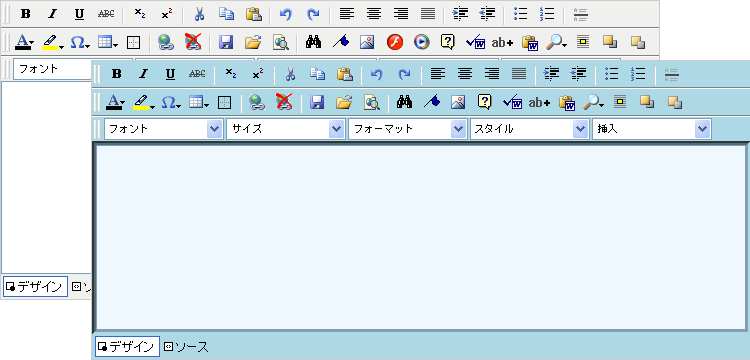

////

|metadata|
{
    "name": "webhtmleditor-creating-custom-skins-for-webhtmleditor",
    "controlName": ["WebHtmlEditor"],
    "tags": ["Editing","Styling","Templating"],
    "guid": "{102E2494-EB9E-431B-90BC-B0E99A7F932F}",  
    "buildFlags": [],
    "createdOn": "2006-10-01T00:00:00Z"
}
|metadata|
////

= WebHtmlEditor のカスタム スキンの作成

このトピックでは、プログラミングにより WebHtmlEditor コントロールのスキン設定を行う方法について説明します。まず、WebHtmlEditor に適用する外見に一貫性のあるスタイルを想像します。次に、WebHtmlEditor コントロールに対して、ページに対する最初の要求があったときにコードビハインド ファイルを介して必要な設定を行うためのコードを書きます。次に、スキン情報を、あとで使用できるように  pick:[asp-net="link:{ApiPlatform}webui.webhtmleditor{ApiVersion}~infragistics.webui.webhtmleditor.webhtmleditor~saveskin.html[SaveSkin]"]  メソッドを使用して XML ファイルとして格納します。このトピックでの説明は、以下のスクリーンショットに示したような、アクア色のモチーフのスキン ファイルを WebHtmlEditor に作成することを目的としています。ただし、色のスキームは自由に変更してかまいません。

作業を開始する前に、ヘルプトピック link:webhtmleditor-layout-of-webhtmleditor.html[WebHtmlEditor のレイアウト]に説明されているような WebHtmlEditor のさまざまな部分について概要を理解してください。 また、BackgroundImage プロパティや Font プロパティなどの、Infragistics Web 要素のスタイルを設定するためのさまざまなプロパティについても理解してください。

[start=1]
. 

コードの記述を開始する前にコード ビハインドに using/imports のディレクティブを配置します。そうすれば、メンバは完全に記述された名前を常に入力する必要がなくなります。

*Visual Basic の場合：*

----
Imports Infragistics.WebUI.WebHtmlEditor
----

*C# の場合：*

----
using Infragistics.WebUI.WebHtmlEditor;
----

[start=2]
. WebHtmlEditor コントロールで実際のデザインを開始する前に、コントロールの各部分に割り当てる色やスタイルを計画することをお勧めします。イメージが決まったら、Microsoft® Visual Studio® .NET でカラーパレットを開きます。[書式] メニューで、[ビルド スタイル] をポイントし、[背景] をクリックします。次にいずれかの色プロパティの近くの省略ボタンをクリックします。このダイアログ ボックスでは、多くの場合 [名前付きカラー] タブを使用すると操作が容易です。

パレットから、テーマの基本色を作るための 2 つの補色を選択します。このトピックでは、アクアまたはマリーンの外観と操作機能を作成することを目標としているので、ここでは [Aqua] と [Blue] を選択します。この 2 つの色の名前をメモ帳に並べて記入します。

次に、選択した基本色に近い色を何色か選びます。これらの色は、WebHtmlEditor で使われている多くの端部に基本色よりも少し薄い、または濃い色を付けるためです。[Aqua] に対しては、[LightCyan]、[LightBlue]、および [DarkCyan] を選択します。 [Blue] に対しては、[Navy]、[MidnightBlue]、および [AliceBlue] を選択します。必要な色を選び終えたら、メモ帳に次の表ができあがります。

[cols="a,a,a,a"]
|====
|アクア
|青

|DarkCyan
|Navy

|LightBlue
|MidnightBlue

|LightCyan
|AliceBlue

|====

[start=3]
. 

このカラーパレットから色を背景、境界、および WebHtmlEditor の制御領域でのマウス効果に割り当てます。まず、エディタ表面の背景色から始めます。これは最も多くエンド ユーザーの目に入る色ですが、あまり目立たないように落ち着いた色にしたほうがよいでしょう。目標はマリーン調のスキームなので、[地の色] プロパティに [LightBlue] を選択します。パレットにある色は、すべてこの薄い青のシェードを付けるとくっきりと映える色ばかりです。

*注：* プロパティの設定は [プロパティ] ウィンドウでも行えますが、このトピックでは自分が使い慣れている .NET プログラミング言語を使用してコードビハインドを使ってプロパティへの割り当てを行います。

*Visual Basic の場合：*

----
' さまざまなスタイルの背景と境界線を
' 青緑色と青の異なるシェードに設定します。
Me.WebHtmlEditor1.BackColor = Color.LightBlue
' WebHtmlEditor でデフォルトのスタイルを使用しないように設定します。
Me.WebHtmlEditor1.UseDefaultStyles = UseDefaultStyles.None
----

*C# の場合：*

----
// さまざまなスタイルの背景と境界線を
// 青緑色と青の異なるシェードに設定します。
this.WebHtmlEditor1.BackColor = Color.LightBlue;
// WebHtmlEditor でデフォルトのスタイルを使用しないように設定します。
this.WebHtmlEditor1.UseDefaultStyles = UseDefaultStyles.None;
----

[start=4]
. 

ボタンの外観を WebHtmlEditor コントロールの全体的なカラースキームに合うようにスタイル設定すると、エンド ユーザーにすっきりした印象を与えるアプリケーションとなります。エンド ユーザーがマウスをツールバーボタンの上に置いたときに WebHtmlEditor がハイライト効果を出すように、水色のような明るいシェードを決めます。エンド ユーザーがボタンを押したときには、ボタンに DarkCyan のような暗いシェードが付くようにします。同様に、境界線の補色とスタイルを割り当てます。[浮き出し] と [くぼみ] の境界線のスタイルがボタンが上がっている状態と押された状態でどのような効果を見せるかを確認します。

*Visual Basic の場合：*

----
' ツールバーボタンのスタイルをハイライトに設定します。
Me.WebHtmlEditor1.ButtonStyle.MouseOverBorderColor = Color.LightCyan
Me.WebHtmlEditor1.ButtonStyle.MouseOverBackColor = Color.Aqua
Me.WebHtmlEditor1.ButtonStyle.MouseOverBorderStyle = BorderStyle.Outset
' ... ボタンのスタイルを押された状態に設定します。
Me.WebHtmlEditor1.ButtonStyle.MouseDownBorderColor = Color.MidnightBlue
Me.WebHtmlEditor1.ButtonStyle.MouseDownBackColor = Color.DarkCyan
Me.WebHtmlEditor1.ButtonStyle.MouseDownBorderStyle = BorderStyle.Inset
----

*C# の場合：*

----
// ツールバー ボタンのスタイルをハイライトに設定します。
this.WebHtmlEditor1.ButtonStyle.MouseOverBorderColor = Color.LightCyan;
this.WebHtmlEditor1.ButtonStyle.MouseOverBackColor = Color.Aqua;
this.WebHtmlEditor1.ButtonStyle.MouseOverBorderStyle = BorderStyle.Outset;
// ... ボタンのスタイルを押された状態に設定します。		
this.WebHtmlEditor1.ButtonStyle.MouseDownBorderColor = Color.MidnightBlue;
this.WebHtmlEditor1.ButtonStyle.MouseDownBackColor = Color.DarkCyan;
this.WebHtmlEditor1.ButtonStyle.MouseDownBorderStyle = BorderStyle.Inset;
----

[start=5]
. 

ドロップダウン メニューを表示したり、ダイアログ ボックスをポップアップさせたりする、エンド ユーザーがアプリケーションと対話を行うための UI も重要な要素です。ボタンのマウス効果と同じように、WebHtmlEditor のこれらのテキスト要素に割り当てる色とスタイルにも整合性を持たせることが重要です。以下のコーディングは、ドロップダウン メニューとダイアログ ボックスに共通の薄い青の背景色を割り当てます。ダイアログ ボックスのタイトルバーの背景色に暗い色を配したので、前面のテキストにはそれに合う明るい色を割り当てる必要があります（テキストのデフォルトの色は、多くの場合は黒です）。

*Visual Basic の場合：*

----
' ダイアログのスタイルを設定します。
Me.WebHtmlEditor1.DialogStyle.BackColor = Color.LightBlue
Me.WebHtmlEditor1.DialogStyle.TitlebarBackColor = Color.MidnightBlue
Me.WebHtmlEditor1.DialogStyle.ForeColor = Color.White
' ドロップダウン メニューのスタイルを設定します。
Me.WebHtmlEditor1.MenuStyle.BackColor = Color.LightBlue
Me.WebHtmlEditor1.MenuStyle.ImageColumnColor = Color.DarkCyan
----

*C# の場合：*

----
// ダイアログのスタイルを設定します。
this.WebHtmlEditor1.DialogStyle.BackColor = Color.LightBlue;
this.WebHtmlEditor1.DialogStyle.TitlebarBackColor = Color.MidnightBlue;
this.WebHtmlEditor1.DialogStyle.ForeColor = Color.White;
// ドロップダウン メニューのスタイルを設定します。
this.WebHtmlEditor1.MenuStyle.BackColor = Color.LightBlue;
this.WebHtmlEditor1.MenuStyle.ImageColumnColor = Color.DarkCyan;
----

[start=6]
. WebHtmlEditor の残った部分のテキスト ウィンドウとタブ ストリップは、ツールバーやその他の UI 要素と整合性のあるスタイルをスキンに設定する必要があります。以下のコードは、テキスト ウィンドウの境界線に [LightBlue]、編集クライアント領域に淡い [AliceBlue] を割り当てます。また、タブ ストリップの背景に [LightBlue] を、ツールバー ボタンをマウスが通過したときに表示される色に似た（ただしそれほど明るくない）[LightCyan] をハイライト色として割り当てています。

*Visual Basic の場合：*

----
' テキスト ウィンドウのスタイルを設定します。
Me.WebHtmlEditor1.TextWindow.BackColor = Color.AliceBlue
Me.WebHtmlEditor1.TextWindow.BorderStyle = BorderStyle.Inset
Me.WebHtmlEditor1.TextWindow.BorderColor = Color.LightBlue
' タブ ストリップのスタイルを設定します。
Me.WebHtmlEditor1.TabStrip.BackColor = Color.LightBlue
Me.WebHtmlEditor1.TabStrip.HighlightBackColor = Color.LightCyan
----

*C# の場合：*

----
// テキスト ウィンドウのスタイルを設定します。
this.WebHtmlEditor1.TextWindow.BackColor = Color.AliceBlue;
this.WebHtmlEditor1.TextWindow.BorderStyle = BorderStyle.Inset;
this.WebHtmlEditor1.TextWindow.BorderColor = Color.LightBlue;
// タブ ストリップのスタイルを設定します。
this.WebHtmlEditor1.TabStrip.BackColor = Color.LightBlue;
this.WebHtmlEditor1.TabStrip.HighlightBackColor = Color.LightCyan;
----

[start=7]
. 

計画に従って WebHtmlEditor のスタイルをすべて設定したら、XML のスキン ファイルに保存します。以下に示すように、SaveSkin メソッドを使って、Web アプリケーションの "skins" というサブフォルダに格納します。

*Visual Basic の場合：*

----
' カスタム スキンを "Aqua.xml" というファイル名で保存します。
Me.WebHtmlEditor1.SaveSkin(Server.MapPath("./skins"),"Aqua")
----

*C# の場合：*

----
// カスタム スキンを "Aqua.xml" というファイル名で保存します。
this.WebHtmlEditor1.SaveSkin(Server.MapPath("./skins"),"Aqua");
----

*注：* Web サーバー上にファイルを保存するときには、ASP.NET プロセスが実行される Windows ID に、そのファイルを作成する書き込み権限が与えられていることを確認する必要があります（このIDは、通常は ASPNET または Network Service という名前が付けられます）。この権限がないと、SaveSkin メソッドを呼び出したときにアクセス権限がないという例外が発行されます。

このトピックでは、カスタム スキンをデザイン、作成、そして保存する方法を説明しました。あとは、Web アプリケーションに見栄えのするスキンを作成する練習をしてください。スキンをランタイムに自動的に適用する方法については、 link:webhtmleditor-load-a-custom-skin.html[カスタム スキンのロード]をお読みください。