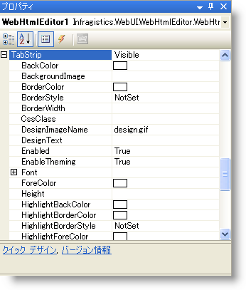

////

|metadata|
{
    "name": "webhtmleditor-customize-the-tab-strip-of-webhtmleditor",
    "controlName": ["WebHtmlEditor"],
    "tags": ["Editing"],
    "guid": "{BBF4F4FC-9135-4731-BB64-1927E953EC9C}",  
    "buildFlags": [],
    "createdOn": "2006-04-01T00:00:00Z"
}
|metadata|
////

= WebHtmlEditor のタブ ストリップのカスタマイズ

WebHtmlEditor では、タブ ストリップ領域のラベル テキストやそのアイコンなどをアプリケーションでカスタマイズするためのプロパティを提供しています。以下では、デザインタイム環境で HTML ビュー タブに表示されるラベルを "Source" に設定する手順を説明します。

[start=1]
. デザイン画面で WebHtmlEditor を選択し、[プロパティ] ウィンドウで  pick:[asp-net="link:{ApiPlatform}webui.webhtmleditor{ApiVersion}~infragistics.webui.webhtmleditor.webhtmleditor~tabstrip.html[TabStrip]"]  プロパティを検索します。このプロパティを展開して、サブプロパティのリストを表示すると、タブ ストリップ領域をカスタマイズできます。

[start=2]
. サブプロパティのリストから HtmlText プロパティを選択します。このプロパティの値を "Source" に設定して、HTML ビュー タブ上のラベルを変更します。この変更は、即座に Microsoft Visual Studio .NET のデザイン画面に反映されます。

== 関連トピック

link:webhtmleditor-webhtmleditor-tab-strip.html[WebHtmlEditor タブ ストリップ]

link:webhtmleditor-hide-the-tab-strip-of-webhtmleditor.html[WebHtmlEditor タブ ストリップの非表示化]