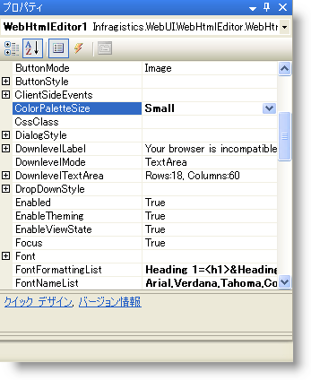
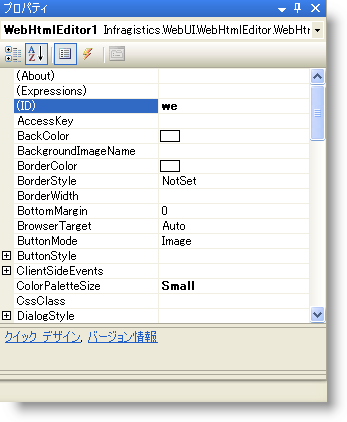

////

|metadata|
{
    "name": "webhtmleditor-improving-webhtmleditor-performance",
    "controlName": ["WebHtmlEditor"],
    "tags": ["Editing","Performance"],
    "guid": "{4F9D0BBB-2A48-4078-AA73-444923DC7741}",  
    "buildFlags": [],
    "createdOn": "2006-12-01T00:00:00Z"
}
|metadata|
////

= WebHtmlEditor のパフォーマンスの改善

開発する Web アプリケーションで WebHtmlEditor の強力な編集機能のすべてを必要としない場合は、一部の機能を無効にするか、その使用を制限することで、パフォーマンスを向上させることができます。この詳細なガイドでは、Web アプリケーションのパフォーマンスに影響を与える WebHtmlEditor のプロパティ、およびそのオーバーヘッドを抑制する、またはなくす方法について説明しています。このトピックを読むと、トレードオフを十分に理解したうえで、WebHtmlEditor の最適化を行うことができます。

作業を行う前に、最適化を行うための既存の WebHtmlEditor アプリケーション、または WebHtmlEditor の簡単なサンプルを準備する必要があります。以下の各セクションでは、1 つの機能を最適化する方法を説明していますが、同じ方法を、Web アプリケーションの必要性に応じて他の機能に 1 つ 1 つ、または集合的に適用することができます。

Webアプリケーションにすぐに適用して、WebHtmlEditor を使用するときに、Web アプリケーションのパフォーマンスを向上させることができるヒントとテクニックもいくつか説明されています。すべての説明に一貫した目的は、ある程度機能を制限することにより、パフォーマンスを向上させることです。Web アプリケーションをデザインするときには、簡単に編集を行い、より速いパフォーマンスを追求する上で、どの機能が必要か、どの機能はなくて済むかを的確に判断することが必要です。

== ViewState の無効化と要求ごとの WebHtmlEditor の構成

サーバー側からの WebHtmlEditor のすべてのプロパティ セットは、その設定が ViewState に格納されます。ASP.NET は、要求を受けるごとにこの ViewState のユーザーとサーバーの間の受け渡しを行います。この ViewState を無効にすると、ユーザーに表示される HTML のペイロードのサイズを軽減できます。 この方法は、次のような状況で非常に有効です。

* エンド ユーザーの接続の帯域幅が小さいため、ViewState が含まれているページの転送に時間がかかる。
* Web アプリケーションでサーバー上の動的な変更が多いため、ViewState のサイズが大きくなる。
* Web アプリケーションによるサーバー上の動的な変更がほとんどなく、デザインタイムの設定に依存している度合いが大きい。したがって、ViewState の果たす役割が小さい。

ViewState を無効にすることによる不利な点は、WebHtmlEditor がデザインタイムに設定されたプロパティの初期値を使用することだけです。ViewState が無効化されると、Web アプリケーションは、ページ要求があるごとに、ページの IsPostBack プロパティが False に設定されている場合にのみ実行される If 条件ブロックに初期化コードを挿入するカスタム プロパティ設定を行う必要があります。

たとえば、ViewState が有効であれば以下のコードにより WebHtmlEditor に動的な背景色を設定できます。

*Visual Basic の場合：*

----
' ViewState が有効なので、最初の要求に対してのみ初期化を行います。
If ( Not Page.IsPostBack ) Then
Me.WebHtmlEditor1.BackColor = Color.Beige
End If
----

*C# の場合：*

----
// ViewState が有効なので、最初の要求に対してのみ初期化を行います。
if ( !Page.IsPostBack )
{
this.WebHtmlEditor1.BackColor = Color.Beige;
}
----

しかし、EnableViewState プロパティを使用して ViewState を無効にすると、このプロパティ設定はポストバックに反映されません。したがって、プロパティ設定はページ要求ごとに実行される必要があります（以下のコード例を参照）。

*Visual Basic の場合：*

----
' ViewState を無効にして、ポストバックの有無にかかわらずページ要求ごとに初期化します。
Me.WebHtmlEditor1.EnableViewState = False
Me.WebHtmlEditor1.BackColor = Color.Beige
----

*C# の場合：*

----
// ViewState を無効にして、ポストバックの有無にかかわらずページ要求ごとに初期化します。
this.WebHtmlEditor1.EnableViewState = false;
this.WebHtmlEditor1.BackColor = Color.Beige;
----

WebHtmlEditor では、コードビハインドからプロパティの初期化を行うほか、ViewState に大きく依存せずにコントロールの外観を初期化するためのカスタム スキン機能が提供されています。詳しい説明は、 link:webhtmleditor-creating-custom-skins-for-webhtmleditor.html[カスタム スキンの作成]と link:webhtmleditor-load-a-custom-skin.html[カスタム スキンのロード]を参照してください。

== 簡単なカスタム ダイアログの使用

ダイアログは、Web サーバーとのやり取りなしにクライアント側でダイアログ ボックスの内容を取得できるので、すばやく開きます。そのためには、カスタム ダイアログ ボックスの内容を、ユーザーに対して表示されるかどうかにかかわりなく、要求ごとに提供する必要があります。ポップアップ ダイアログ ボックスが複雑になると、表示される HTML が複雑になり、大きくなります。

これを避けるために、以下のいずれかの方法、またはすべての方法を実行することにより、WebHtmlEditor の表示前のダイアログ ボックスがパフォーマンスに与える影響を軽減できます。

* ポップアップ ダイアログ ボックスの内容をできるだけシンプルにします。カスタム ダイアログ ボックスの HTML コンテンツの設定の仕方については、 link:webhtmleditor-customize-the-help-dialog-box-of-webhtmleditor.html[「ダイアログ ボタンのカスタマイズ」]を参照してください。
* ツールバー上の Web アプリケーションで使用しないダイアログ ボックス ボタンを削除します。このようなボタンを Toolbar Items コレクションから削除すると、ポップアップ ダイアログ ボックスに表示されなくなります。 link:webhtmleditor-remove-toolbar-buttons-of-webhtmleditor.html[ツールバーボタンの削除]に手順を追った削除方法が説明されています。
* 標準ダイアログ ボックス ボタンをカスタム ダイアログ ボックス ボタンに置換します。カスタム ボタンの ImageName プロパティは、既存のボタンと同じような外観となるように、また ButtonClicked イベントを開発時に作成する別の Web ページの URL にダイレクトされた新しいウィンドウを開くように設定します。したがって、ダイアログ ボックスは複雑になりますが、ユーザーがカスタム ダイアログ ボタンをクリックしたときにのみ開きます。

== 小さなカラー ピッカーの使用

「簡単なカスタム ダイアログの使用」で説明した最適化についてのヒントの特別なケースとして、WebHtmlEditor が表示する 1 つ以上の複雑なダイアログ ボックスがポップアップ カラー ピッカーである場合が考えられます。この場合は、  pick:[asp-net="link:{ApiPlatform}webui.webhtmleditor{ApiVersion}~infragistics.webui.webhtmleditor.webhtmleditor~colorpalettesize.html[ColorPaletteSize]"]  プロパティを使用して、ダイアログ ボックスに表示する HTML を小さくすることができます。このプロパティは、コードビハインドをプログラミングすることにより、または以下のスクリーンショットに示したように [プロパティ] ウィンドウを通じて（Microsoft® Visual Studio® .NETで [F4] を押します）設定できます。

カラー パレットのサイズが小さいほど、一度にユーザーに表示されるポップアップ カラー ピッカーのダイアログ ボックスの色の列が少なくなります。

== 基本編集での表サポート機能の無効化

一般的な経験則として、WebHtmlEditor 上でアクティブになる機能が少ないほど、パフォーマンスは速くなることを覚えておいてください。

WebHtmlEditor の HTML の表要素と複雑なレイアウトを表示する機能のサポートは、パフォーマンスのオーバーヘッドの観点からは高価な機能です。なぜならば、ユーザーが表を追加する前に操作するための表関連ダイアログ ボックス用に表示前の HTML が必要となり、またそれには表の編集に必要な機能性をサポートするための Javascript が含まれるためです。

開発する Web アプリケーションでユーザーが複雑な表のレイアウトを作成する必要がなければ、InsertTable ツールバー ボタンを削除することをお勧めします。 link:webhtmleditor-remove-toolbar-buttons-of-webhtmleditor.html[ツールバーボタンの削除]に、このための手順を追った操作方法が説明されています。

== WebHtmlEditor を参照する ID の短縮

pick:[asp-net="link:{ApiPlatform}webui.webhtmleditor{ApiVersion}~infragistics.webui.webhtmleditor.downlevellabel~id.html[ID]"] プロパティは、コントロールのプログラム上の識別子として使われるだけではなく、

コントロール内のすべての下位要素に与えられる名前がページ上で重複することがないように確認する機能もあります（たとえば、ツールバーの項目やスタイルに割り当てられた ID 属性を検査します）。

WebHtmlEditor コントロールに長い ID を割り当てると（デフォルトでは WebHtmlEditor1 なので 14 ビット）、それが何度もレンダリングされる場合にパフォーマンスに影響する恐れがあります。多少明瞭性を犠牲にしても、WebHtmlEditor に割り当てる ID を短くすると、レンダリングされる HTML サイズが小さくなります。Visual Studio .NET で表示される [プロパティ] ウィンドウで、以下のスクリーンショットに示したように ID プロパティを変更できます。

この例は、コントロールとその子の HTML としてレンダリングされる ID 属性を変更するだけではなく、Visual Studio .NET で使用されるプログラム上の識別子にも影響を与えます（お分かりのように、このプロパティはかっこに入っており、C# または VB.NET のコードでは設定できません）。