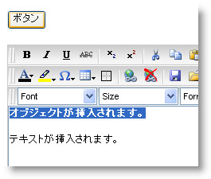

////

|metadata|
{
    "name": "webhtmleditor-insert-objects-into-webhtmleditor",
    "controlName": ["WebHtmlEditor"],
    "tags": ["Editing"],
    "guid": "{A3F2B502-30DE-4802-940D-245426732FA4}",  
    "buildFlags": [],
    "createdOn": "2007-10-09T14:11:49Z"
}
|metadata|
////

= オブジェクトを WebHtmlEditor に挿入

WebHtmlEditor™ の link:webhtmleditor-client-side-events-csom.html[クライアント側オブジェクトモデル]（CSOM）には WebHtmlEditor のカレットの場所に任意のオブジェクトまたはプレーン テキストを挿入することができる強力な関数が含まれています。この関数、insertAtCaret はオブジェクトまたは文字列のいずれかを受け付けることができ、コントロールのカレットの場所に挿入します。

HTML ボタンの onclick イベントに関連付けられると、以下の JavaScript は WebHtmlEditor のカレットの場所にオブジェクトまたはプレーン テキストの両方を挿入します。この例は、ID を "WebHtmlEditor1" に設定した状態で Web フォーム上に HTML ボタンと WebHtmlEditor のインスタンスがすでにあることが前提となっています。

*JavaScript の場合*

----
function insertObject(){
// エディタへの参照を取得します。
    var _editor = iged_getById("WebHtmlEditor1");
/// 新しいスパン オブジェクトを作成します。
    var object = document.createElement("SPAN");
// オブジェクトをスタイルしてテキストを追加します。
    object.style.background = "blue";
    object.style.color = "white";
    object.innerHTML = "An object is inserted.";    
// オブジェクトを WebHtmlEditor に挿入します。
    _editor.insertAtCaret( object );
// WebHtmlEditor はテキストを挿入することも可能です。
    _editor.insertAtCaret( " Text is inserted." );
}
----