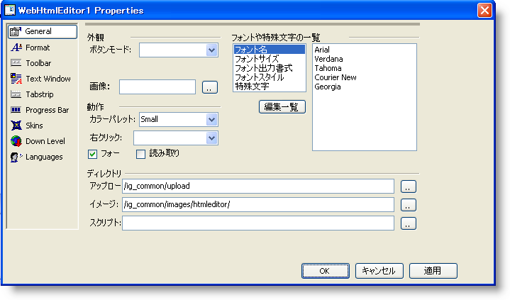

////

|metadata|
{
    "name": "webhtmleditor-overview-of-the-webhtmleditor-designer",
    "controlName": ["WebHtmlEditor"],
    "tags": ["Design Environment","Editing"],
    "guid": "{DE5CA177-5EF3-46A7-AB5B-95D6CC86DA8E}",  
    "buildFlags": [],
    "createdOn": "2006-11-01T00:00:00Z"
}
|metadata|
////

= WebHtmlEditor デザイナの概要

WebHtmlEditor コントロールはデザインタイム クイック デザインに付属しており、Microsoft® Visual Studio® .NET デザイナ環境におけるコントロールの外観および動作をカスタマイズできます。この詳細なガイドでは、クイック デザインの各タブの目的と機能について学び、変更を加えて WebHtmlEditor の外観と動作に与える効果を確認します。

実際にクイック デザインの操作に入る前に、ツールボックスからコントロールを Visual Studio .NET のデザイナ サーフェイスにドラッグする方法と、WebHtmlEditor で使用するアプリケーションの種類についての一般的な知識を学ぶ必要があります。ここで説明する設定をさまざまなに変更し、また Web アプリケーションに組み込まれた WebHtmlEditor にどのような効果が生じるかを確認することにより、このトピックからは単に説明されている以上のことを学べます。

WebHtmlEditor のクイック デザインを開きます（[プロパティ] ウィンドウが Microsoft® Visual Studio® .NET のワークスペース内に開いていない場合は、[WebHtmlEditor] をクリックして選択し、[F4] キーを押すと開きます）。[プロパティ] ウィンドウの下部にある [クイック デザイン] のリンクをクリックすると、クイック デザインが開きます。

クイック デザインには、次の 9 つのタブがあります。以下の各リンクをクリックすると、ここのタブの使い方に関するトピックを読むことができます。

* link:webhtmleditor-webhtmleditor-designer-general-tab.html[全般]
* link:webhtmleditor-webhtmleditor-designer-format-tab.html[形式]
* link:webhtmleditor-webhtmleditor-designer-toolbar-tab.html[ツールバー]
* link:webhtmleditor-webhtmleditor-designer-text-window-tab.html[[テキスト] ウィンドウ]
* link:webhtmleditor-webhtmleditor-designer-tabstrip-tab.html[タブストリップ]
* link:webhtmleditor-webhtmleditor-designer-progress-bar-tab.html[プログレスバー]
* link:webhtmleditor-webhtmleditor-designer-skins-tab.html[スキン]
* link:webhtmleditor-webhtmleditor-designer-down-level-tab.html[ダウン レベル]
* link:webhtmleditor-webhtmleditor-designer-languages-tab.html[言語]

このセクションのトピックでは、WebHtmlEditor の [プロパティ] ダイアログボックスの詳しい説明を読み、デザインタイムにコードを書かずに実行できるさまざまなカスタマイズ作業のサンプルを見ることができます。ここで、クイック デザインを自分で設定し、WebHtmlEditor でその効果を確認することにより、クイック デザインの機能を学習しておくとあとで役に立ちます。クイック デザインでは、WebHtmlEditor のサーバー側オブジェクトのプロパティが提供されており、マニュアルにはその機能についての詳しく説明されています。最後に、デザインタイムの設定で WebHtmlEditor コントロールについてのあらゆる設定を学習することは難しいので、同じ効果を実行時に使い慣れた .NET プログラミング言語で実現する方法をヘルプで参照してください。