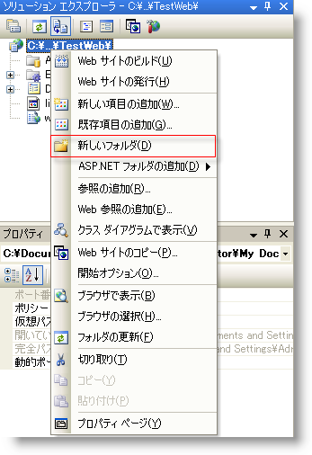

////

|metadata|
{
    "name": "webhtmleditor-set-where-upload-files-are-stored",
    "controlName": ["WebHtmlEditor"],
    "tags": ["Editing"],
    "guid": "{D18D8468-CB31-4D17-AA00-83AF1D2E7BB6}",  
    "buildFlags": [],
    "createdOn": "2006-11-01T00:00:00Z"
}
|metadata|
////

= アップロード ファイル格納位置の設定

Web サーバーには、WebHtmlEditor でプレビューまたは編集したドキュメントに添付されてアップロードされたファイル（画像やストリーミング メディア ファイルなど）を格納する機能があります。 pick:[asp-net="link:{ApiPlatform}webui.webhtmleditor{ApiVersion}~infragistics.webui.webhtmleditor.webhtmleditor~uploadedfilesdirectory.html[UploadedFilesDirectory]"]  プロパティは、デフォルトでアップロードされたファイルは "ig_common" の下の "upload" というサブフォルダに格納されていると見なします。アップロードされたファイルを別の位置に格納したい場合は、このプロパティを変更する必要があります。UploadedFilesDirectory プロパティは、Web アプリケーションのデザインタイムに設定できますが、アップロードされたファイルの通常の流れでは、個々のユーザーがそれぞれの UploadedFilesDirectory を受け取ります。そのためには、UploadedFilesDirectory プロパティをランタイムに個々のユーザーに関連づけられたパスに設定する必要があります。次の例では、コードを使用して UploadedFilesDirectory プロパティを設定しています。

[start=1]
. Microsoft® Visual Studio® .NET の開発中のプロジェクトの [ソリューション エクスプローラ] ビューで自分の Web プロジェクトを右クリックし、[新規フォルダ] をクリックします。アップロードされたファイル ディレクトリは、仮想ディレクトリか、仮想ディレクトリの下にあります。このフォルダに "uploads" という名前をつけます。この例の目的を考えると、Web アプリケーションは仮想ディレクトリにあり、アプリケーションを展開するときにこのサブフォルダを作成することが適切です。

[start=2]
. 次に、コードビハインド（たとえば、Page_Load イベント ハンドラ内）で、次の文を記述して UploadedFilesDirectory プロパティを初期化します。

*Visual Basic の場合：*

----
' 自分の Web アプリケーションのこのサブフォルダにアップロードを格納します。
Me.WebHtmlEditor1.UploadedFilesDirectory = "./uploads"
----

*C# の場合：*

----
// 自分の Web アプリケーションのこのサブフォルダにアップロードを格納します。
this.WebHtmlEditor1.UploadedFilesDirectory = "./uploads";
----

*注：* アップロード ファイルの格納場所を指定するとともに、Web サイトがアップロードされたファイルを受け取れるように構成する必要があります（つまり、フォルダに書き込み権限を付与するなど）。詳細は、 link:webhtmleditor-configuring-the-upload-area-in-iis.html[「IIS でのアップロード領域の構成」]を参照してください。