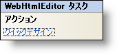

////

|metadata|
{
    "name": "webhtmleditor-smart-tag",
    "controlName": ["WebHtmlEditor"],
    "tags": ["Design Environment","Editing"],
    "guid": "{A51B725F-56A3-482D-B17D-F94A1E51AC6E}",  
    "buildFlags": [],
    "createdOn": "0001-01-01T00:00:00Z"
}
|metadata|
////

= WebHtmlEditor スマート タグ

Visual Studio 2005（.NET Framework 2.0）では、それぞれの {ProductName} コントロール/コンポーネントが固有のスマート タグを備えています。コントロール/コンポーネントを選択するだけで、Smart Tag のアンカーが表示されます。このアンカーをクリックするとポップアップ パネルが表示され、そこからコントロール/コンポーネントの最もよく使用するプロパティや設定にすばやく簡単にアクセスできます。

WebHtmlEditor のスマート タグには次のセクションが含まれています。

* アクション -- よく使うタスク（クイック デザイナへのアクセスなど）を実行できます。

各セクションの項目（フィールド、ドロップダウン リスト、チェックボックスなど）の説明は、下記を参照してください。

[options="header", cols="a,a,a"]
|====
|アクション|説明|対応するプロパティ

|クイック デザイン
|[クイックデザイン] をクリックすると、WebHtmlEditor デザイナが表示されます。これは、コントロールを右クリックしてコンテキスト メニューから [クイック デザイン] を選択するのと同じです。
|なし

|====