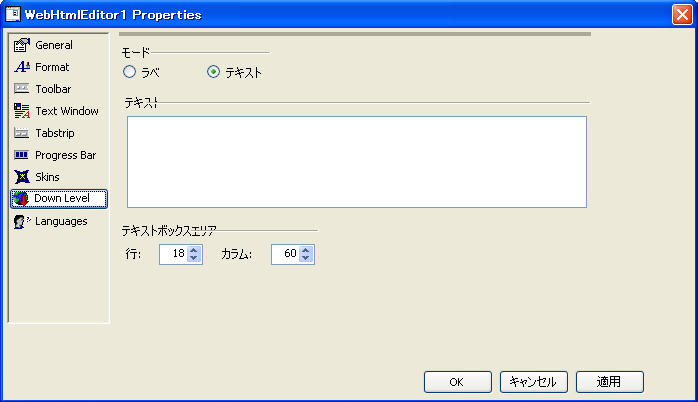

////

|metadata|
{
    "name": "webhtmleditor-webhtmleditor-designer-down-level-tab",
    "controlName": ["WebHtmlEditor"],
    "tags": ["Design Environment","Editing"],
    "guid": "{8A895E66-D8FE-47FA-8527-913A930F6AC4}",  
    "buildFlags": [],
    "createdOn": "0001-01-01T00:00:00Z"
}
|metadata|
////

= WebHtmlEditor デザイナ（ダウン レベル タブ）

[ダウン レベル] タブには、WebHtmlEditor のダウン レベルのブラウザに適した関連サポートに関連するプロパティが表示されます。ダウン レベルのブラウザとは、WebHtmlEditor の編集機能に必要な JavaScript と HTML ドキュメント オブジェクト モデルのサポートが完全ではないブラウザを意味します（通常は旧バージョンのブラウザや機能が少ないブラウザ）。 ダウンレベルと判断されたブラウザからのページ要求に対応するときには、WebHtmlEditor はシンプルな編集機能セット（したがって、幅広い互換性を持つ）でフォールバックしようと試みます。

エンドユーザーが編集機能が豊富な WebHtmlEditor 環境をサポートしない Web ブラウザを使用すると予想される場合は、上記のスクリーンショットに示したように WebHtmlEditor の [モード] を [ラベル] に設定します。この設定により、エンド ユーザーに対し、ブラウザの最低要件を示すメッセージが表示されます。[ラベル] オプションを選択すると、ダウンレベルのブラウザを使用するユーザーに対して表示されるメッセージを指定する [テキスト] フィールドを使用できます。