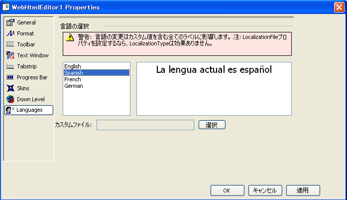

////

|metadata|
{
    "name": "webhtmleditor-webhtmleditor-designer-languages-tab",
    "controlName": ["WebHtmlEditor"],
    "tags": ["Design Environment","Editing","Localization"],
    "guid": "{030BA8F2-F7E2-4E95-9559-4673CB4BE75B}",  
    "buildFlags": [],
    "createdOn": "0001-01-01T00:00:00Z"
}
|metadata|
////

= WebHtmlEditor デザイナ（言語タブ）

[言語] タブでは、ランタイムに、ラベル、ツールチップ、静的なテキストをレンダリングするために、WebHtmlEditor が使用するローカライズ ファイルを変更できます。また、このタブではカスタム言語ファイルを指定できます。

*注：* WebHtmlEditor の言語を変更すると、すべてのデフォルト テキスト値が変更されます。したがって、WebHtmlEditor の文字列型のプロパティに何かテキストを指定していれば、その変更は失われてしまいます（新しい言語のテキスト値で上書きされます）。

この点を忘れても、他の文字列型のプロパティを設定する前に言語を選択するように勧める、よく目立つヒントラベルが表示されます。

組み込み言語以外の言語をサポートしたい場合（最新リストの link:webhtmleditor-multi-language-support.html[マルチ言語のサポート]を参照）、カスタム ローカライズ ファイルとして既存のローカライズ ファイルのひとつをコピーおよびローカライズする必要があります。ローカライズ ファイルはテキスト ベースの XML ドキュメントなので、WebHtmlEditor やそれ以外のエディタで簡単に編集できます。詳細は、 link:webhtmleditor-creating-and-using-a-custom-language-file.html[「カスタム言語ファイルを作成および使用」]を参照してください。