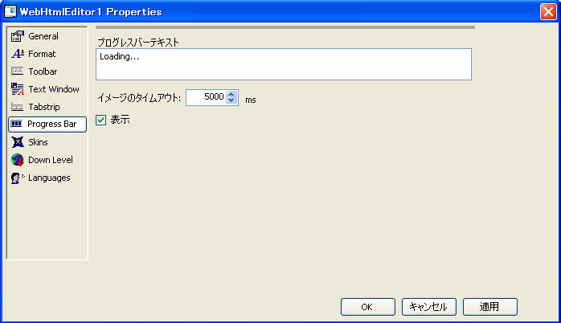

////

|metadata|
{
    "name": "webhtmleditor-webhtmleditor-designer-progress-bar-tab",
    "controlName": ["WebHtmlEditor"],
    "tags": ["Design Environment","Editing"],
    "guid": "{DA1FDA05-685A-4D2F-B483-F972B823D4DD}",  
    "buildFlags": [],
    "createdOn": "0001-01-01T00:00:00Z"
}
|metadata|
////

= WebHtmlEditor デザイナ（プログレス バー タブ）

WebHtmlEditor の [プログレス バー] タブでは、プログレス バーのロード中に表示されるテキストの変更や、この機能に関するその他のカスタマイズを行えます。Web アプリケーションでグラフィックスが多用されていたり、ネットワークの帯域幅が小さかったりする場合は、WebHtmlEditor のロード中にプログレス バーを表示することをお勧めします。このバーはデフォルトでは表示されないので、表示するためには、このタブで [表示] チェックボックスを選択し、[適用] をクリックする必要があります。

