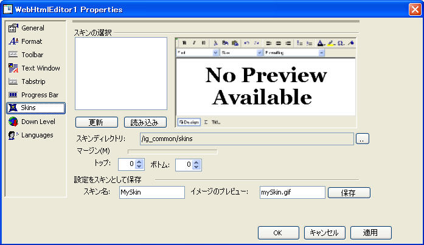

////

|metadata|
{
    "name": "webhtmleditor-webhtmleditor-designer-skins-tab",
    "controlName": ["WebHtmlEditor"],
    "tags": ["Editing","Styling","Theming"],
    "guid": "{0986C4C8-CAFE-4BD0-875C-999C8EC1A089}",  
    "buildFlags": [],
    "createdOn": "0001-01-01T00:00:00Z"
}
|metadata|
////

= WebHtmlEditor デザイナ（スキン タブ）

[スキン] タブを選択すると、WebHtmlEditor でのスキンの処理方法を設定するためのパネルが表示され、Web サーバーに XML ファイル形式で保存されている定義済みのルックを選択できます。このペインの上半分では、既存のスキンを選択でき、それがプレビュー画像と関連付けられていればプレビューを見ることができます（GIF などの標準フォーマットを提供すると、サムネイル ビットマップが表示されます）。 [ロード] をクリックすると、[スキン ディレクトリ] フィールドに示されたパスのスキン ファイルを読み取ることができます。そのスキンの外観が気に入れば、[適用] をクリックしてデザイン表面で現在の WebHtmlEditor への変更を確定します。

ペインの下半分では、WebHtmlEditor にデザインした現在の外観を、Microsoft® Visual Studio® .NET でスキン ディレクトリのスキン ファイルに保存できます。[保存] をクリックすると、"MySkin" ファイルを WebHtmlEditor の現在のルックとフィールを [スキン ディレクトリ] フィールドに指定したパスに保存できます。