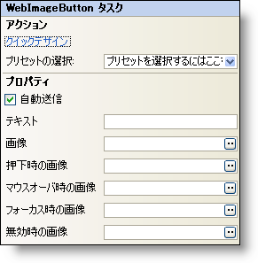

////

|metadata|
{
    "name": "webimagebutton-smart-tag",
    "controlName": ["WebImageButton"],
    "tags": ["Design Environment","Layouts","Styling"],
    "guid": "{5BF8EFB2-BD20-4C4D-8B7A-4D8995305090}",  
    "buildFlags": [],
    "createdOn": "2005-01-11T00:00:00Z"
}
|metadata|
////

= WebImageButton スマート タグ

Visual Studio 2005（.NET Framework 2.0）では、それぞれの {ProductName} コントロール/コンポーネントが固有のスマート タグを備えています。コントロール/コンポーネントを選択するだけで、Smart Tag のアンカーが表示されます。このアンカーをクリックするとポップアップ パネルが表示され、そこからコントロール/コンポーネントの最もよく使用するプロパティや設定にすばやく簡単にアクセスできます。

WebImageButton のスマート タグには次のセクションが含まれています。

* アクション -- よく使うタスク（クイック デザイナへのアクセス、プリセットのロードなど）を実行できます。
* [プロパティ] -- よく使うプロパティ（FocusImage など）への容易なアクセスを提供します。

各セクションの項目（たとえば、フィールド、ドロップダウン リスト、チェックボックス）およびプロパティ グリッドの項目の対応するプロパティの説明については以下を参照してください。

[options="header", cols="a,a,a"]
|====
|アクション|説明|対応するプロパティ

|クイック デザイン
|[クイックデザイン] をクリックすると、WebImageButton デザイナが表示されます。これは、コントロールを右クリックしてコンテキスト メニューから [クイック デザイン] を選択するのと同じです。
|なし

|プリセットの選択
|「ここをクリック」リンクをクリックして、WebDateTimeEdit のプリセットを素早く選択します。これは、WebImageButton デザイナを開いて [プリセット] を展開してから [プリセットの管理] をクリックするのと同じです。
|なし

|====

[options="header", cols="a,a,a"]
|====
|プロパティ|説明|対応するプロパティ

|AutoSubmit
|これをチェックすると、コントロールがクリックされたときはサーバーにポストバックが強制されます。
|AutoSubmit

|Text
|WebImageButton に表示されるデフォルト テキスト。
|Text

|Image
|省略記号 (...) をクリックして [ファイルを開く] ダイアログを開き、コントロール用のデフォルト画像を選択します。
|Image

|PressedImage
|省略記号 (...) をクリックして [ファイルを開く] ダイアログを開き、コントロールを押したときやアクションキー（スペース、Enter、Escape など）を押したときの画像を選択します。
|Image (PressedAppearance)

|HoverImage
|省略記号 (...) をクリックして [ファイルを開く] ダイアログを開き、コントロールが上に置かれたときの画像を選択します。
|Image (HoverAppearanace)

|FocusImage
|省略記号 (...) をクリックして [ファイルを開く] ダイアログを開き、コントロールがフォーカスを得たときの画像を選択します。
|Image (FocusAppearance)

|DisabledImage
|省略記号 (...) をクリックして [ファイルを開く] ダイアログを開き、WebImageButton が無効になったときの画像を選択します。
|Image (DisabledAppearance)

|====