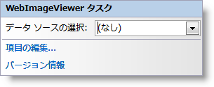

////

|metadata|
{
    "name": "webimageviewer-webimageviewer-smart-tag",
    "controlName": ["WebImageViewer"],
    "tags": ["Design Environment","Layouts","Styling"],
    "guid": "{110F3865-01C8-48E1-8541-6A6473FD7EB2}",  
    "buildFlags": [],
    "createdOn": "0001-01-01T00:00:00Z"
}
|metadata|
////

= WebImageViewer スマート タグ

Visual Studio 2005/2008（.NET Framework 2.0/3.5）では、{ProductName} の個々のコントロール/コンポーネントにはスマート タグがあります。コントロールやコンポーネントを選択するだけで、スマート タグのアンカーが表示されます。このアンカーをクリックするとポップアップ パネルが表示され、そこからコントロール/コンポーネントの最もよく使うプロパティや設定にすばやく簡単にアクセスできます。

WebImageViewer のスマート タグには次のセクションが含まれています。

* [データソースの選択] -- プロジェクト内ですでに設定されているデータソースを選択できます。

各セクションの項目（フィールド、ドロップダウン リスト、チェックボックスなど）の説明と、各項目が対応するプロパティ グリッドのプロパティについては、以下の表を参照してください。

WebImageViewer™ のスマート タグには次のリンクが含まれています。

* 項目の編集 -- これを選択すると WebImageViewer クイック デザイナーを開きます。これによって、項目を追加する、または既存の項目を編集することができます。
* バージョン情報 -- これを選択すると WebFishEyeBar の製品情報が表示されます。状態、バージョン、有効期限、製品キーなどの情報を含みます。

[options="header", cols="a,a,a"]
|====
|データ ソース|説明|対応するプロパティ

|データ ソースの選択
|ドロップダウン ボックスを使用し、WebImageViewer で使用するデータ ソースを選択できます。構成されたデータ ソースがない場合は、<New data source...> を選択します。
|*DataSource*

|====