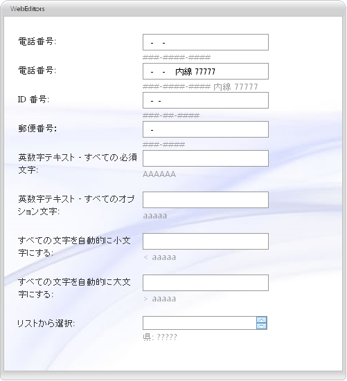

////

|metadata|
{
    "name": "webmaskeditor-about-webmaskeditor",
    "controlName": ["WebMaskEditor"],
    "tags": ["Editing","Getting Started"],
    "guid": "{B374E83E-C219-4ED8-80CF-B017A7A91242}",  
    "buildFlags": [],
    "createdOn": "2009-03-06T14:40:15Z"
}
|metadata|
////

= WebMaskEditor について

WebMaskEditor™ は、広範かつカスタマイズ可能な入力マスク機能を提供するエディター コントロールで、さまざまな外観および動作ベースのプロパティを提供します。WebMaskEditor は優れたパフォーマンスと応答性の高いエンドユーザー エクスペリエンスを促進する証明済みのコードベースを利用するために {ProductName} AJAX フレームワークを使用して構築されます。 pick:[asp-net="link:{ApiPlatform}web{ApiVersion}~infragistics.web.ui.editorcontrols_namespace.html[Infragistics.Web.UI.EditorControls]"]  名前空間で WebMaskEditor を見つけることができます。

すべての {ProductName} AJAX コントロールのように、WebMaskEditor は Infragistics® Application Styling Framework にシームレスに統合します。CSS ベースのプロパティを使用すると、既存のスタイル シートを利用することによって、WebMaskEditor を手動でカスタマイズできます。

WebMaskEditor は、クライアント側の JavaScript プログラミング環境に堅牢なモデルも公開します。クライアント サイド オブジェクトモデル（CSOM）は、十分な機能を備えたプロパティとメソッドで構成され、開発者はサーバー側でポストバックしなくても、重要な機能単位をプログラムできます。

WebMaskEditor コントロールの機能の一部には以下が含まれます:

* *ハイパフォーマンス* -- 軽量のマークアップと最適化されたコードがパフォーマンスを向上します。
* *スピン ボタン* -- エンドユーザーは値のリストを簡単にスピンできます。
* *標準的なバリデーターのサポート* -- ASP.NET バリデーター コントロールをサポートします。
* *ShowMaskOnFocus* -- 編集モードで、表示される文字列（入力パターン）はカレットの右側のカットオフ プロンプトとリテラル文字で動的に構築できます。
* *SelectionOnFocus* -- 編集モードに入ると必ず異なる選択タイプを設定できます。
* *InputMask* -- キーボード入力をフィルタリングするために使用される入力マスクを設定することができます。
* *PadChar* -- コントロールがフォーカスを失う時に表示テキストで空のマスク位置を埋めるために使用される文字を設定できます。
* *PromptChar* -- コントロールがフォーカスを持つ時に表示テキストで空のマスク位置を埋めるために使用される文字を設定できます。