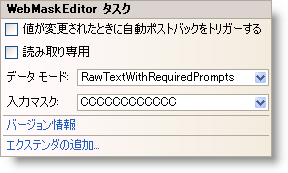

////

|metadata|
{
    "name": "webmaskeditor-webmaskeditor-smart-tag",
    "controlName": ["WebMaskEditor"],
    "tags": ["Design Environment"],
    "guid": "{76ACB569-221D-4E8F-9271-33A4C00C3320}",  
    "buildFlags": [],
    "createdOn": "2009-03-06T14:41:04Z"
}
|metadata|
////

= WebMaskEditor スマート タグ

Visual Studio 2005/2008（.NET Framework 2.0/3.5）では、{ProductName} の個々のコントロール/コンポーネントにはスマート タグがあります。コントロールやコンポーネントを選択することで、スマート タグのアンカーが表示されます。このアンカーをクリックするとポップアップ パネルが表示され、そこからコントロール/コンポーネントの最もよく使うプロパティや設定にすばやく簡単にアクセスできます。

WebMaskEditor™ のスマート タグには次の項目が含まれています。

* 値の変更時に自動ポストバック -- ValueChanged イベントに適用される自動ポストバック オプションを設定できます。
* 読み取り専用 -- エンドユーザーがコントロールのテキストを編集できるかどうかを構成することができます。
* データ モード -- エディターで値を折り返すためのオブジェクトのタイプを設定できます。
* 入力マスク -- キーボード入力をフィルタリングするために入力マスクを設定できます。

WebMaskEditor スマート タグには次のリンクが含まれています。

* バージョン情報 -- これをクリックすると WebMaskEditor 製品の情報を開きます。状態、バージョン、有効期限、製品キーなどの情報を含みます。
* エクステンダーの追加 -- これをクリックすると、WebMaskEditor と使用可能なすべてのコントロール エクステンダーを表示するダイアログを表示します。

項目の説明と、プロパティ グリッドの各項目が対応するプロパティについては、以下の表を参照してください。

[options="header", cols="a,a,a"]
|====
|項目|説明|対応するプロパティ

|値の変更時に自動ポストバック
|ValueChanged イベントに適用される自動ポストバック オプションを取得/設定します。
|*ValueChanged (AutoPostBackFlags)*

|読み取り専用
|エンドユーザーがコントロールのテキストを編集する機能を取得または設定します。
|*ReadOnly*

|データ モード
|Value プロパティをラップするために使用されるオブジェクト型を取得または設定します。
|*DataMode*

|入力マスク
|キーボード入力のフィルタリングに使用される入力マスクを取得/設定します。
|*InputMask*

|====