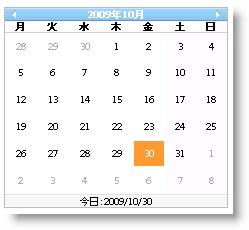

////

|metadata|
{
    "name": "webmonthcalenadar-set-a-custom-day-as-the-first-day-of-the-week",
    "controlName": ["WebMonthCalendar"],
    "tags": ["How Do I","Localization","Styling"],
    "guid": "{B8174A1E-E3AA-47A2-A99C-A3B60B3B15FE}",  
    "buildFlags": [],
    "createdOn": "0001-01-01T00:00:00Z"
}
|metadata|
////

= カスタム日を週の最初の日として設定

WebMonthCalendar™ によって、任意の日を週の最初の曜日として設定できます。これは、コントロールの  pick:[asp-net="link:{ApiPlatform}web{ApiVersion}~infragistics.web.ui.editorcontrols.webmonthcalendar~firstdayofweek.html[FirstDayOfWeek]"]  プロパティを以下の FirstDayOfWeek 列挙体メンバーのいずれかに設定することによって達成できます。

* *Sunday* -- 週の最初の曜日が日曜日であることを示します。
* *Monday* -- 週の最初の曜日が月曜日であることを示します。
* *Tuesday* -- 週の最初の曜日が火曜日であることを示します。
* *Wednesday* -- 週の最初の曜日が水曜日であることを示します。
* *Thursday* -- 週の最初の曜日が木曜日であることを示します。
* *Friday* -- 週の最初の曜日が金曜日であることを示します。
* *Saturday* -- 週の最初の曜日が土曜日であることを示します。
* *Default* -- 週の最初の曜日がシステム設定で指定されていることを示します。

デフォルトでは、このプロパティは Default に設定されます。Microsoft® Visual Studio® [プロパティ] ウィンドウを使用する、または以下のコードを使用することによって、FirstDayOfWeek プロパティを設定できます:

*Visual Basic の場合：*

----
 WebMonthCalendar1.FirstDayOfWeek = FirstDayOfWeek.Monday
----

*C# の場合：*

----
 WebMonthCalendar1.FirstDayOfWeek = FirstDayOfWeek.Monday;
----

