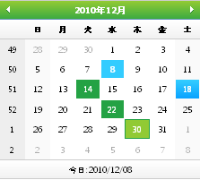

////

|metadata|
{
    "name": "webmonthcalendar-about-webmonthcalendar",
    "controlName": ["WebMonthCalendar"],
    "tags": ["Editing"],
    "guid": "{9B934686-F3CA-4C5B-B595-45B9C3D737AC}",  
    "buildFlags": [],
    "createdOn": "0001-01-01T00:00:00Z"
}
|metadata|
////

= WebMonthCalendar について

WebMonthCalendar™ は、1 ヵ月のカレンダーを描画するカレンダー コントロールで、さまざまな外観および動作ベースのプロパティを提供します。WebMonthCalendar は優れたパフォーマンスと応答性の高いエンドユーザー エクスペリエンスを促進する証明済みのコード ベースを利用するために {ProductName} AJAX フレームワークを使用して構築されます。 pick:[asp-net="link:{ApiPlatform}web{ApiVersion}~infragistics.web.ui.editorcontrols_namespace.html[Infragistics.Web.UI.EditorControls]"]  名前空間で WebMonthCalendar を見つけることができます。

すべての {ProductName} AJAX コントロールのように、WebMonthCalendar は Infragistics® Application Styling Framework にシームレスに統合します。CSS ベースのプロパティを使用すると、既存のスタイルシートを利用することによって、WebMonthCalendar を手動でカスタマイズできます。

WebMonthCalendar は、クライアント側の JavaScript プログラミング環境に堅牢なモデルも公開します。クライアント サイドオブジェクトモデル（CSOM）は、十分な機能を備えたプロパティとメソッドで構成され、開発者はサーバー側でポストバックしなくても、重要な機能単位をプログラムできます。

WebMonthCalendar コントロールの機能の一部には以下が含まれます:

* *ハイパフォーマンス* -- 軽量のマークアップと最適化されたコードがパフォーマンスを向上します。
* *キーボード ナビゲーション* -- キーボードを使用したコントロールへのアクセスをサポートします。
* *HotKeys* -- ユーザー独自のホットキーをドロップダウン リストを開くために設定できます。
* *標準的なバリデーターのサポート* -- ASP.NET バリデーター コントロールをサポートします。
* *CustomDays* -- カレンダーで特定の日の外観を修正できます。
* *ドロップダウン リストのカスタマイズ* -- 月と年のドロップダウン リストの列数と年のリストの行数をカスタマイズするオプションを提供します。
* *最大値と最小値* -- エディタに入力できる日付の許容可能な範囲を簡単に指定できます。
* *カルチャー* -- ローカライズされたフォーマットのためにコントロールによって使用される CultureInfo オブジェクトを設定できます。
* *アニメーション* -- ドロップダウン リストを開く/閉じる時のアニメーションをカスタマイズできます。
* *フォーカスおよびホバーのための CssClasses* -- すべての領域のマウスオーバーのスタイルと日ごとのフォーカス スタイルをサポートします。
* *EnableWeekNumbers* -- エンドユーザーに週番号を表示または非表示にするためのオプションをユーザーに提供します。

以下の画像はさまざまなホバーおよび選択スタイルを表示します。

