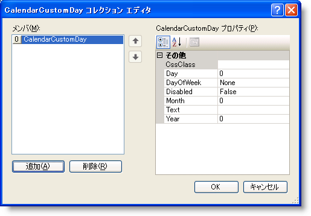

////

|metadata|
{
    "name": "webmonthcalendar-creating-custom-days-in-webmonthcalendar",
    "controlName": ["WebMonthCalendar"],
    "tags": ["Editing","How Do I","Tips and Tricks"],
    "guid": "{8044A18F-5152-45A3-A658-B3B126F5D492}",  
    "buildFlags": [],
    "createdOn": "0001-01-01T00:00:00Z"
}
|metadata|
////

= WebMonthCalendar でカスタム日を作成

== 始める前に

WebMonthCalendar™ によって、外観をカスタマイズしたり、カレンダーの特定の日にユーザー独自のテキストを定義することができます。 ユーザー独自のカスタム CSS クラスは、カレンダーの任意の日のテキストをスタイルするために使用できます。 コントロールの  pick:[asp-net="link:{ApiPlatform}web{ApiVersion}~infragistics.web.ui.editorcontrols.webmonthcalendar~customdays.html[CustomDays]"]  プロパティを設定することによって達成できます。

== 達成すること

WebMonthCalendar でカスタム日を作成する方法を学習します。

== 次の手順を実行します

[start=1]
. Microsoft® Visual Studio® ツールボックスから、ScriptManager コンポーネントと WebMonthCalendar コントロールをフォームにドラッグ アンド ドロップします。
[start=2]
. カスタム日に CSS クラスを定義するために ASPX ソースに以下のコードを含めます。この CSS クラスが WebMonthCalendar コントロールに関連づけられると、カスタム日のテキストは赤色に変わります。

*HTML の場合:*

----

----

[start=3]
. プロパティ ウィンドウで、CustomDays プロパティを指定して、省略記号 (...) ボタンをクリックし、CalendarCustomDay コレクション エディタを起動します。
[start=4]
. [追加] ボタンをクリックしてカスタム日を追加します。 CalendarCustomDay コレクション エディタは以下の画像のようになります。

[start=5]
. 赤色の「H」を付けて June 26th, 2009 を表示するために、CalendarCustomDay コレクション エディタの右側のペインで以下の CalendarCustomDay プロパティを設定します。

[options="header", cols="a,a"]
|====
|プロパティ|Value

|CssClass
|myCustomDay

|日:
|26

|月
|6

|テキスト
|H

|年
|2009

|====

[start=6]
. アプリケーションを保存して実行します。 WebMonthCalendar は以下の画像のようになるはずです。

[source]
----
----

== コード ビハインドからカスタム日を作成

[source]
----
// CalendarCustomDay のインスタンスを作成します
----

[source]
----
CalendarCustomDay myCustomDay = new CalendarCustomDay();
----

[source]
----
//ユーザー独自の Css クラスをカスタム日の CssClass プロパティに設定します
----

[source]
----
myCustomDay.CssClass = "myCustomDay";
----

[source]
----
//Text プロパティをユーザーが表示したいテキストに設定します
----

[source]
----
myCustomDay.Text = "H";
----

[source]
----
//ユーザーがカスタマイズしたい月の日を設定します
----

[source]
----
myCustomDay.Day = 26;
----

[source]
----
//月を設定します
----

[source]
----
myCustomDay.Month = 6;
----

[source]
----
//年を設定します
----

[source]
----
myCustomDay.Year = 2009;
----

[source]
----
// WebMonthCalendar の CustomDays コレクションにユーザーが作成したカスタム日を追加します
----

[source]
----
WebMonthCalendar1.CustomDays.Add(myCustomDay);
----