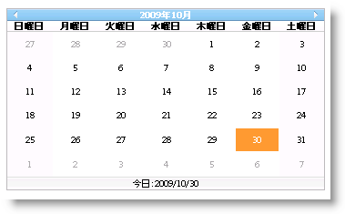

////

|metadata|
{
    "name": "webmonthcalendar-day-name-formats-in-webmonthcalendar",
    "controlName": ["WebMonthCalendar"],
    "tags": ["How Do I","Theming","Tips and Tricks"],
    "guid": "{077B8078-6620-4566-A29E-84A9426AF902}",  
    "buildFlags": [],
    "createdOn": "0001-01-01T00:00:00Z"
}
|metadata|
////

= WebMonthCalendar の曜日名の書式

WebMonthCalendar™ は、曜日の異なる表示フォーマットをユーザーに提供します。コントロールの  pick:[asp-net="link:{ApiPlatform}web{ApiVersion}~infragistics.web.ui.editorcontrols.webmonthcalendar~daynameformat.html[DayNameFormat]"]  プロパティを以下のオプションのいずれかに設定するだけで、曜日の表示フォーマットを設定することができます。

* *Full* -- 曜日はフル フォーマットで表示されます。たとえば、Monday(月曜日)などです。
* *Short* -- 曜日は最初の 3 文字で表示されます。たとえば、Thu（火曜日）などです。
* *FirstLetter* -- 曜日は大文字の頭文字で表示されます。たとえば、S などです。
* *FirstTwoLetters* -- 曜日は最初の 3 文字で表示されます。たとえば、Sa などです。
* *Shortest* -- 曜日は小文字の頭文字で表示されます。たとえば、f などです。

Microsoft® Visual Studio® [プロパティ] ウィンドウを使用する、または以下のコードを使用することによって、DayNameFormat プロパティを設定できます:

*Visual Basic の場合：*

----
WebMonthCalendar1.DayNameFormat = DayNameFormat.Full
----

*C# の場合：*

----
WebMonthCalendar1.DayNameFormat = DayNameFormat.Full;
----

