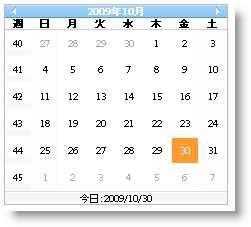

////

|metadata|
{
    "name": "webmonthcalendar-enable-week-numbers-in-webmonthcalendar",
    "controlName": ["WebMonthCalendar"],
    "tags": ["How Do I","Styling"],
    "guid": "{9AD8020F-79E6-4E1A-A0DD-DE057E695371}",  
    "buildFlags": [],
    "createdOn": "2009-01-07T10:15:25Z"
}
|metadata|
////

= WebMonthCalendar で週番号を有効にする

一部の国では週番号が使用されます。WebMonthCalendar™ は週番号をエンドユーザーに示すためのオプションを提供します。これは、コントロールの  pick:[asp-net="link:{ApiPlatform}web{ApiVersion}~infragistics.web.ui.editorcontrols.webmonthcalendar~enableweeknumbers.html[EnableWeekNumbers]"]  プロパティを True に設定することで達成できます。デフォルトでこのプロパティは False に設定されます。

Microsoft® Visual Studio® [プロパティ] ウィンドウを使用する、または以下のコードを使用することによって、EnableWeekNumbers プロパティを設定できます:

*Visual Basic の場合：*

----
WebMonthCalendar1.EnableWeekNumbers = true
----

*C# の場合：*

----
WebMonthCalendar1.EnableWeekNumbers = true;
----

コントロールの  pick:[asp-net="link:{ApiPlatform}web{ApiVersion}~infragistics.web.ui.editorcontrols.webmonthcalendar~weeknumberlabel.html[WeekNumberLabel]"]  プロパティを設定することによって、週番号の列ヘッダーに表示されるユーザー独自のラベルを設定することもできます。

*Visual Basic の場合：*

----
WebMonthCalendar1.WeekNumberLabel = "Wk"
----

*C# の場合：*

----
WebMonthCalendar1.WeekNumberLabel = "Wk";
----

== 週番号の規則

WebMonthCalendar によって、年の最初の週を決定するための異なる規則を設定することができます。コントロールの  pick:[asp-net="link:{ApiPlatform}web{ApiVersion}~infragistics.web.ui.editorcontrols.webmonthcalendar~weekrule.html[WeekRule]"]  プロパティを以下のオプションのいずれかに設定することによって、これらの規則を設定できます。

* *FirstDay* -- 最初の週はその年の最初の週で開始し、1 日から 7 日までのいずれかになります。
* *FirstFullWeek* -- 最初の週はその年の最初の週で開始し、7 日間全日になります。
* *FirstFourDayWeek* -- 最初の週はその年の最初の週で開始し、4 日から 7 日までのいずれかになります。

*注:* WeekRule プロパティは、FirstDayOfWeek プロパティによって異なります。つまり、週番号は、コントロールにユーザーが設定した週の最初の曜日で変わります。

*Visual Basic の場合：*

----
WebMonthCalendar1.WeekRule = System.Globalization.CalendarWeekRule.FirstFullWeek
----

*C# の場合：*

----
WebMonthCalendar1.WeekRule = System.Globalization.CalendarWeekRule.FirstFullWeek;
----

*注:* EnableWeekNumbers プロパティが False に設定されると、WeekRule プロパティは効果がなくなります。