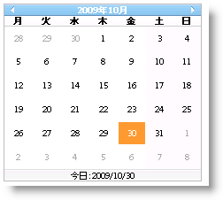
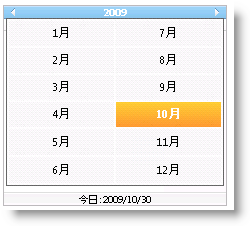
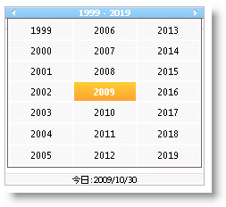
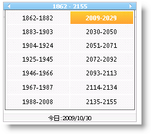

////

|metadata|
{
    "name": "webmonthcalendar-getting-started-with-webmonthcalendar",
    "controlName": ["WebMonthCalendar"],
    "tags": ["Editing","Getting Started"],
    "guid": "{CB90B08B-0EF2-4302-A39A-DECACAC8F07B}",  
    "buildFlags": [],
    "createdOn": "0001-01-01T00:00:00Z"
}
|metadata|
////

= WebMonthCalendar で開始

WebMonthCalendar は、特定の時点でエンドユーザーが見ることができる以下の 4 つのビューをサポートします。

*月カレンダー ビュー:* これは、ユーザーが一月の日付を選択できる WebMonthCalendar で表示される最初のビューです。

*月選択ビュー:* このビューには、ヘッダーの月のラベルをクリックすることで表示される月のリストが含まれます。

*年選択ビュー:* このビューには、ヘッダーの年のラベルをクリックすることで表示される年のリストが含まれます。

*10 年選択ビュー:* このビューには、カレンダーが年選択ビューである時に、年のラベルをクリックすることで表示される 10 年のリストが含まれます。

エンドユーザーによって開くことができるこのリストは、WebMonthCalendar コントロールの  pick:[asp-net="link:{ApiPlatform}web{ApiVersion}~infragistics.web.ui.editorcontrols.webmonthcalendar~titleformat.html[TitleFormat]"]  プロパティが構成される方法によって異なります。TitleFormat プロパティは、 pick:[asp-net="link:{ApiPlatform}web{ApiVersion}~infragistics.web.ui.editorcontrols.calendartitleformat.html[CalendarTitleFormat]"]  列挙体の以下のメンバーのいずれかに設定できます。

* *Month* -- タイトルは現在の月のひとつのラベル/ボタンを表示します。
* *MonthYear* -- タイトルは CultureInfo クラス（CultureInfo.DateTimeFormat.YearMonthPattern）の YearMonthPattern に基づくフォーマットでひとつのラベル/ボタンを表示します。
* *MonthAndYear* -- タイトルは現在の月および年の 2 つのラベル/ボタンを表示します。

*注:* ドロップダウン リストが有効な場合、対応する年と月のラベルは、以下の状態がサポートされるボタンとして動作します。状態は、標準、マウス オーバー、押下時です。

上記のシナリオは、TitleFormat プロパティが MonthAndYear に設定されている時に当てはまります。ただし、TitileFormat が Month または MonthYear に設定されている場合、タイトルをクリックするとタイトルに年の月のリストが開きます。年をクリックすると、タイトルに 10 年の年のリストが開きます。10 年をクリックすると 10 年のリストが開きます。

Microsoft® Visual Studio® [プロパティ] ウィンドウを使用する、または以下のコードを使用することによって、TitleFormat プロパティを設定できます:

*Visual Basic の場合：*

----
WebMonthCalendar1.TitleFormat = Infragistics.Web.UI.EditorControls.CalendarTitleFormat.Month
----

*C# の場合：*

----
WebMonthCalendar1.TitleFormat = Infragistics.Web.UI.EditorControls.CalendarTitleFormat.Month;
----