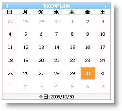
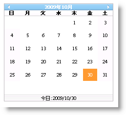

////

|metadata|
{
    "name": "webmonthcalendar-hiding-days-of-previous-and-next-months-in-webmonthcalendar",
    "controlName": ["WebMonthCalendar"],
    "tags": ["How Do I","Styling"],
    "guid": "{34E7CF3A-C50E-471A-948E-637F14775DC0}",  
    "buildFlags": [],
    "createdOn": "0001-01-01T00:00:00Z"
}
|metadata|
////

= WebMonthCalendar で前月および翌月の日を非表示にする

WebMonthCalendar™ によって、他の月日をエンドユーザーに表示しないようにできます。これは、コントロールの  pick:[asp-net="link:{ApiPlatform}web{ApiVersion}~infragistics.web.ui.editorcontrols.webmonthcalendar~hideothermonthdays.html[HideOtherMonthDays]"]  プロパティを True に設定することで達成できます。デフォルトでこのプロパティは False に設定されます。

*注:* このプロパティが有効な場合、 pick:[asp-net="link:{ApiPlatform}web{ApiVersion}~infragistics.web.ui.editorcontrols.webmonthcalendar~changemonthtodateclicked.html[ChangeMonthToDateClicked]"]  プロパティと WeekendStylePriority の効果はありません。

Microsoft® Visual Studio® [プロパティ] ウィンドウを使用する、または以下のコードを使用することによって、HideOtherMonthDays プロパティを設定できます:

*Visual Basic の場合：*

----
WebMonthCalendar1.HideOtherMonthDays = true
----

*C# の場合：*

----
WebMonthCalendar1.HideOtherMonthDays = true;
----

== 他の月日を非表示にする前

== 他の月日を非表示にした後

