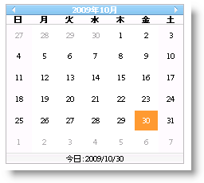

////

|metadata|
{
    "name": "webmonthcalendar-hiding-header-and-footer-of-webmonthcalendar",
    "controlName": ["WebMonthCalendar"],
    "tags": ["How Do I","Styling"],
    "guid": "{8AAF6CF1-134C-45D1-881A-499A06C82410}",  
    "buildFlags": [],
    "createdOn": "0001-01-01T00:00:00Z"
}
|metadata|
////

= WebMonthCalendar のヘッダーおよびフッターを非表示にする

WebMonthCalendar™ によって、ヘッダーおよびフッターをエンドユーザーに表示しないようにできます。WebMonthCalendar のヘッダー部分には左右に 2 つのボタンがあり、これによって翌月および前月、そして月および年のラベルにナビゲーションできます。WebMonthCalendar のフッター部分には今日の日付が含まれます。コントロールの pick:[asp-net="link:{ApiPlatform}web{ApiVersion}~infragistics.web.ui.editorcontrols.webmonthcalendar~showheader.html[ShowHeader]"]  および  pick:[asp-net="link:{ApiPlatform}web{ApiVersion}~infragistics.web.ui.editorcontrols.webmonthcalendar~showfooter.html[ShowFooter]"]  プロパティを False に設定するだけで、ヘッダーおよびフッターを非表示にできます。

Microsoft® Visual Studio® [プロパティ] ウィンドウを使用する、または以下のコードを使用することによって、ShowHeader および ShowFooter プロパティを設定できます:

*Visual Basic の場合：*

----
WebMonthCalendar1.ShowFooter = false
WebMonthCalendar1.ShowHeader = false
----

*C# の場合：*

----
WebMonthCalendar1.ShowFooter = false;
WebMonthCalendar1.ShowHeader = false;
----

== ヘッダーおよびフッターを非表示にする前

== ヘッダーおよびフッターを非表示にした後

image::images/WebMonthCalendar_Hiding_Header_and_Footer_of_WebMonthCalenadar_02.png[]