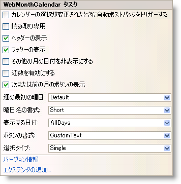

////

|metadata|
{
    "name": "webmonthcalendar-webmonthcalendar-smart-tag",
    "controlName": ["WebMonthCalendar"],
    "tags": ["Design Environment"],
    "guid": "{F57D3A37-5D0A-4A79-B6D0-2AEFFFEAA226}",  
    "buildFlags": [],
    "createdOn": "0001-01-01T00:00:00Z"
}
|metadata|
////

= WebMonthCalendar スマート タグ

Visual Studio 2005/2008（.NET Framework 2.0/3.5）では、{ProductName} の個々のコントロール/コンポーネントにはスマート タグがあります。コントロールやコンポーネントを選択することで、スマート タグのアンカーが表示されます。このアンカーをクリックするとポップアップ パネルが表示され、そこからコントロール/コンポーネントの最もよく使うプロパティや設定にすばやく簡単にアクセスできます。

WebMonthCalendar™ のスマート タグには次の項目が含まれています。

* 値の変更時に自動ポストバック -- ValueChanged イベントに適用される自動ポストバック オプションを設定できます。
* 読み取り専用 -- エンドユーザーがコントロールのテキストを編集できるかどうかを構成することができます。
* ヘッダー表示 -- 左右に 2 つのボタンを含むヘッダーの表示/非表示を設定することができ、これによって翌月および前月、そして月や年のラベルにナビゲーションすることができます。
* フッター表示 -- 今日の日付を含むフッター部分の表示/非表示を設定することができます。
* 他の月で日を非表示 -- 前月と翌月に属する日付セルで日数を非表示にすることができます。
* 週番号を有効にする -- 週番号を表示するためのオプションをユーザーに提供します。
* 翌月または前月のボタンを表示 -- 翌月および前月にナビゲートすることができるカレンダーのアクティブ領域の表示/非表示を設定できます。
* 週の最初の曜日 -- 週の最初の曜日として任意の曜日を設定できます。
* 曜日名の書式 -- 曜日を表す文字列の書式を設定できます。
* 表示日 -- 曜日を表すテキスト文字列の表示/非表示を設定できます。
* ボタンの書式 -- 翌月および前月にナビゲートするために使用されるボタンに表示されるテキストの書式を設定できます。
* 選択タイプ -- 1 日、1 週、または複数日などの選択タイプを設定できます。

WebMonthCalendar のスマート タグには次のリンクが含まれています。

* バージョン情報 -- これをクリックすると WebMonthCalendar 製品の情報を開きます。状態、バージョン、有効期限、製品キーなどの情報を含みます。
* エクステンダーの追加 -- これをクリックすると、WebMonthCalendar と使用可能なすべてのコントロール エクステンダーを表示するダイアログを表示します。

項目の説明と、プロパティ グリッドの各項目が対応するプロパティについては、以下の表を参照してください。

[options="header", cols="a,a,a"]
|====
|項目|説明|対応するプロパティ

|値を変更するときに自動的に PostBack
|ValueChanged イベントに適用される自動ポストバック オプションを取得/設定します。
|*ValueChanged (AutoPostBackFlags)*

|読み取り専用
|エンドユーザーがコントロールのテキストを編集できる可能性を取得/設定します。
|*ReadOnly*

|ヘッダーの表示
|コントロールのヘッダーの表示を取得/設定します。
|*ShowHeader*

|フッターを表示
|コントロールのフッターの表示を取得/設定します。
|*ShowFooter*

|その他の月で日付を非表示します
|前月と翌月に属する日付セルで日数を非表示または表示にするオプションを取得/設定します。
|*HideOtherMonthDays*

|週数を有効します
|週番号を表示するオプションを取得/設定します。
|*EnableWeekNumbers*

|次または前の月のボタンを表示します
|翌月および前月にナビゲートするために使用されるボタンの表示を取得/設定します。
|*ShowNextPrevMonth*

|週の最初の曜日
|週の最初の日を取得/設定します。
|*FirstDayOfWeek*

|曜日名の書式
|曜日を表すテキストの書式を取得または設定します。
|*DayNameFormat*

|表示日
|曜日を表すテキストの表示を取得/設定します。
|*VisibleDaynames*

|ボタンの書式
|翌月および前月にナビゲートするために使用されるボタンに表示されるテイストの書式を取得/設定します。
|*NextPrevFormat*

|選択タイプ
|1 日、1 週、または複数日などの選択タイプを取得/設定します。
|*SelectionType*

|====