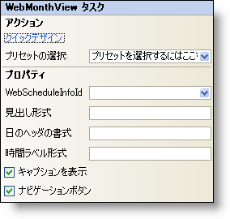

////

|metadata|
{
    "name": "webmonthview-smart-tag",
    "controlName": ["WebSchedule"],
    "tags": ["Design Environment","Scheduling"],
    "guid": "{3BC934B7-FE59-44C8-B6BC-DBBD38C24C9F}",  
    "buildFlags": [],
    "createdOn": "2005-04-11T00:00:00Z"
}
|metadata|
////

= WebMonthView スマート タグ

Visual Studio 2005（.NET Framework 2.0）では、{ProductName}の個々のコントロール／コンポーネントにはスマートタグがあります。コントロールやコンポーネントを選択するだけで、スマート タグのアンカーが表示されます。このアンカーをクリックするとポップアップ パネルが表示され、そこからコントロール/コンポーネントの最もよく使うプロパティや設定にすばやく簡単にアクセスできます。

WebMonthView™ のスマートタグには次のセクションが含まれています。

* アクション -- よく使うタスク（クイック デザイナーへのアクセス、プリセットのロードなど）を実行できます。
* ［プロパティ］ -- よく使うプロパティ（Caption Formatなど）への容易なアクセスを提供します。

各セクションの項目（フィールド、ドロップダウン リスト、チェックボックスなど）の説明と、各項目が対応するプロパティ グリッドのプロパティについては、以下の表を参照してください。

[options="header", cols="a,a,a"]
|====
|アクション|説明|対応するプロパティ

|クイック デザイン
|［クイック デザイン］をクリックすると、クイック デザイナーが表示されます。これは、コントロールを右クリックしてコンテキスト メニューから ［クイック デザイン］ を選択するのと同じです。
|なし

|プリセットの選択
|「ここをクリック」リンクをクリックして、UltraWebTab のプリセットを素早く選択します。これは、クイック デザイナーを開いて ［プリセット］ を展開してから ［プリセットの管理］ をクリックするのと同じです。
|なし

|====

[options="header", cols="a,a,a"]
|====
|プロパティ|説明|対応するプロパティ

|WebScheduleInfoID
|WebScheduleの各ビューは、WebScheduleInfoが適切に機能する必要があります。WebフォームにすでにWebScheduleInfoがある場合、WebScheduleInfoIDドロップダウンに表示されます。
| pick:[asp-net="link:{ApiPlatform}webui.webschedule{ApiVersion}~infragistics.webui.webschedule.webscheduleviewbase~webscheduleinfo.html[WebScheduleInfoID]"] 

|キャプションフォーマット
|WebMonthViewでキャプションの形式を変更します。「M」、「d」、｢y」の文字を使用します。
| pick:[asp-net="link:{ApiPlatform}webui.webschedule{ApiVersion}~infragistics.webui.webschedule.webscheduleviewbase~captionheadervisible.html[CaptionFormatString]"] 

|日ヘッダーフォーマット
|各日にはヘッダーがあり、ヘッダーの形式は変更できます。「M」、「d」、｢y」の文字を使用します。
| pick:[asp-net="link:{ApiPlatform}webui.webschedule{ApiVersion}~infragistics.webui.webschedule.dayorientedscheduleview~dayheaderformatstring.html[DayHeaderFormatString]"] 

|時間ラベルフォーマット
|予定が特定の日に発生すると、予定が発生する日に時間が表示されます。「h」、｢H」および「m」の文字が付いているタイムラベルの形式を変更できます。デフォルトは「HH:mm」です。
| pick:[asp-net="link:{ApiPlatform}webui.webschedule{ApiVersion}~infragistics.webui.webschedule.dayorientedscheduleview~timelabelformatstring.html[TimeLabelFormatString]"] 

|キャプションを表示
|チェックボックスをオンにすると、キャプションが表示されます。
| pick:[asp-net="link:{ApiPlatform}webui.webschedule{ApiVersion}~infragistics.webui.webschedule.webscheduleviewbase~captionheadervisible.html[CaptionHeaderVisible]"] 

|ナビゲーションボタン
|カレンダー上部にある月のナビゲーションボタンの表示/非表示を切り替えます。
| pick:[asp-net="link:{ApiPlatform}webui.webschedule{ApiVersion}~infragistics.webui.webschedule.webscheduleviewbase~navigationbuttonsvisible.html[NavigationButtonsVisible]"] 

|====