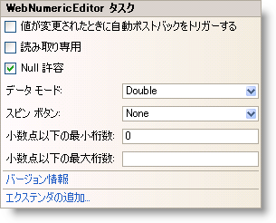

////

|metadata|
{
    "name": "webnumericeditor-webnumericeditor-smart-tag",
    "controlName": ["WebNumericEditor"],
    "tags": [],
    "guid": "{D3520890-37F5-4C74-A2A8-18353ED8E1D9}",  
    "buildFlags": [],
    "createdOn": "2009-03-06T10:04:25Z"
}
|metadata|
////

= WebNumericEditor スマート タグ

Visual Studio 2005/2008（.NET Framework 2.0/3.5）では、{ProductName} の個々のコントロール/コンポーネントにはスマート タグがあります。コントロールやコンポーネントを選択することで、スマート タグのアンカーが表示されます。このアンカーをクリックするとポップアップ パネルが表示され、そこからコントロール/コンポーネントの最もよく使うプロパティや設定にすばやく簡単にアクセスできます。

WebNumericEditor™ のスマート タグには次の項目が含まれています。

* 値の変更時に自動ポストバック -- ValueChanged イベントに適用される自動ポストバック オプションを設定できます。
* 読み取り専用 -- エンドユーザーがコントロールのテキストを編集できるかどうかを構成することができます。
* Nullable -- null 値のサポートおよび Value プロパティに System.Nullable を使用する機能を提供します。
* データ モード -- エディターで値を折り返すためのオブジェクトのタイプを設定できます。
* スピン ボタン -- スピン ボタンの表示状態および位置を設定できます。
* 小数点以下の最小桁数 -- コントロールがフォーカスを失ったときにエディターに表示する小数点以下の最小桁数を設定することができます。
* 小数点以下の最大桁数 -- コントロールがフォーカスを失ったときにエディターに表示する小数点以下の最大桁数を設定することができます。NumericEditorProvider の MaxDecimalPlaces は 0 から 20 までの値のみサポートします。

WebNumericEditor のスマート タグには次のリンクが含まれています。

* バージョン情報 -- これをクリックすると WebNumericEditor 製品情報が開きます。状態、バージョン、有効期限、製品キーなどの情報を含みます。
* エクステンダーを追加 -- これをクリックすると、WebNumericEditor と使用可能なすべてのコントロール エクステンダーを表示するダイアログを表示します。

項目の説明と、プロパティ グリッドの各項目が対応するプロパティについては、以下の表を参照してください。

[options="header", cols="a,a,a"]
|====
|項目|説明|対応するプロパティ

|値の変更時に自動ポストバック
|ValueChanged イベントに適用される自動ポストバック オプションを取得/設定します。
|*ValueChanged (AutoPostBackFlags)*

|読み取り専用
|エンドユーザーがコントロールのテキストを編集する機能を取得または設定します。
|*ReadOnly*

|Nullable
|null 値のサポートおよび Value プロパティに System.Nullable を使用する機能を取得または設定します。
|*Nullable*

|データ モード
|Value プロパティをラップするために使用されるオブジェクト型を取得または設定します。
|*DataMode*

|スピン ボタン
|スピン ボタンの表示状態および位置を取得または設定します。
|*SpinButtonsDisplay (Buttons)*

|小数点以下の最小桁数
|コントロールがフォーカスを失った時にテキストに使用される小数点以下の最小桁数を取得/設定することができます。
|*MinDecimalPlaces*

|小数点以下の最大桁数
|コントロールがフォーカスを失った時にテキストに使用される小数点以下の最大桁数を取得/設定することができます。
|*MaxDecimalPlaces*

|====