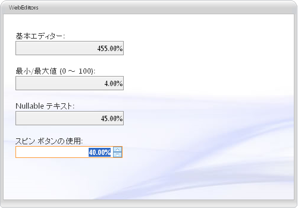

////

|metadata|
{
    "name": "webpercenteditor-about-webpercenteditor",
    "controlName": ["WebPercentEditor"],
    "tags": ["Editing","Getting Started"],
    "guid": "{F66F703C-DE62-49D2-B6A6-CCC3FABF49B9}",  
    "buildFlags": [],
    "createdOn": "2009-03-06T13:15:15Z"
}
|metadata|
////

= WebPercentEditor について

WebPercentEditor™ はパーセントの編集機能を可能にするエディター コントロールで、さまざまな外観および動作ベースのプロパティを提供します。WebPercentEditor は優れたパフォーマンスと応答性の高いエンドユーザー エクスペリエンスを促進する証明済みのコード ベースを利用するために {ProductName} AJAX フレームワークを使用して構築されます。 pick:[asp-net="link:{ApiPlatform}web{ApiVersion}~infragistics.web.ui.editorcontrols_namespace.html[Infragistics.Web.UI.EditorControls]"]  名前空間で WebPercentEditor を見つけることができます。

すべての {ProductName} AJAX コントロールのように、WebPercentEditor は Infragistics® Application Styling Framework にシームレスに統合します。CSS ベースのプロパティを使用すると、既存のスタイルシートを利用することによって、WebPercentEditor を手動でカスタマイズできます。

WebPercentEditor は、クライアント側の JavaScript プログラミング環境に堅牢なモデルも公開します。クライアント サイド オブジェクトモデル（CSOM）は、十分な機能を備えたプロパティとメソッドで構成され、開発者はサーバー側でポストバックしなくても、重要な機能単位をプログラムできます。

WebPercentEditor コントロールの機能の一部には以下が含まれます:

* *ハイパフォーマンス* -- 軽量のマークアップと最適化されたコードがパフォーマンスを向上します。
* *スピン ボタン* -- エンドユーザーは値のリストを簡単にスピンできます。
* *標準的なバリデーターのサポート* -- ASP.NET バリデーター コントロールをサポートします。
* *NegativeCssClass* -- これは値が負の時にエディターに適用されます。
* *DisplayFactor* -- 乗数を値に適用します（サポートされる値のリスト: 1、10、100、1000、10000、100000、1000000）。
* *最大値と最小値* -- エディターに入力できる許容可能な範囲を簡単に指定できます。
* *Min および Max DecimalPlaces* -- コントロールがフォーカスを失った時に表示される小数点以下の最大および最小桁数を設定することができます。
* *DataMode* -- コントロールで値を折り返すために使用されるオブジェクトのタイプを設定できます。
* *SelectionOnFocus* -- 編集モードに入ると必ず異なる選択タイプを設定できます。
* *MaxLength* -- コントロールに入力できるテキスト文字列の最大長を設定できます。
* *カルチャー* -- ローカライズされたフォーマットのためにコントロールによって使用される CultureInfo オブジェクトを設定できます。