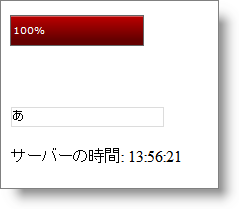

////

|metadata|
{
    "name": "webprogressbar-using-webprogressbar-as-an-ajax-progress-indicator",
    "controlName": ["WebProgressBar"],
    "tags": [],
    "guid": "{E149C0B7-AEBC-45DE-87E8-004D47E6B8A8}",  
    "buildFlags": [],
    "createdOn": "2009-03-03T16:25:59Z"
}
|metadata|
////

= 進行インジケータとして WebProgressBar を使用

== 始める前に

WebProgressBar™ は Ajax ポストバックの進行状況を視覚的に表示するために使用できます。たとえば、AJAX リクエストをサーバーに行い、ある程度時間がかかると予測される場合、進行状況インジケーターとして WebProgressBar を使用できます。

この詳細なガイドでは、ユーザーが WebTextEdit™ に入力すると常に、フェッチおよび Label コントロールにサーバー時間を表示するためにカスタム AJAX リクエストが作成されます。この AJAX リクエストは WebProgressBar を使用して監視されます。

== 達成すること

WebProgressBar を使用して AJAX リクエストの進行状況を示す方法を学習します。

== 次の手順を実行します

[start=1]
. Visual Studio™ ツールボックスから、ScriptManager コンポーネント、WebProgressBar コントロール、WebTextEdit コントロールおよびラベル コントロールをフォームにドラッグ アンド ドロップします。WebTextEdit コントロールに textedit、またラベル コントロールに lblMsg と名前を付けます。
[start=2]
. WebTextEdit の TextChanged クライアント側イベントの Javascript ハンドラを追加します。プロパティ ウィンドウで ClientSideEvents を展開し、TextChanged プロパティを指定して、これを実行できます。ドロップダウンから [新しいハンドラを追加...] を選択します。これで Aspx ソースに textedit_TextChanged という名前の Javascript 関数が自動的に作成されます。
[start=3]
. 以下のコード実装で textedit_TextChanged JavaScript 関数を更新します。

*JavaScript の場合：*

[source]
----
var timeoutId = null;
var objRequest = null;
function textedit_TextChanged(oEdit, newText, oEvent) {
	//setTimeout を使用して設定したタイムアウト設定をクリアします 
	//WebProgressBar でのメソッド
	if (timeoutId) {
		window.clearTimeout(timeoutId);
		timeoutId = null;
	}
----

[source]
----
	// WebTextEdit の参照を取得します
	var textedit = igedit_getById(oEdit);
	if (window.XMLHttpRequest) {
		//すべての新しいブラウザ用のコード
		objRequest = new XMLHttpRequest();
	}
	else if (window.ActiveXobject) {
		//IE5 以降用のコード
		objRequest = new ActiveXObject("Microsoft.XMLHTTP");
	}
	if (objRequest == null)
		return;
	//XMLHttp オブジェクトの状態が変わる時に関数を起動します
	objRequest.onreadystatechange = ProcessResponse;
	//サーバーとの接続を開きます
	objRequest.open("GET", "Default.aspx?GetTime=true", true);
	objRequest.send(null);
}
----

上記のコードでは、

** 最初に 2 つのグローバル変数が作成されます。ひとつは、タイムアウト設定を指定する整数を保持するための timeoutId、もうひとつは Web ページがロードされた後にサーバーと直接通信するために使用される XMLHttpRequest オブジェクトを保持するための objRequest です。
** TextChanged 関数では、最初に setTimeout メソッドを使用して設定されたタイムアウト設定がクリアされます。
** 次に、ブラウザに基づいて新しい XMLHttpRequest オブジェクトが作成され、objRequest 変数に保存されます。
** 次にリクエストが準備されて送付されます。リクエストの準備中、XMLHttpRequest オブジェクトの状態を変更すると ProcessResponse という名前の関数が起動されます。ProcessResponse という関数が次の手順で実装されます。open メソッドでは、“GetTime=true” はサーバーでチェックされる HTTP クエリ文字列の値です。

[start=4]
. javascript ブロックで以下の関数 ProcessResponse を追加します。

*JavaScript の場合：*

[source]
----
function ProcessResponse() {
	var progressBar = $find("WebProgressBar1");
	var currentValue = progressBar.get_progressValue() + 5;
	if(currentValue < 100)
		progressBar.set_progressValue(currentValue);
	else {
		currentValue = 99;
		progressBar.set_progressValue(currentValue);
	}
----

[source]
----
	//リクエストが完全に処理されている場合
	if(objRequest.readyState == 4) {
		//リクエストが成功かどうかをチェックします  
		if (objRequest.status == 200) {
			var lblMesg = document.getElementById("<%=lblMsg.ClientID%>");
			lblMesg.innerHTML = "Server Time is : " + objRequest.responseText;
			progressBar.set_progressValue(100);
----

[source]
----
if (timeoutId == null)
				timeoutId = window.setTimeout(reset,1000);
		}
	}
}
----

ProcessResponse 関数では、WebProgressBar の値は、リクエストが完全に処理されるまで 5 ずつ増加されます。

*注：* WebProgressBar のデフォルト値は、0（最小値）と 100（最大値）です。

リクエストが完全に処理されて成功すると、ラベルはサーバーから送付される時間を表示します。次に、プログレス バーの値は 100 に設定され、リクエストが完了したことを示します。プログレス バーの値は 1000 ミリ秒後に ‘reset’ 関数を評価するために setTimeout メソッドを呼び出すことで 0 に再びリセットされるので、ユーザーは別の AJAX 呼び出しの進行状況を確認できます。次の手順で、‘reset’ 関数が実装されます。
[start=5]
. reset 関数は、以下に示すように WebProgressBar の値を 0 に設定します。

*JavaScript の場合：*

----
function reset() {
	var pbar = $find("WebProgressBar1");
	pbar.set_progressValue(0);
}
----

[start=6]
. この手順では、サーバーのリクエストを受け付けるだけでなくエンドユーザーへの応答を表示するコードが記述されます。次のコードをページ ロード イベントに追加します。

*Visual Basic の場合：*

----
'ページがキャッシュされないようにすると、リクエストが
'毎回サーバーに送付されます。
Response.Cache.SetCacheability(HttpCacheability.NoCache)
if (Request.QueryString["GetTime"] == "true")
{
	Response.Clear()
	Response.Write(DateTime.Now.ToLongTimeString())
	Response.End()
}
----

*C# の場合：*

----
//ページがキャッシュされないようにすると、リクエストが
//毎回サーバーに送付されます
Response.Cache.SetCacheability(HttpCacheability.NoCache);
if (Request.QueryString["GetTime"] == "true")
{
	Response.Clear();
	Response.Write(DateTime.Now.ToLongTimeString());
	Response.End();
}
----

上記のコードでは、リクエストの HTTP クエリ文字列の値が検証され、応答としてサーバー時間が返されます。
[start=7]
. アプリケーションを保存して実行します。ユーザーが WebTextEdit に入力するとラベルがサーバーから更新された時間を表示することを確認します。

*TextEdit に入力前：*

image::images/WebProgressBar_Using_WebProgressBar_as_Ajax_Progress_Indicator_01.png[]

*TextEdit に入力後：*

