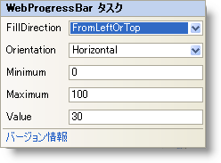

////

|metadata|
{
    "name": "webprogressbar-webprogressbar-smart-tag",
    "controlName": ["WebProgressBar"],
    "tags": ["Design Environment"],
    "guid": "{E70AAE4B-5785-4077-AEE7-8DB25544E358}",  
    "buildFlags": [],
    "createdOn": "0001-01-01T00:00:00Z"
}
|metadata|
////

= WebProgressBar スマート タグ

Visual Studio 2005/2008（.NET Framework 2.0/3.5）では、{ProductName} の個々のコントロール/コンポーネントにはスマート タグがあります。コントロールやコンポーネントを選択することで、スマート タグのアンカーが表示されます。このアンカーをクリックするとポップアップ パネルが表示され、そこからコントロール/コンポーネントの最もよく使うプロパティや設定にすばやく簡単にアクセスできます。

WebProgressBar™ のスマート タグには次の項目が含まれています。

* FillDirection -- プログレス バーの塗りつぶし方向。
* Orientation – WebProgressBar の方向。
* Minimum-- WebProgressBar の開始値。
* Maximum – WebProgressBar の終了値。
* Value – バーの現在の進行状況。

WebProgressBar のスマート タグには次のリンクが含まれています。

* About -- これをクリックすると WebProgressBar 製品情報が開きます。状態、バージョン、有効期限、製品キーなどの情報を含みます。

項目の説明と、プロパティ グリッドの各項目が対応するプロパティについては、項目（たとえば、フィールド、ドロップダウン リスト）の以下の表を参照してください。

[options="header", cols="a,a,a"]
|====
|項目|説明|対応するプロパティ

|FillDirection
|ドロップダウン リストによって、進行状況バーを塗りつぶしたい方向を FromLeftOrTop または FromRightOrBottom のいずれかに選択できます。
|*FillDirection*

|方向
|ドロップダウン リストによって、WebProgressBar の方向を水平または垂直のいずれかに選択することができます。
|*Orientation*

|最小
|バーの開始値を指定できます。
|*Minimum*

|最大
|バーの終了値を指定できます。
|*Maximum*

|値
|バーの現在の進行状況を設定できます。
|*Value*

|====