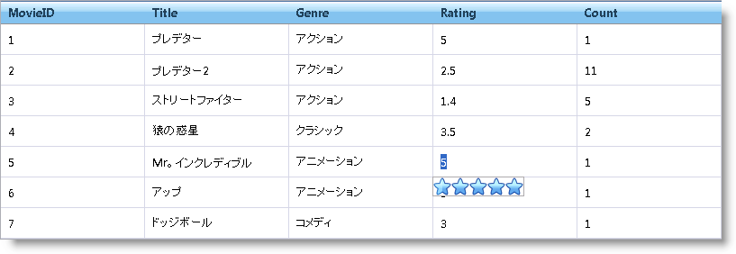

////

|metadata|
{
    "name": "webrating-editor-provider",
    "controlName": ["WebRating"],
    "tags": ["Editing","Selection"],
    "guid": "44e0c2cf-8cc1-4750-b326-0ae308054bb6",  
    "buildFlags": [],
    "createdOn": "2010-06-01T05:45:24.8737753Z"
}
|metadata|
////

= WebRating エディタ プロバイダー

WebRating コントロールはデータのエディタとして機能します。エンドユーザーの操作に基づいてコントロールは情報を記録します。WebRating はエディタ プロバイダーとして使用可能です。したがって {ProductName} グリッドコントロールの埋め込みエディタとして使用できます。

エディタ プロバイダーとして WebRating を使用するプロセスは、その他のエディタ プロバイダーを使用するプロセスと同じです。エディタ プロバイダーの詳細は、 link:webdatagrid-editor-providers.html[エディター プロバイダー]を参照してください。

エディタ プロバイダーとして WebRating を使用するには、 pick:[asp-net="link:{ApiPlatform}web{ApiVersion}~infragistics.web.ui.gridcontrols.webdatagrid~editorproviders.html[EditorProviders]"]  プロパティを使用することによって、 pick:[asp-net="link:{ApiPlatform}web{ApiVersion}~infragistics.web.ui.gridcontrols.ratingeditorprovider.html[RatingEditorProvider]"]  オブジェクトをエディタ プロバイダー コレクションに追加します。オブジェクトの  pick:[asp-net="link:{ApiPlatform}web{ApiVersion}~infragistics.web.ui.gridcontrols.editorprovider`1~editorcontrol.html[EditorControl]"]  プロパティを使用してエディタの設定を有効にします。RatingEditorProvider オブジェクトの ID を、 pick:[asp-net="link:{ApiPlatform}web{ApiVersion}~infragistics.web.ui.gridcontrols.cellediting.html[CellEditing]"]  などの動作の列設定の  pick:[asp-net="link:{ApiPlatform}web{ApiVersion}~infragistics.web.ui.gridcontrols.columneditsetting~editorid.html[EditorID]"]  プロパティに指定します。これでエンドユーザーがセルを編集する時、WebRating コントロールがエディタとして現れます。

以下のコードは、CellEditing 動作のエディタ プロバイダーとして WebRating を使用する方法を示します。

*HTML の場合:*

----
<ig:webdatagrid ID="WebDataGrid1" 
            runat="server" 
            Height="350px" Width="800px" 
            DataKeyFields="MovieID"
            DataSourceID="SqlDataSource1"
            >
            <Behaviors>
                <ig:editingcore Enabled="true">
                    <Behaviors>
                    <%-- Use WebRating as editor provider --%>
                    <ig:CellEditing Enabled="true">
                            <ColumnSettings>
                                <ig:EditingColumnSetting ColumnKey="Rating" EditorID="WebDataGrid1_RatingProvider1" />
                            </ColumnSettings>
                        </ig:CellEditing>
                    </Behaviors>
                </ig:editingcore>
            </Behaviors>
            <%-- Add a rating editor provider --%>
            <EditorProviders>
                <ig:RatingEditorProvider ID="WebDataGrid1_RatingProvider1">
                    <EditorControl runat="server" EnableContinuousSelection="true" Precision="Half">
                    </EditorControl>
                </ig:RatingEditorProvider>
            </EditorProviders>
        </ig:webdatagrid>
----

ユーザーがセルで編集モードを開始すると、編集のためにセルの下に WebRating コントロールが表示します。

