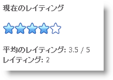

////

|metadata|
{
    "name": "webrating-getting-started-with-webrating",
    "controlName": ["WebRating"],
    "tags": ["Getting Started","Selection"],
    "guid": "f216753f-526b-442d-ae23-12bed6b800ae",  
    "buildFlags": [],
    "createdOn": "2010-06-01T04:44:59.3037535Z"
}
|metadata|
////

= WebRating で開始

== 始める前に

WebRating™ コントロールはユーザーがコントロールを操作に関する平均および投票数を記録します。このコントロールは、それぞれ  pick:[asp-net="link:{ApiPlatform}web{ApiVersion}~infragistics.web.ui.editorcontrols.webrating~average.html[Average]"]  プロパティと  pick:[asp-net="link:{ApiPlatform}web{ApiVersion}~infragistics.web.ui.editorcontrols.webrating~votecount.html[VoteCount]"]  プロパティでユーザーの平均評価値と投票数合計を保存します。

== 達成すること

ユーザーの評価を記録するように WebRating を設定する方法を学習します。

== 以下の手順を実行します

[start=1]
. WebRating コントロールを Visual Studio Toolbox からページにドラッグします。
[start=2]
. 以下のオプションを付けて WebRating コントロールを設定します。

..  pick:[asp-net="link:{ApiPlatform}web{ApiVersion}~infragistics.web.ui.editorcontrols.webrating~autopostbackflags.html[AutoPostBackFlags]"] . pick:[asp-net="link:{ApiPlatform}web{ApiVersion}~infragistics.web.ui.editorcontrols.ratingautopostbackflags~rated.html[Rated]"]  プロパティを Async に設定します。この設定によって、評価項目がクリックされるたびに WebRating はサーバーにポストバックします。これによってコントロールはエンドユーザーの平均と投票数を追跡することが可能となります。
..  pick:[asp-net="link:{ApiPlatform}web{ApiVersion}~infragistics.web.ui.editorcontrols.ratingclientevents~rated.html[Rated]"]  クライアント側イベントを処理します。イベント ハンドラーで、ユーザーの投票数と平均評価をページに表示します。

*HTML の場合:*

----
<ig:WebRating ID="WebRating1" runat="server" AutoPostBackFlags-Rated ="Async" >
   <ClientEvents Rated="WebRating1_RatedEventHandler" />
</ig:WebRating>
----

[start=3]
. Rated イベント ハンドラーに次のコードを追加します。

*JavaScript の場合*

----
function WebRating1_RatedEventHandler(webRating, args) {
        var scoreLabel = $get("Score");
        var countLabel = $get("VoteCount");
        var average = webRating.get_average();
        var count = webRating.get_voteCount();
        var max = webRating.get_maximumValue();
        scoreLabel.innerHTML = average + " / " + max;
        countLabel.innerHTML = " " + count;
}
----

[start=4]
. 3 つのスパン要素をページに追加して情報をユーザーに表示します。この時点で、ページは次のようになります。

*HTML の場合:*

----

現在のレイティング
 
 

   <ig:WebRating ID="WebRating1" runat="server" AutoPostBackFlags-Rated="Async" >
               <ClientEvents Rated="WebRating1_RatedEventHandler" />
   </ig:WebRating>

 
平均のレイティング

 
レイティング回数

----

[start=5]
. アプリケーションを実行します。ユーザーが評価項目をクリックした時に、ページにユーザーの平均評価と投票数を表示します。

