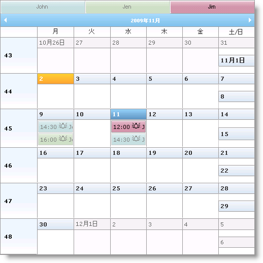
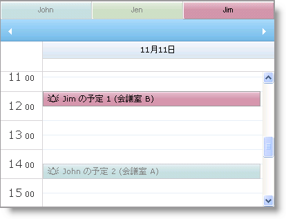

////

|metadata|
{
    "name": "webschedule-about-multi-resource-view",
    "controlName": ["WebSchedule"],
    "tags": ["Getting Started","Scheduling"],
    "guid": "{CEAF1CBC-0408-487D-93DD-63B79A3E8C3B}",  
    "buildFlags": [],
    "createdOn": "0001-01-01T00:00:00Z"
}
|metadata|
////

= マルチリソース ビューについて

WebSchedule™ コントロール (WebDayView™ および WebMonthView™) によって、複数のリソースからスケジュール情報を表示できます。マルチリソース ビューを有効にするには、WebScheduleInfo™ コンポーネントの link:{ApiPlatform}webui.webschedule{ApiVersion}~infragistics.webui.webschedule.webscheduleinfo~enablemultiresourceview.html[EnableMultiResourceView] プロパティを True に設定します。

== オーバーレイ モード

オーバーレイ モードによってエンドユーザーは異なるリソースのスケジュール情報をひとつのビューで見ることができます。アクティブなリソースは非アクティブなリソースと区別するために一意なスタイルで表示されます。アクティブなリソースと非アクティブなリソースのスタイルのカスタマイズに関する詳細は、 link:webschedule-styling-active-and-inactive-resources.html[「アクティブおよび非アクティブ リソースのスタイル」]を参照してください。

タブ コントロールによって、異なるリソース間を切り替えることができます。 link:{ApiPlatform}webui.webschedule{ApiVersion}~infragistics.webui.webschedule.webdayview~enablemultiresourcecaption.html[EnableMultiResourceCaption] を True または False に設定してこの動作を制御します。

図 1 - WebMonthView。

図 2 - WebDayView。

== イベント

WebScheduleInfo コンポーネントには、WebSchedule コントロールで表示されるスケジュール情報で Resource オブジェクトを保持する link:{ApiPlatform}webui.webschedule{ApiVersion}~infragistics.webui.webschedule.webscheduleinfo~visibleresources.html[VisibleResource] コレクションが含まれます。ユーザーが希望する情報だけを示すために VisibleResource コレクションを操作するための WebScheduleInfo の link:{ApiPlatform}webui.webschedule{ApiVersion}~infragistics.webui.webschedule.webscheduleinfo~resourcesfetched_ev.html[ResourcesFetched] イベントを処理できます。ページの PreLoad イベントのコレクションにリソースを入力することもできます。このイベントの処理についての詳細は、 link:webschedule-set-visible-resources.html[「表示可能なリソースを設定」]を参照してください。

リソースで作業する場合、以下のイベントを使用できます。

link:{ApiPlatform}webui.webschedule{ApiVersion}~infragistics.webui.webschedule.webscheduleinfoclientevents~activeresourcechanging.html[ActiveResourceChanging] – アクティブ リソースが変更されようとすると、クライアント側イベントが起動されます。

link:{ApiPlatform}webui.webschedule{ApiVersion}~infragistics.webui.webschedule.webscheduleinfo~activeresourcechanging_ev.html[ActiveResourceChanging] – アクティブ リソースが変更されようとすると、サーバー側イベントが起動されます。

link:{ApiPlatform}webui.webschedule{ApiVersion}~infragistics.webui.webschedule.webscheduleinfoclientevents~activeresourcechanged.html[ActiveResourceChanged] – アクティブ リソースが変更された後、クライアント側イベントが起動されます。

link:{ApiPlatform}webui.webschedule{ApiVersion}~infragistics.webui.webschedule.webscheduleinfo~activeresourcechanged_ev.html[ActiveResourceChanged] – アクティブ リソースが変更された後、サーバー側イベントが起動されます。

次のコードは、複数のリソース ビューを有効にする方法を示します。

*HTML の場合:*

----
<igsch:webscheduleinfo runat="server" ID="WebScheduleInfo1" 
    EnableMultiResourceView="True" EnableSmartCallbacks="True" >
</igsch:webscheduleinfo>
----

*Visual Basic の場合：*

----
Protected Sub Page_Init(ByVal sender As Object, ByVal e As EventArgs)
    If Not Page.IsPostBack Then
        Me.WebScheduleInfo1.EnableMultiResourceView = True
    End If
End Sub
----

*C# の場合：*

----
protected void Page_Init(object sender, EventArgs e)
{
    if (!Page.IsPostBack)
    {
        this.WebScheduleInfo1.EnableMultiResourceView = true;
    }
}
----

== 関連トピック

link:webschedule-styling-active-and-inactive-resources.html[アクティブおよび非アクティブ リソースのスタイル]

link:webschedule-set-visible-resources.html[表示可能なリソースを設定]