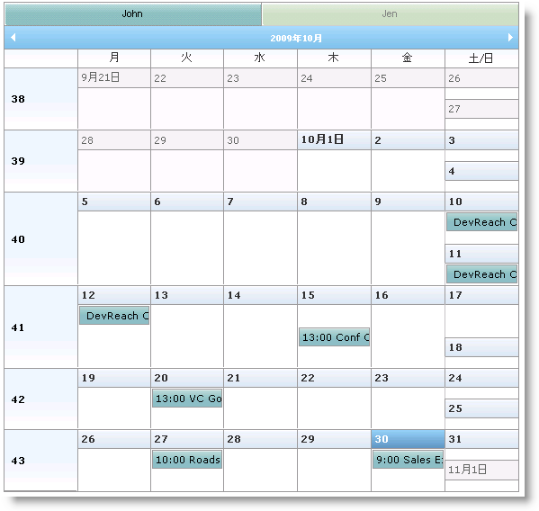

////

|metadata|
{
    "name": "webschedule-binding-to-a-data-set-with-webschedulegenericdataprovider",
    "controlName": ["WebSchedule"],
    "tags": ["Data Binding","How Do I","Scheduling"],
    "guid": "{2C2C7BB6-A1AF-439B-8EDA-1E8BB0DCB405}",  
    "buildFlags": [],
    "createdOn": "0001-01-01T00:00:00Z"
}
|metadata|
////

= WebScheduleGenericDataProvider を使用して WebSchedule をデータ セットへのバインディング

== 始める前に

WebScheduleGenericDataProvider™ コンポーネントによって、ユーザーが選択したカスタム データ ソースにバインドすることができます。WebScheduleInfo コンポーネントは、WebSchedule™ データ ソースを構成するために以下のプロパティをユーザーに提供します。

* link:{ApiPlatform}webui.webscheduledataprovider{ApiVersion}~infragistics.webui.data.webschedulegenericdataprovider~activitydatasource.html[ActivityDataSource]/ link:{ApiPlatform}webui.webscheduledataprovider{ApiVersion}~infragistics.webui.data.webschedulegenericdataprovider~activitydatasourceid.html[ActivityDataSourceID]
* link:{ApiPlatform}webui.webscheduledataprovider{ApiVersion}~infragistics.webui.data.webschedulegenericdataprovider~resourcedatasource.html[ResourceDataSource]/ link:{ApiPlatform}webui.webscheduledataprovider{ApiVersion}~infragistics.webui.data.webschedulegenericdataprovider~resourcedatasourceid.html[ResourceDataSourceID]
* link:{ApiPlatform}webui.webscheduledataprovider{ApiVersion}~infragistics.webui.data.webschedulegenericdataprovider~variancedatasource.html[VarianceDataSource]/ link:{ApiPlatform}webui.webscheduledataprovider{ApiVersion}~infragistics.webui.data.webschedulegenericdataprovider~variancedatasourceid.html[VarianceDataSourceID]

さらに、WebScheduleGenericDataProvider コンポーネントは、WebScheduleInfo の対応するオブジェクトに割り当てるデータ バインディング プロパティを設定するためにユーザーに link:{ApiPlatform}webui.webscheduledataprovider{ApiVersion}~infragistics.webui.data.appointmentbinding.html[AppointmentBinding]、 link:{ApiPlatform}webui.webscheduledataprovider{ApiVersion}~infragistics.webui.data.resourcebinding.html[ResourceBinding]、および link:{ApiPlatform}webui.webscheduledataprovider{ApiVersion}~infragistics.webui.data.variancebinding.html[VarianceBinding] オブジェクトを提供します。これらのプロパティによって、バインドするためのデータ フィールドなどを指定できます。データ テーブルの列またはデータ オブジェクトのプロパティの名前が、WebScheduleGenericDataProvider によって期待される名前と一致する場合、データ バインディングは自動的に行われ、データ フィールドを明示的に定義する必要はありません。これらの名前のリストについては、 link:webschedule-data-model-for-webschedule-generic-data-provider.html[WebSchedule の汎用データ プロバイダーのデータ モデル]を参照してください。

データ オブジェクトにバインドする場合、アクティビティ ID およびバリアンス ID をそれぞれ指定するために、 link:{ApiPlatform}webui.webschedule{ApiVersion}~infragistics.webui.webschedule.webscheduleinfo~activityadding_ev.html[ActivityAdding] および link:{ApiPlatform}webui.webschedule{ApiVersion}~infragistics.webui.webschedule.webscheduleinfo~varianceadding_ev.html[VarianceAdding] イベントを処理します。

WebScheduleGenericDataProvider についての詳細は、 link:webschedulegenericdataprovider-about-webschedulegenericdataprovider.html[「WebScheduleGenericDataProvider について」]を参照してください。

== 達成すること

アクティビティ、リソース、およびバリアンス情報で DataSet オブジェクトに WebMonthView™ をバインドするために WebScheduleGenericDataProvider を使用する方法を学習します。

== 次の手順を実行します

[start=1]
. ASP.NET Web サイトを作成します。
[start=2]
. Microsoft® Visual Studio™ ツールボックスからページに WebScheduleInfo コンポーネントをドラッグします。
[start=3]
. WebMonthView コントロールをページにドラッグします。
[start=4]
. WebScheduleGenericDataProvider コンポーネントをページにドラッグします。
[start=5]
. スマート コールバックを有効にし、 link:{ApiPlatform}webui.webschedule{ApiVersion}~infragistics.webui.webschedule.webscheduleinfo~activityadding_ev.html[ActivityAdding] および link:{ApiPlatform}webui.webschedule{ApiVersion}~infragistics.webui.webschedule.webscheduleinfo~varianceadding_ev.html[VarianceAdding] イベントを処理するために WebScheduleInfo を設定します。

*HTML の場合:*

----
<igsch:webscheduleinfo runat="server" ID="WebScheduleInfo1" EnableSmartCallbacks="true" 
    OnActivityAdding="WebScheduleInfo1_ActivityAdding" 
    EnableRecurringActivities="true" 
    EnableMultiResourceView="true" onvarianceadding="WebScheduleInfo1_VarianceAdding"
    >
</igsch:webscheduleinfo>
----

[start=6]
. ActivityAdding イベント ハンドラの Activity オブジェクトの ID を作成します。Activity データ ソースに追加できるようになる前に Activity オブジェクトは ID を必要とします。イベント ハンドラで一意の ID を指定してください。この手順で System.Data 名前空間の using/import ステートメントを含める必要があります。

*Visual Basic の場合：*

----
Protected Sub WebScheduleInfo1_ActivityAdding(ByVal sender As Object, ByVal e As CancelableActivityEventArgs)
    Dim ds As DataSet = TryCast(Me.Session("ds"), DataSet)
    Dim rowCount As Integer = ds.Tables("Appointments").Rows.Count
    Dim lastId As Integer = CInt(ds.Tables("Appointments").Rows(rowCount - 1)(0))
    e.Activity.DataKey = lastId + 1
End Sub
----

*C# の場合：*

----
protected void WebScheduleInfo1_ActivityAdding(object sender, CancelableActivityEventArgs e)
{
    DataSet ds = this.Session["ds"] as DataSet;
    int rowCount = ds.Tables["Appointments"].Rows.Count;
    int lastId = (int)ds.Tables["Appointments"].Rows[rowCount - 1][0];
    e.Activity.DataKey = lastId + 1;
}
----

[start=7]
. VarianceAdding イベント ハンドラのバリアンスの ID を作成します。

*Visual Basic の場合：*

----
Protected Sub WebScheduleInfo1_VarianceAdding(ByVal sender As Object, ByVal e As CancelableActivityEventArgs)
    e.Activity.DataKey = New Random().[Next]()
End Sub
----

*C# の場合：*

----
protected void WebScheduleInfo1_VarianceAdding(object sender, CancelableActivityEventArgs e)
{
    e.Activity.DataKey = new Random().Next();
}
----

[start=8]
. WebScheduleInfo コンポーネントで関連づけるために、WebScheduleGenericDataProvider の link:{ApiPlatform}webui.webscheduledataprovider{ApiVersion}~infragistics.webui.data.webscheduledataproviderbase~webscheduleinfoid.html[WebScheduleInfoID] プロパティを "WebScheduleInfo1" に設定します。

*HTML の場合:*

----
<ig_scheduledata:WebScheduleGenericDataProvider ID="WebScheduleGenericDataProvider1" runat="server"
WebScheduleInfoID="WebScheduleInfo1" >
<%--行うこと:データ バインディング オプションを設定します --%>
</ig_scheduledata:WebScheduleGenericDataProvider>
----

[start=9]
. WebMonthView の WebScheduleInfoID プロパティを "WebScheduleInfo1" に設定します。

*HTML の場合:*

----
<igsch:WebMonthView ID="WebMonthView1" runat='server' WebScheduleInfoID="WebScheduleInfo1">
</igsch:WebMonthView>
----

[start=10]
. 予定、リソース、およびバリアンスのデータ バインディング オプションを設定します。

.. AppointmentBinding、ResourceBinding、および VarianceBinding オブジェクトを作成します。
.. それぞれの DataKeyMember および DataMember プロパティを設定します。DataMember プロパティは、オブジェクトがバインドするデータ エンティティを定義し、DataKeyMember プロパティはデータ エンティティのプライマリ キー フィールドです。
.. 予定データに関係するフィールドをリソース データに定義するために、AppointmentBinding および VarianceBinding オブジェクトの ResourceKeyMember プロパティを設定します。VarianceBinding オブジェクトは、AppointmentBinding と同じデータ メンバーを使用することに注意してください。バリアンスは値に設定された OriginalStartDateTimeUtc フィールドがある予約にすぎないので、これを行うことができます。

*HTML の場合:*

----
<AppointmentBinding DataKeyMember="ID" DataMember="Appointments" ResourceKeyMember="ResourceKey" />
<ResourceBinding DataKeyMember="ID" DataMember="Resources"/>
<VarianceBinding DataKeyMember="ID" DataMember="Appointments" ResourceKeyMember="ResourceKey" />
----

[start=11]
. 最初のロードでページの Load イベントのアクティビティおよびリソース データを作成します。

.. DataSet オブジェクトを作成します。

*Visual Basic の場合：*

----
Dim ds As DataSet
If Not Page.IsPostBack Then
        ' 行うこと：データを作成し、データ セットに追加します。
    ds = New DataSet("GenericDataProviderSample")
End If
----

*C# の場合：*

----
DataSet ds;
if (!Page.IsPostBack)
{
    ds = new DataSet("GenericDataProviderSample");
// 行うこと：データを作成し、データ セットに追加します。
}
----

.. アクティビティ データを表すために DataTable オブジェクトを作成します。

*Visual Basic の場合：*

----
Dim appointmentsTable As New DataTable("Appointments")
appointmentsTable.Columns.Add("ID", GetType(Integer))
appointmentsTable.Columns.Add("StartDateTimeUtc", GetType(DateTime))
appointmentsTable.Columns.Add("Duration", GetType(Integer))
appointmentsTable.Columns.Add("Subject", GetType(String))
appointmentsTable.Columns.Add("AllDayEvent", GetType(Boolean))
appointmentsTable.Columns.Add("Location", GetType(String))
appointmentsTable.Columns.Add("ActivityDescription", GetType(String))
appointmentsTable.Columns.Add("Status", GetType(Integer))
appointmentsTable.Columns.Add("EnableReminders", GetType(Boolean))
appointmentsTable.Columns.Add("ShowTimeAs", GetType(Integer))
appointmentsTable.Columns.Add("Importance", GetType(Integer))
appointmentsTable.Columns.Add("VarianceID", GetType(String))
appointmentsTable.Columns.Add("RecurrencePattern", GetType(String))
appointmentsTable.Columns.Add("RecurrenceID", GetType(Integer))
appointmentsTable.Columns.Add("OriginalStartDateTimeUtc", GetType(DateTime))
appointmentsTable.Columns.Add("ResourceKey", GetType(String))
----

*C# の場合：*

----
DataTable appointmentsTable = new DataTable("Appointments");
appointmentsTable.Columns.Add("ID", typeof(int));
appointmentsTable.Columns.Add("StartDateTimeUtc", typeof(DateTime));
appointmentsTable.Columns.Add("Duration", typeof(int));
appointmentsTable.Columns.Add("Subject", typeof(string));
appointmentsTable.Columns.Add("AllDayEvent", typeof(bool));
appointmentsTable.Columns.Add("Location", typeof(string));
appointmentsTable.Columns.Add("ActivityDescription", typeof(string));
appointmentsTable.Columns.Add("Status", typeof(int));
appointmentsTable.Columns.Add("EnableReminders", typeof(bool));
appointmentsTable.Columns.Add("ShowTimeAs", typeof(int));
appointmentsTable.Columns.Add("Importance", typeof(int));
appointmentsTable.Columns.Add("VarianceID", typeof(string));
appointmentsTable.Columns.Add("RecurrencePattern", typeof(string));
appointmentsTable.Columns.Add("RecurrenceID", typeof(int));
appointmentsTable.Columns.Add("OriginalStartDateTimeUtc", typeof(DateTime));
appointmentsTable.Columns.Add("ResourceKey", typeof(string));
----

.. Appointments テーブルにデータを追加するためのユーティリティ関数を作成します。

*Visual Basic の場合：*

----
Protected Function CreateAppointment(ByVal id As Integer, ByVal startDateTime As DateTime, ByVal appointmentDuration As Integer, ByVal appName As String, ByVal location As String, ByVal appDescription As String, _
ByVal allDayEvent As Boolean) As Object()
Return New Object() {id, startDateTime.ToUniversalTime(), appointmentDuration, appName, allDayEvent, location, _
        appDescription, 1, False, 1, 1, Guid.NewGuid().ToString(), _
"", Nothing, Nothing, "-999"}
End Function
----

*C# の場合：*

----
protected object[] CreateAppointment(int id, DateTime startDateTime, int appointmentDuration,
string appName, string location, string appDescription, bool allDayEvent)
{
	return new object[] 
    { 
        id, 
        startDateTime.ToUniversalTime(), 
        appointmentDuration, 
        appName, 
        allDayEvent, 
        location, 
        appDescription, 
        1, 
        false, 
        1, 
        1, 
        Guid.NewGuid().ToString(), 
        "", 
        null, 
        null, 
        "-999" 
    };
}
----

.. データを Appointments テーブルに追加します。

*Visual Basic の場合：*

----
appointmentsTable.Rows.Add(CreateAppointment(1, DateTime.Today.AddHours(9), 3600, "Sales Expo", "NYC", "Description", _
    False))
appointmentsTable.Rows.Add(CreateAppointment(2, DateTime.Today.AddDays(3).AddHours(14), 4000, "Win 7 Rollout ", "US", "Description", _
    False))
appointmentsTable.Rows.Add(CreateAppointment(3, DateTime.Today.AddDays(5).AddHours(11), 4600, "Finalise Merger", "Milan", "Description", _
    False))
appointmentsTable.Rows.Add(CreateAppointment(4, DateTime.Today.AddDays(10).AddHours(13), 3600, "Tour Sites", "India", "Description", _
    False))
appointmentsTable.Rows.Add(CreateAppointment(5, DateTime.Today.AddDays(-3).AddHours(10), 4600, "Roadshow", "Abu Dhabi", "Description", _
    False))
appointmentsTable.Rows.Add(CreateAppointment(6, DateTime.Today.AddDays(-10).AddHours(13), 3200, "VC Golf", "Country Club", "Description", _
    False))
appointmentsTable.Rows.Add(CreateAppointment(7, DateTime.Today.AddDays(-15).AddHours(13), 3600, "Conf Call", "London", "Description", _
    False))
appointmentsTable.Rows.Add(CreateAppointment(8, DateTime.Today.AddDays(-20).AddHours(9), 3600 $$*$$ 24 $$* $$ 2, "DevReach Conference", "Sofia", "The fourth edition of the premier developer conference on Microsoft technologies in SEE", _
    True))
----

*C# の場合：*

----
appointmentsTable.Rows.Add(
    CreateAppointment(1, DateTime.Today.AddHours(9), 3600, "Sales Expo", "NYC", "Description", false)
    );
appointmentsTable.Rows.Add(
    CreateAppointment(2, DateTime.Today.AddDays(3).AddHours(14), 4000, "Win 7 Rollout ", "US", "Description", false)
    );
appointmentsTable.Rows.Add(
    CreateAppointment(3, DateTime.Today.AddDays(5).AddHours(11), 4600, "Finalise Merger", "Milan", "Description", false)
    );
appointmentsTable.Rows.Add(
   CreateAppointment(4, DateTime.Today.AddDays(10).AddHours(13), 3600, "Tour Sites", "India", "Description", false)
   );
appointmentsTable.Rows.Add(
    CreateAppointment(5, DateTime.Today.AddDays(-3).AddHours(10), 4600, "Roadshow", "Abu Dhabi", "Description", false)
    );
appointmentsTable.Rows.Add(
    CreateAppointment(6, DateTime.Today.AddDays(-10).AddHours(13), 3200, "VC Golf", "Country Club", "Description", false)
    );
appointmentsTable.Rows.Add(
    CreateAppointment(7, DateTime.Today.AddDays(-15).AddHours(13), 3600, "Conf Call", "London", "Description", false)
    );
appointmentsTable.Rows.Add(
    CreateAppointment(8, DateTime.Today.AddDays(-20).AddHours(9), 3600 $$*$$ 24 $$* $$ 2, "DevReach Conference", "Sofia",
    "The fourth edition of the premier developer conference on Microsoft technologies in SEE", true)
    );
----

.. リソースのデータで DataTable オブジェクトを作成します。

*Visual Basic の場合：*

----
Dim resourcesTable As New DataTable("Resources")
resourcesTable.Columns.Add("ID", GetType(Integer))
resourcesTable.Columns.Add("ResourceName", GetType(String))
resourcesTable.Columns.Add("ResourceDescription", GetType(String))
resourcesTable.Columns.Add("EmailAddress", GetType(String))
resourcesTable.Rows.Add(New Object() {-999, "Unassigned", "Unassigned Resource", "unassigned@unassigned"})
resourcesTable.Rows.Add(New Object() {-998, "John", "John Resource", "John@Webmail"})
resourcesTable.Rows.Add(New Object() {-997, "Jen", "Jen", "Jen@Webmail"})
----

*C# の場合：*

----
DataTable resourcesTable = new DataTable("Resources");
resourcesTable.Columns.Add("ID", typeof(int));
resourcesTable.Columns.Add("ResourceName", typeof(string));
resourcesTable.Columns.Add("ResourceDescription", typeof(string));
resourcesTable.Columns.Add("EmailAddress", typeof(string));
resourcesTable.Rows.Add(new object[] { -999, "Unassigned", "Unassigned Resource", "unassigned@unassigned" });
resourcesTable.Rows.Add(new object[] { -998, "John", "John Resource", "John@Webmail" });
resourcesTable.Rows.Add(new object[] { -997, "Jen", "Jen", "Jen@Webmail" });
----

.. 2 つのテーブルをデータ セットに追加し、セッション状態でデータ セットを保存します。セッションでデータ セットを保存し、ポストバック毎にそれにバインドする必要がある理由は、WebSchedule が新しいデータをポストバックが発生する毎にフェッチ（非同期または同期）するからです。

*Visual Basic の場合：*

----
ds.Tables.Add(appointmentsTable)
ds.Tables.Add(resourcesTable)
Me.Session("ds") = ds
----

*C# の場合：*

----
ds.Tables.Add(appointmentsTable);
ds.Tables.Add(resourcesTable);
this.Session["ds"] = ds;
----

.. If ステートメントの外に予定、リソース、およびバリアンスのデータ ソースを設定すると、ポストバック毎に発生します。

*Visual Basic の場合：*

----
WebScheduleGenericDataProvider1.ActivityDataSource = Me.Session("ds")
WebScheduleGenericDataProvider1.ResourceDataSource = Me.Session("ds")
WebScheduleGenericDataProvider1.VarianceDataSource = Me.Session("ds")
----

*C# の場合：*

----
WebScheduleGenericDataProvider1.ActivityDataSource = this.Session["ds"];
WebScheduleGenericDataProvider1.ResourceDataSource = this.Session["ds"];
WebScheduleGenericDataProvider1.VarianceDataSource = this.Session["ds"];
----

[start=12]
. アプリケーションを実行します。WebMonthView コントロールは、リソースおよび関連するアクティビティにユーザーが作成したデータを表示します。挿入、更新、および削除は、データ セットで処理されます。

== 関連トピック

link:webschedule-handle-concurrency-conflicts.html[並行性競合の処理]

link:webschedule-connecting-webschedule-to-a-database-in-visual-studio-2005.html[Visual Studio 2005 での WebSchedule の Database への接続]

link:webschedule-binding-to-access-data-source-using-webschedulegenericdataprovider.html[WebScheduleGenericDataSource を使用してデータ ソース コントロールにアクセスするためにバインド]

link:webschedule-webschedulegenericdataprovider-crud-statements-for-sql-data-source.html[SQL データ ソース用の WebScheduleGenericDataProvider CRUD ステートメント]