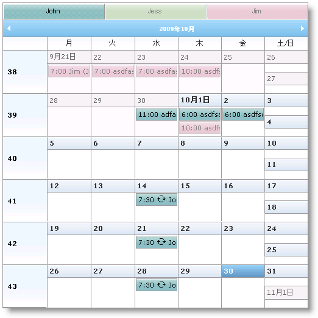

////

|metadata|
{
    "name": "webschedule-binding-to-access-data-source-using-webschedulegenericdataprovider",
    "controlName": ["WebSchedule"],
    "tags": ["Data Binding","How Do I","Scheduling"],
    "guid": "{DE73FBEF-99C5-4D04-925B-9ED79984CEF1}",  
    "buildFlags": [],
    "createdOn": "0001-01-01T00:00:00Z"
}
|metadata|
////

= WebScheduleGenericDataSource を使用して Access データ ソースにバインド

== 始める前に

WebScheduleGenericDataProvider™ コンポーネントによって、ユーザーが選択したカスタム データ ソースにバインドすることができます。WebScheduleInfo コンポーネントは、WebSchedule™ データ エンティティ データ ソースを構成するために以下のプロパティをユーザーに提供します。

* link:{ApiPlatform}webui.webscheduledataprovider{ApiVersion}~infragistics.webui.data.webschedulegenericdataprovider~activitydatasource.html[ActivityDataSource]/ link:{ApiPlatform}webui.webscheduledataprovider{ApiVersion}~infragistics.webui.data.webschedulegenericdataprovider~activitydatasourceid.html[ActivityDataSourceID]
* link:{ApiPlatform}webui.webscheduledataprovider{ApiVersion}~infragistics.webui.data.webschedulegenericdataprovider~resourcedatasource.html[ResourceDataSource]/ link:{ApiPlatform}webui.webscheduledataprovider{ApiVersion}~infragistics.webui.data.webschedulegenericdataprovider~resourcedatasourceid.html[ResourceDataSourceID]
* link:{ApiPlatform}webui.webscheduledataprovider{ApiVersion}~infragistics.webui.data.webschedulegenericdataprovider~variancedatasource.html[VarianceDataSource]/ link:{ApiPlatform}webui.webscheduledataprovider{ApiVersion}~infragistics.webui.data.webschedulegenericdataprovider~variancedatasourceid.html[VarianceDataSourceID]

さらに、WebScheduleGenericDataProvider コンポーネントは、WebScheduleInfo の対応するオブジェクトに割り当てるデータ バインド プロパティを設定するためにユーザーに link:{ApiPlatform}webui.webscheduledataprovider{ApiVersion}~infragistics.webui.data.appointmentbinding.html[AppointmentBinding]、 link:{ApiPlatform}webui.webscheduledataprovider{ApiVersion}~infragistics.webui.data.resourcebinding.html[ResourceBinding]、および link:{ApiPlatform}webui.webscheduledataprovider{ApiVersion}~infragistics.webui.data.variancebinding.html[VarianceBinding] オブジェクトを提供します。これらのプロパティによって、バインドするためのデータ フィールドなどを指定できます。データ テーブルの列またはデータ オブジェクトのプロパティの名前が、WebScheduleGenericDataProvider によって期待される名前と一致する場合、データ バインドは自動的に行われ、データ フィールドを明示的に定義する必要はありません。これらの名前のリストについては、 link:webschedule-data-model-for-webschedule-generic-data-provider.html[「WebSchedule の汎用データ プロバイダーのデータ モデル」]を参照してください。

データ ソース コントロールにバインドする場合、データベースを更新するために create、update、および delete ステートメントを指定する必要があります。

WebScheduleGenericDataProvider についての詳細は、 link:webschedulegenericdataprovider-about-webschedulegenericdataprovider.html[「WebScheduleGenericDataProvider について」]を参照してください。

このチュートリアルは、WebScheduleSampleData.mdb と呼ばれるサンプル データベースを使用します。このデータ フィールドは以下のとおりです。

image::images/WebSchedule_Binding_to_Access_Data_Source_using_WebGenericDataSource_02.png[]

image::images/WebSchedule_Binding_to_Access_Data_Source_using_WebGenericDataSource_03.png[]

== 達成すること

Access Data Source でアクティビティ、リソース、およびバリアンス データにバインドし、それらを WebMonthView™ コントロールで表示する方法を学習します。

== 次の手順を実行します

[start=1]
. ASP.NET Web サイトを作成します。
[start=2]
. Microsoft® Visual Studio™ ツールボックスからページに WebScheduleInfo コンポーネントをドラッグします。
[start=3]
. WebMonthView コントロールをページにドラッグします。
[start=4]
. WebScheduleGenericDataProvider コンポーネントをページにドラッグします。
[start=5]
. 3 つの AccessDataSource コンポーネントをページにドラッグします。
[start=6]
. データ ソース ActivityDataSource、ResourceDataSource、および VarianceDataSource に名前を付けます。
[start=7]
. ActivityDataSource をデータベースに接続し、Create、Update、および Delete コマンドを設定します。

*注* :Delete ステートメントは、アクティビティ ID ではなく VarianceID フィールドを使用するために必要です。

*HTML の場合:*

----
<asp:AccessDataSource ID="activityDataSource" runat="server" DataFile="~/App_Data/WebScheduleSampleData.mdb"
    DeleteCommand="DELETE FROM [Activities] WHERE [VarianceID] = ?" InsertCommand="INSERT INTO [Activities] ([StartDateTimeUtc], [Duration], [Subject], [AllDayEvent], [Location], [Status], [EnableReminder], [ReminderInterval], [ShowTimeAs], [Importance], [RecurrenceID], [OriginalStartDateTimeUtc], [RecurrencePattern], [ResourceID], [VarianceID], [ActivityDescription]) VALUES (?, ?, ?, ?, ?, ?, ?, ?, ?, ?, ?, ?, ?, ?, ?, ?)"
    SelectCommand="SELECT * FROM [Activities]" UpdateCommand="UPDATE [Activities] SET [StartDateTimeUtc] = ?, [Duration] = ?, [Subject] = ?, [AllDayEvent] = ?, [Location] = ?, [Status] = ?, [EnableReminder] = ?, [ReminderInterval] = ?, [ShowTimeAs] = ?, [Importance] = ?, [RecurrenceID] = ?, [OriginalStartDateTimeUtc] = ?, [RecurrencePattern] = ?, [ResourceID] = ?, [VarianceID] = ?, [ActivityDescription] = ? WHERE [ID] = ?">
    <DeleteParameters>
        <asp:Parameter Name="VarianceID" Type="String" />
    </DeleteParameters>
    <UpdateParameters>
        <asp:Parameter Name="StartDateTimeUtc" Type="DateTime" />
        <asp:Parameter Name="Duration" Type="Int32" />
        <asp:Parameter Name="Subject" Type="String" />
        <asp:Parameter Name="AllDayEvent" Type="Boolean" />
        <asp:Parameter Name="Location" Type="String" />
        <asp:Parameter Name="Status" Type="Int32" />
        <asp:Parameter Name="EnableReminder" Type="Boolean" />
        <asp:Parameter Name="ReminderInterval" Type="Int32" />
        <asp:Parameter Name="ShowTimeAs" Type="Int32" />
        <asp:Parameter Name="Importance" Type="Int32" />
        <asp:Parameter Name="RecurrenceID" Type="Int32" />
        <asp:Parameter Name="OriginalStartDateTimeUtc" Type="DateTime" />
        <asp:Parameter Name="RecurrencePattern" Type="String" />
        <asp:Parameter Name="ResourceID" Type="Int32" />
        <asp:Parameter Name="VarianceID" Type="String" />
        <asp:Parameter Name="ActivityDescription" Type="String" />
        <asp:Parameter Name="ID" Type="Int32" />
    </UpdateParameters>
    <InsertParameters>
        <asp:Parameter Name="StartDateTimeUtc" Type="DateTime" />
        <asp:Parameter Name="Duration" Type="Int32" />
        <asp:Parameter Name="Subject" Type="String" />
        <asp:Parameter Name="AllDayEvent" Type="Boolean" />
        <asp:Parameter Name="Location" Type="String" />
        <asp:Parameter Name="Status" Type="Int32" />
        <asp:Parameter Name="EnableReminder" Type="Boolean" />
        <asp:Parameter Name="ReminderInterval" Type="Int32" />
        <asp:Parameter Name="ShowTimeAs" Type="Int32" />
        <asp:Parameter Name="Importance" Type="Int32" />
        <asp:Parameter Name="RecurrenceID" Type="Int32" />
        <asp:Parameter Name="OriginalStartDateTimeUtc" Type="DateTime" />
        <asp:Parameter Name="RecurrencePattern" Type="String" />
        <asp:Parameter Name="ResourceID" Type="Int32" />
        <asp:Parameter Name="VarianceID" Type="String" />
        <asp:Parameter Name="ActivityDescription" Type="String" />
    </InsertParameters>
</asp:AccessDataSource>
----

[start=8]
. ResourceDataSource をデータベースに接続し、Select コマンドを設定します。

*HTML の場合:*

----
<asp:AccessDataSource ID="resourceDataSource" runat="server" DataFile="~/App_Data/WebScheduleSampleData.mdb"
	SelectCommand="SELECT * FROM [Resources]">
</asp:AccessDataSource>
----

[start=9]
. VarianceDataSource をデータベースに接続し、Create、Update、および Delete コマンドを設定します。バリアンス データ ソースは、アクティビティとして同じデータ テーブルを使用することに注意してください。

*HTML の場合:*

----
<asp:AccessDataSource ID="varianceDataSource" runat="server" DataFile="~/App_Data/WebScheduleSampleData.mdb"
    DeleteCommand="DELETE FROM [Activities] WHERE ([OriginalStartDateTimeUtc] IS NOT NULL) AND [VarianceID] = ?"
    InsertCommand="INSERT INTO [Activities] ([StartDateTimeUtc], [Duration], [Subject], [AllDayEvent], [Location], [Status], [EnableReminder], [ReminderInterval], [ShowTimeAs], [Importance], [RecurrenceID], [OriginalStartDateTimeUtc], [RecurrencePattern], [ResourceID], [VarianceID], [ActivityDescription]) VALUES (?, ?, ?, ?, ?, ?, ?, ?, ?, ?, ?, ?, ?, ?, ?, ?)"
    SelectCommand="SELECT * FROM [Activities]" UpdateCommand="UPDATE [Activities] SET [Status] = ? WHERE [ID] = ?">
    <DeleteParameters>
        <asp:Parameter Name="VarianceID" Type="String" />
    </DeleteParameters>
    <UpdateParameters>
        <asp:Parameter Name="Status" Type="Int32" />
        <asp:Parameter Name="ID" Type="Int32" />
    </UpdateParameters>
    <InsertParameters>
        <asp:Parameter Name="StartDateTimeUtc" Type="DateTime" />
        <asp:Parameter Name="Duration" Type="Int32" />
        <asp:Parameter Name="Subject" Type="String" />
        <asp:Parameter Name="AllDayEvent" Type="Boolean" />
        <asp:Parameter Name="Location" Type="String" />
        <asp:Parameter Name="Status" Type="Int32" />
        <asp:Parameter Name="EnableReminder" Type="Boolean" />
        <asp:Parameter Name="ReminderInterval" Type="Int32" />
        <asp:Parameter Name="ShowTimeAs" Type="Int32" />
        <asp:Parameter Name="Importance" Type="Int32" />
        <asp:Parameter Name="RecurrenceID" Type="Int32" />
        <asp:Parameter Name="OriginalStartDateTimeUtc" Type="DateTime" />
        <asp:Parameter Name="RecurrencePattern" Type="String" />
        <asp:Parameter Name="ResourceID" Type="Int32" />
        <asp:Parameter Name="VarianceID" Type="String" />
        <asp:Parameter Name="ActivityDescription" Type="String" />
    </InsertParameters>
</asp:AccessDataSource>
----

[start=10]
. スマート コールバック、繰り返しアクティビティ、Multi Resource View を有効にし、その ID を WebScheduleInfo の "WebScheduleInfo1" に設定します。

*HTML の場合:*

----
<igsch:WebScheduleInfo ID="wsInfo" runat="server" EnableRecurringActivities="True" EnableSmartCallbacks="true"
    EnableMultiResourceView="True" EnableReminders=">
</igsch:WebScheduleInfo>
----

[start=11]
. WebMonthView の WebScheduleInfoID プロパティを "WebScheduleInfo1" に設定します。

*HTML の場合:*

----
<igsch:WebMonthView ID="WebMonthView1" WebScheduleInfoID="wsInfo" runat="server">
</igsch:WebMonthView>
----

[start=12]
. WebScheduleInfo コンポーネントと関連づけるために WebScheduleGenericDataProvider の WebScheduleInfoID プロパティを "WebScheduleInfo1" に設定し、アクティビティ、リソース、およびバリアンス データ ソース ID を設定します。

*HTML の場合:*

----
<ig_scheduledata:WebScheduleGenericDataProvider runat="server" ID="WebScheduleGenericProvider1"
    WebScheduleInfoID="wsInfo" ActivityDataSourceID="activityDataSource" ResourceDataSourceID="resourceDataSource"
    VarianceDataSourceID="varianceDataSource">
	<%--行うこと:データ バインド オプションを設定します --%>
</ig_scheduledata:WebScheduleGenericDataProvider>            
----

[start=13]
. 予定、リソース、およびバリアンスのデータ バインド オプションを設定します。

.. AppointmentBinding、ResourceBinding、および VarianceBinding オブジェクトを作成します。
.. それぞれの DataKeyMember プロパティを設定します。DataKeyMember プロパティは、データ エンティティのプライマリ キー フィールドです。
.. 予定データをリソース データに関係づけるフィールドを定義するために、AppointmentBinding および VarianceBinding オブジェクトの ResourceKeyMember プロパティを設定します。
.. バリアンス ID メンバーを定義するために、AppointmentBinding および VarianceBinding オブジェクトの VarianceKeyMember プロパティを設定します。
.. このパターンを定義するフィールドに VarianceBinding オブジェクトの RecurrencePatternMember プロパティを設定します。

*HTML の場合:*

----
<AppointmentBinding DataKeyMember="ID" ResourceKeyMember="ResourceID" VarianceKeyMember="VarianceID"
RecurrencePatternMember="RecurrencePattern" />
<ResourceBinding DataKeyMember="ID" />
<VarianceBinding DataKeyMember="ID" ResourceKeyMember="ResourceID" VarianceKeyMember="VarianceID"
RecurrencePatternMember="RecurrencePattern" />       
----

[start=14]
. アプリケーションを実行します。WebMonthview は、ユーザーが編集および更新することもできるデータベースのデータを表示します。

== 関連トピック

link:webschedule-handle-concurrency-conflicts.html[並行処理の競合の処理]

link:webschedule-connecting-webschedule-to-a-database-in-visual-studio-2005.html[Visual Studio 2005 で WebSchedule をデータベースに接続]

link:webschedule-binding-to-a-data-set-with-webschedulegenericdataprovider.html[WebScheduleGenericDataProvider で設定したデータへの WebSchedule バインディング]

link:webschedule-webschedulegenericdataprovider-crud-statements-for-sql-data-source.html[SQL データ ソース用の WebScheduleGenericDataProvider CRUD ステートメント]