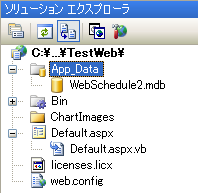
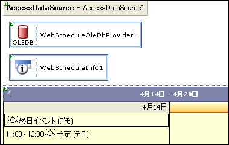
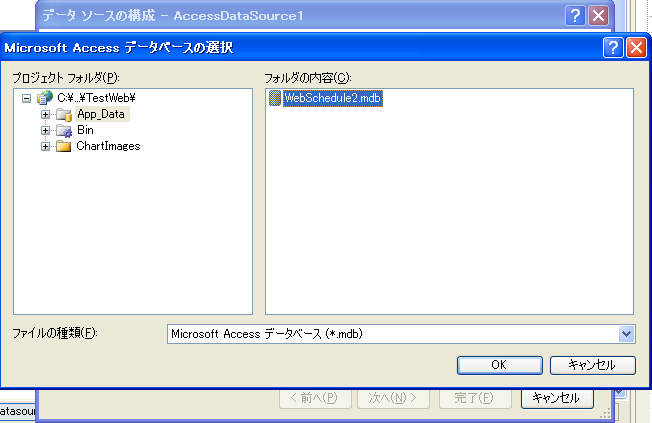
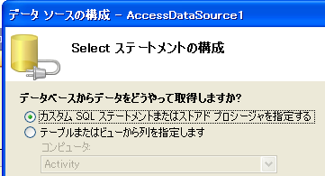
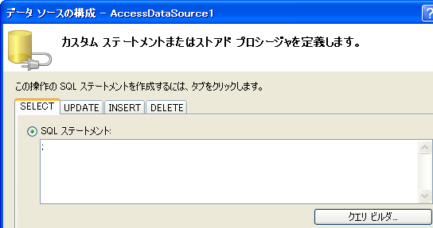
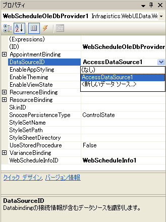
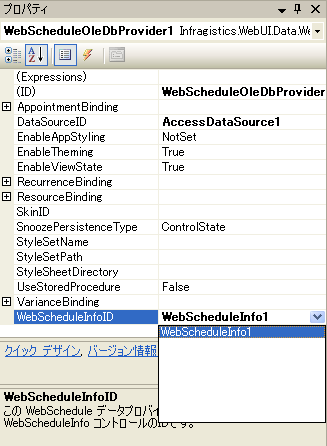

////
|metadata|
{
    "name": "webschedule-connecting-webschedule-to-a-database-in-visual-studio-2005",
    "controlName": ["WebSchedule"],
    "tags": ["Data Binding","How Do I","Scheduling"],
    "guid": "{AAC382D0-5CEA-49D1-912D-9CE2DCA625A8}",
    "buildFlags": [],
    "createdOn": "0001-01-01T00:00:00Z"
}
|metadata|
////

= Visual Studio 2005 での WebSchedule の Database への接続

このトピックでは、DataSourceID プロパティを使用して AccessDataSource コントロールを WebSchedule OLE DB データ プロバイダーとともに使用できるように設定する方法について説明します。Microsoft® Visual Studio® .NET 2005（.NET Framework）で WebSchedule™ をデータベースに接続するには、この方法をお勧めします。

WebSchedule SQL データプロバイダーは、SqlDataSource（AccessDataSource が拡張する）の Microsoft SQL Server への接続をサポートします。ここで、WebSchedule データ プロバイダーがデータ ソース コントロールの ConnectionString プロパティを使用してデータベースへの接続を確立するということを理解することが重要です。

WebSchedule データ プロバイダーは、ADO.NET 2.0 で導入されたデータ ソース コントロールのすべての種類はサポートしていません。また、イベントとの関連付け、メンバーのバインド、衝突の検出などのデータ ソースコントロールの追加機能を利用することができません。代わりに、WebScheduleデータ プロバイダーは、共通の API を通じて、これらの機能をサポートしています。

このトピックでは、WebSchedule OLE DB データ プロバイダーを AccessDataSource コントロールに接続するための手順を、順を追って説明します。

[start=1]
. 新しい Web アプリケーションを起動し、Toolbox から次のリストのコントロールをデザイン表面にドラッグします。「Infragistics タブ」と指定されているのは、WebSchedule のコントロール/コンポーネントを含めて、{ProductName} のコントロールとコンポーネントを含めるために選択したタブです。
[start=2]
. AccessDataSource（Data タブ）
** WebScheduleInfo（Infragistics タブ）
** WebScheduleOleDbProvider（Infragistics タブ）
** WebDayView（Infragistics タブ）

この手順を終了すると、Web アプリケーションに次のコントロール レイアウトが含まれます。

image::images/WebSchedule_Connecting_WebSchedule_to_a_Database_in_Microsoft_Visual_Studio_NET_2005_1.png[]

[start=3]
. AccessDataSource との接続を構成する前に、'WebSchedule2.mdb ファイルを Web アプリケーションの App_Data フォルダにコピーします。これは、Microsoft Visual Studio .NET 2005 で新しく追加された、開発するアプリケーションのデータ リソースを保持するためのフォルダです。
[start=4]
. WebSchedule1.mdb ファイルは、オペレーティング システムに基づき以下のデフォルト位置にインストールされます。

** XP -- {InstallPathXP}\\{PlatformName}\WebSchedule\Data
** Windows Vista 以後 -- {InstallPathVista}\\{PlatformName}\WebSchedule\Data

App_Data フォルダを右クリックし、[既存の項目を追加...] を選択します。これで、WebSchedule2.mdb ファイル（または自身の Access データベース ファイル）が含まれている {ProductName} サンプル インストール フォルダにナビゲートできます。

App_Data フォルダは Web プロジェクトのフォルダの下にネストされているように見えるので、IIS 仮想ディレクトリの下にデータ ファイルを格納することは、ユーザーがその URL を推測して直接このデータ ファイルをダウンロードするのではないかと、セキュリティに不安を感じるかもしれません。IIS では、このような特別なフォルダは HTTP 要求から保護されており、特別な URL のデータ ファイルに対する要求に対しては「ファイルが見つからない」という 404 のエラーが発行されます。App_Data に含まれるデータ ファイルは、Web アプリケーション経由でのみ要求でき、外部からはアクセスできません。

[start=5]
. AccessDataSource コントロールのスマート タグをクリックして、データベース接続の確立に関連するタスクのリストを展開します。この AccessDataSource コントロールはフォームにドロップしたばかりなので、[データソースの構成]をクリックして、[データソースの構成] ウィザードを開きます。
[start=6]

[start=7]
. [ブラウズ] をクリックして [データベース] を選択し、App_Data フォルダにある WebSchedule2.mdb データベースを選択します。[次へ] をクリックして、先に進みます。
[start=8]

[start=9]
. [カスタム SQL ステートメントまたはストアド プロシージャの指定] ラジオ ボタンを選択して、Select ステートメントを構成します。このラジオ ボタンを選択したことにより、ウィザードの他のページは無効になります。
[start=10]
. 

WebSchedule データ プロバイダーは、接続情報の取得に AccessDataSource コントロールと、提供されている高度なデータ バインド サポートを使用します。[次へ] をクリックして、先に進みます。

[start=11]
. 最小限のカスタム SELECT ステートメントを定義します（たとえば、セミコロンが 1 つだけの ";"）。WebSchedule データ プロバイダーは、それ自身のデータ バインドを処理するので、ここでの定義の影響を受けません。このデータ ソース コントロールが Web アプリケーションの他のデータ コンシューマに提供する SQL（またはストアド プロシージャ）があれば、それをカスタマイズできます。[次へ] をクリックして作業を続けます。
[start=12]
. 

[start=13]
. [データソースの構成] ウィザードの最後のページでは、接続のテストを行うことができます。ただし、ステップ 5 と 6 でデータバインド情報を指定していないと、このテストは失敗します。WebSchedule データ プロバイダーでは、この追加情報のプロンプトは表示されません。なぜならば、必要とされるのはデータ ソース コントロールの接続情報だけだからです。[終了] をクリックして、データ ソース コントロールの構成を終了します。
[start=14]
. WebSchedule OLE DB データ プロバイダーを選択して、[プロパティ] ウィンドウで DataSourceID プロパティを設定して AccessDataSource コントロールに接続します。AccessDataSource の ID（"AccessDataSource1"）は、以下に示したドロップダウン リストに表示されるはずです。
[start=15]
. 

[start=16]
. データ プロバイダーの  pick:[asp-net="link:{ApiPlatform}webui.webschedule{ApiVersion}~infragistics.webui.webschedule.webscheduleinfo.html[WebScheduleInfo]"]  プロパティを WebScheduleInfo コンポーネントに割り当てられている ID（"WebScheduleInfo1"）に設定して、WebSchedule OLE DB データ プロバイダーを WebScheduleInfo™ コントロールに接続します。
[start=17]
. 

[start=18]
. さらに、WebDayView™ コントロールを選択してその WebScheduleInfoID プロパティを設定して WebScheduleInfo コンポーネントに接続します。ランタイムに、WebScheduleInfo が中枢神経の役割を果たして、データ プロバイダーを 1 つ以上の WebSchedule ビュー要素と接続します。
[start=19]
. 以上で、WebSchedule 要素と新しい AccessDataSource コントロールの新しいインスタンスとの間で必要とされるデータベース接続構成が完了しました。[CTRL-F5] キーを押して、Microsoft Visual Studio .NET 2005 で Web アプリケーションを実行して、すべてが正常に機能することを確認します。

== 関連トピック

link:webschedule-handle-concurrency-conflicts.html[並行性競合の処理]

link:webschedule-binding-to-access-data-source-using-webschedulegenericdataprovider.html[WebScheduleGenericDataSource を使用してデータ ソースコントロールにアクセスするためにバインド]

link:webschedule-binding-to-a-data-set-with-webschedulegenericdataprovider.html[WebScheduleGenericDataProvider で設定したデータへの WebSchedule バインディング]

link:webschedule-webschedulegenericdataprovider-crud-statements-for-sql-data-source.html[SQL データ ソース用の WebScheduleGenericDataProvider CRUD ステートメント]