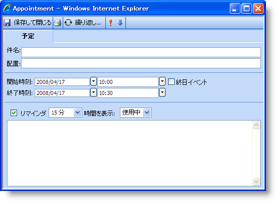
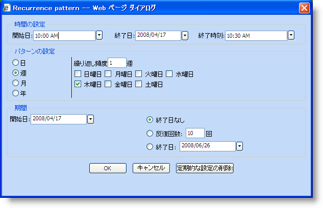
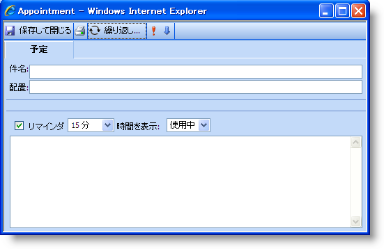
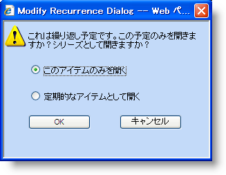
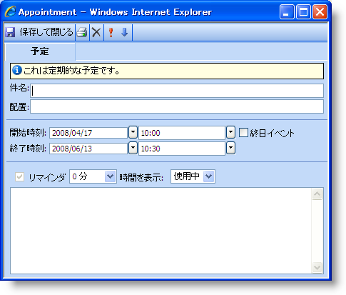
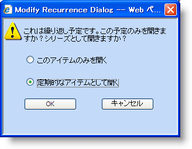
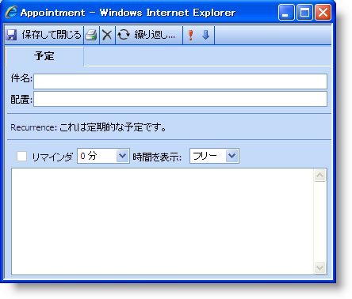

////

|metadata|
{
    "name": "webschedule-creating-and-modifying-a-recurring-appointment",
    "controlName": ["WebSchedule"],
    "tags": ["How Do I","Scheduling"],
    "guid": "{8BA32EFB-B919-4B38-B73A-6C26F1A25131}",  
    "buildFlags": [],
    "createdOn": "2006-10-04T00:00:00Z"
}
|metadata|
////

= 繰り返し予定を作成および編集

== 始める前に

繰り返し予定は、基本の予定から作成される特殊なタイプの pick:[asp-net="link:{ApiPlatform}webui.webschedule{ApiVersion}~infragistics.webui.webschedule.appointment.html[予定]"] です。CreateRecurrence メソッドを含むコードで、または [繰り返し] ダイアログ ボックスを使用して、 pick:[asp-net="link:{ApiPlatform}webui.webschedule{ApiVersion}~infragistics.webui.webschedule.recurrence.html[Recurrence]"]  オブジェクトを作成できます。繰り返しが作成されたら、単発の Recurrence オブジェクトまたは一連のオブジェクト全体のいずれかを修正するオプションが提供されます。

== 達成すること

この詳細なガイドでは、繰り返し予定を作成および修正するためにエンド ユーザーが取るべき手順を説明します。[繰り返し] ダイアログ ボックスで使用可能なオプションについての詳細は、「繰り返しパターン ダイアログ ボックス」を参照してください。

== 繰り返し予定の作成

[start=1]
. コードを介してボタン クリックを使用するか、ビュー コントロールをダブルクリックすることによって [予定] ダイアログ ボックスを開きます。[予定] ダイアログ ボックスが表示します。

[start=2]
. [予定] ダイアログ ボックスのツールバーで [繰り返し...] をクリックします。[繰り返しパターン] ダイアログ ボックスがデフォルト オプションで表示されます。

*注：* WebScheduleInfo の  pick:[asp-net="link:{ApiPlatform}webui.webschedule{ApiVersion}~infragistics.webui.webschedule.webscheduleinfo~enablerecurringactivities.html[EnableRecurringActivities]"]  プロパティが True（デフォルトでは False に設定）される場合に限り繰り返しボタンが使用できます。

[start=3]
. この時点で [キャンセル] または [繰り返しの削除] をクリックすると、繰り返しを予定に追加せずにダイアログ ボックスが閉じます。
[start=4]
. [OK] をクリックすると、WebScheduleInfo はダイアログ ボックスの設定を検証します。設定が有効な場合、[繰り返し] ダイアログ ボックスが閉じて、[予定] ダイアログ ボックスの情報を更新します。

*注：* [予定] ダイアログ ボックスには、開始時間と終了時間のセクションがなくなります。代わりに、繰り返し予定として識別するテキストが表示されます。

[start=5]
. ツールバーで [保存] および [閉じる] をクリックすると、WebScheduleInfo クライアント側オブジェクトに情報が送信されます。

== 単発の繰り返し予定を更新

[start=1]
. コードを介してボタン クリックを使用するか、ビュー コントロールをダブルクリックすることによって [予定] ダイアログ ボックスを開きます。[繰り返しを修正] ダイアログ ボックスが表示されます。

[start=2]
. [この発生を開く] を選択して、[OK] をクリックします。[予定] ダイアログ ボックスが開きます。

*注：* [繰り返し...] ツールバー ボタンはもう表示されず、「これは繰り返し予定です」という件名の上にステータス バーが表示されます。これは定期的な予定です。

[start=3]
. 予定の修正が終了したら、[保存] と [閉じる] をクリックします。

.. WebScheduleInfo は、修正が予定に行われたかどうかをチェックします。予定が修正されていない場合には、[予定] ダイアログ ボックスが変更されずに閉じます。修正が行われた場合には、新しいバリアントがこの繰り返しに作成されるサーバーに WebScheduleInfo が情報を送信します。
.. WebScheduleInfo は、この情報を検証しないで、ダイアログ ボックスからの新しい値を使用して、予定を自動的に更新します。これで、データ プロバイダが検証を実行するサーバーに予定が送信されます。検証の間、データ プロバイダは、情報がオリジナルの occurrence オブジェクトと異なっているかどうかをチェックします。

== 一連の繰り返し予定を更新

[start=1]
. コードを介してボタン クリックを使用するか、ビュー コントロールをダブルクリックすることによって [予定] ダイアログ ボックスを開きます。[繰り返しを修正] ダイアログ ボックスが表示されます。

[start=2]
. [このシリーズを開く] を選択して、[OK] をクリックします。[予定] ダイアログ ボックスが開きます。

*注：* [繰り返し...] ツールバー ボタンが表示されます（エンド ユーザーが [この発生を開く] を選択したときとは反対）。StartTime および EndTime フィールドも繰り返しの状態を識別するテキストで置き換えられます。

[start=3]
. ダイアログ ボックスを修正したら、[保存] と [閉じる] をクリックします。ダイアログ ボックスが WebScheduleInfo に変更を通知し、サーバーに送信されます。
[start=4]
. サーバー上の WebScheduleInfo コンポーネントがデータ プロバイダに recurrence オブジェクトで変更が発生したことを通知します。