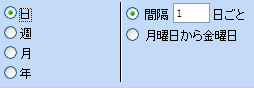
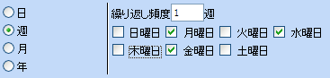
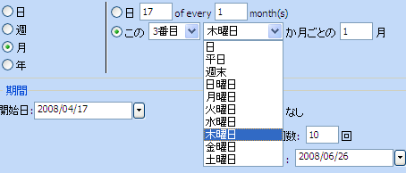

////

|metadata|
{
    "name": "webschedule-how-recurrence-logic-is-executed",
    "controlName": ["WebSchedule"],
    "tags": ["Design Environment","Scheduling","Tips and Tricks"],
    "guid": "{8ACE6D47-0A55-47BE-9B54-57BCEF80847A}",  
    "buildFlags": [],
    "createdOn": "2006-10-04T00:00:00Z"
}
|metadata|
////

= 繰り返しロジックの実行方法

このトピックでは、繰り返しアクティビティが WebSchedule アプリケーションにもたらす機能について学習します。このトピックが終了すると、どの繰り返しパターン アクティビティを自動的に予約できるのか、また繰り返しパターンへの例外をどのように処理するのかについて理解することができます。繰り返しを適用することによって WebSchedule コントロールが一般的なスケジュールのシナリオを管理する方法を読んでください。

== 繰り返しとは?

繰り返しは、日常生活で我々を取り巻くパターンに関するすべてです。毎朝同じ時間に出勤して、毎週月曜日の 9 時には週間スタッフ会議に出席、毎年 1 月、4 月、7 月、10 月の最終水曜日に投資ポートフォリオで会社の四半期コンファレンス コールに定期的に参加し、毎年 2 月の第一日曜日の午後 6 時 15 分にフットボールの決勝戦のキックオフを見るというような具合です。

== 繰り返しのパターン

定期的に開かれる週間スタッフ会議のために毎週月曜日の 9 時にアクティビティを入力する代わりに、毎週月曜日に週間アクティビティをスケジュールすることができます。WebSchedule は、繰り返しの日付範囲で一定の間隔で、繰り返しアクティビティ（発生と呼ばれる）のコピーを自動的に生成します。これらの一定の間隔は、繰り返しの期間と呼ばれます。また繰り返しはこの期間スキップすることができるため、毎日のアクティビティ、隔週の予定、3 カ月ごとに発生する四半期ごとのイベントを指定できます。

== 毎日のアクティビティ

毎日、毎ウィークディ、一日おきにどのくらいのアクティビティが繰り返すのかを考えてみましょう。空のスケジュールは、当然だと考える繰り返しの毎日のルーチンがない単なるスケジュールです。毎日の繰り返しがない場合には、昼休みのようなルーチンの一部である毎日のアクティビティをほとんど入力しません。しかし日常の繰り返しがある場合には、1 度入力だけ入力する必要があります。

毎日の繰り返しアクティビティは、週 7 日間とするか、各週 5 日にすることができます。毎日の繰り返しは、各アクティビティ間で同じ日数だけスキップします。たとえば 30 日ごとに生じる利子の発生などです。

== 毎週のアクティビティ

毎週のアクティビティは、毎週発生するアクティビティですが、毎日の繰り返しが複雑すぎる週の数日に発生する場合もあります。たとえば、多くの大学は 1 週間に数日おきに授業を行います。数日おきとは、月曜日、水曜日、金曜日のような場合です。毎週の繰り返しはこのスケジュールのための最高のソリューションです。

毎週のアクティビティは 1 日または 7 日程度発生し（ただし後者の場合は毎日の繰り返しと違いはありません）、示した週の日にちのみに発生します。1 回よりも多い複数回を指定することによって、隔週などのその他のいくつかの頻度も使用できます。

== 毎月のアクティビティ

毎月のアクティビティは請求日、支払い日、または特定の利益関係者の会合を開く日などです。これらのアクティビティの多くは 1 カ月のある時点で発生しますが、特定の日付（毎月 20 日に請求書を発行）または 1 月のある日の特定の発生（毎月第二木曜日に開催される地域の役員会合）のいずれかによって記述することができます。

毎月のアクティビティは、1 よりも多い複数の期間を割り当てると、隔月、四半期、半年などスケジューリング アプリケーションに一般的に用意されているいくつかのその他の期間で繰り返します。

== 毎年のアクティビティ

いくつかのアクティビティは、会社のピクニック、納税期限、結婚記念日など年に 1 回だけ発生します。エンド ユーザーがこれらのようなアクティビティをある年に入力すれば、翌年以降忘れずに済みます。このような場合に毎年の繰り返しを使用してください。

image::images/WebSchedule_How_Recurrence_Logic_is_Executed_04.png[]

毎月の繰り返し同様、毎年の繰り返しは特定の日付、または特定の月の特定の日の相対的な発生に基づいた日（9 月の最後の日曜日や 5 月の第三金曜日）に発生するように設定できます。

== 繰り返しの範囲

繰り返しは、常に最初のアクティビティ（ルート アクティビティと言われる）と同じ日時で正確に開始しなければなりません。繰り返しの終わりは以下の 3 とおりで設定できます。

* 事前に決定した最大回数後に終了する。
* 明示的な終了日付を繰り返しに指定する。
* 時間の終わりまで繰り返しが続く。

発生の回数後、または特定の終了日のいずれに繰り返しが終了するのかは切り替えることができます。エンド ユーザーが一方を修正すると、もう一方が自動的に再計算されます。

== 規則への例外 - バリアンス

現代生活同様、繰り返しに関するすべてが厳格に確定しているわけではありません。おそらく、あるウィークディの朝に歯医者の予定を入れたり、月曜日が休日のときにはスタッフ会議が木曜日に開かれます。繰り返しアクティビティの規則性におけるこのような例外のために、WebSchedule はバリアンスを提供します。バリアンスは、アクティビティでの通常と異なる開始時間やおそらく一時的な場所の変更など、変更を伴った繰り返しアクティビティのコピーです。

以下の図は、繰り返しアクティビティが発生する日を変更するためにバリアンスがどのように使用されるのかを示しています。黄色で表示される火曜日の 1 日を除いて、毎週月曜日の予定を含む毎月のカレンダー（12 月 26 日、1 月 2、16、23、および 30 日）を明るい青で表示します。ユーザーは 1 月 9 日月曜日に元々予定されていた発生を修正して、翌日に発生するように移動することができます。

image::images/WebSchedule_How_Recurrence_Logic_is_Executed_05.png[]

これと同時にバリアンスには制約があります。バリアンスは期間内でなければなりません。これは、期間よりも早く発生したり、期間よりも後に発生するようにユーザーが発生をスケジュールできないことを意味します。たとえば、月曜日の予定を同じ週の別の日に移動することはバリアンスになりますが、以下のような日付に移動することは認められません。

* 前の発生と同じ日またはそれ以前の日（繰り返しの開始以前のすべての日を含む）。
* 次の発生以降に重複または開始する日にち（繰り返しの終了後のすべての日を含む）。

これらの制約はバリアンス、およびバリアンスが到達した方法を明白にして、ユーザーの処理を簡素化します。

バリアンスのもうひとつの特別なプロパティは、削除された発生をマークすることです。これらのアクティビティは、オンデマンドで WebSchedule によって継続的に生成されるので、特別なマーカーのバリアンスは、ユーザーがどの発生を削除したのかを WebSchedule に通知します。技術的に、必要な場合には繰り返しシリーズに「穴」が表示されるように削除済みとしてマークされたバリアンスとしてこの情報の存在が継続的に保持されます。

== まとめ

繰り返しの基礎がよく分かるにしたがって、思い浮かんでくる用途が増えてきます。ユーザーがこれらのアクティビティを今日どのようにスケジュールするのかを評価してください。スケジュールにおいて繰り返しのアクティビティまたはこれに同様にアクティビティの頻度をよく分かることによって、WebSchedule アプリケーションが経験を拡張するために繰り返しを活用することができる機会を識別できます。