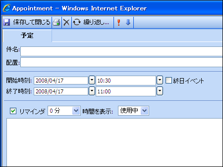

////

|metadata|
{
    "name": "webschedule-printing-an-appointment",
    "controlName": ["WebSchedule"],
    "tags": ["How Do I","Printing","Scheduling"],
    "guid": "{3BE7814C-1E98-4452-B04D-97455A2F9BC2}",  
    "buildFlags": [],
    "createdOn": "0001-01-01T00:00:00Z"
}
|metadata|
////

= 予定の印刷

[予定] ダイアログには印刷アイコンの付いたツールバー ボタンが含まれます。このボタンが押されると、ブラウザ用のデフォルトの印刷ダイアログが表示して、印刷するプリンタを選択することができます。

Forms プロジェクトを開始している場合には、「Print.htm」と呼ばれるファイルがあります。このファイルを使用して、印刷された情報のフォーマットを制御します。このドキュメントのすべての情報は、ランタイムに [予定] ダイアログからプルされます。これにはすべてのラベルとフィールドが含まれます。

「Print.htm」ファイルの構造は完全にカスタマイズ可能です。ただし、JavaScript エラーが発生するため、フィールドおよびラベルを削除しないでください。情報の印刷を中止したい場合には、そのフィールドおよびラベルの表示スタイルを非表示に設定できます。

*注：* 既存のフィールドまたはラベルのテキスト セットは、印刷処理中に上書きされます。

