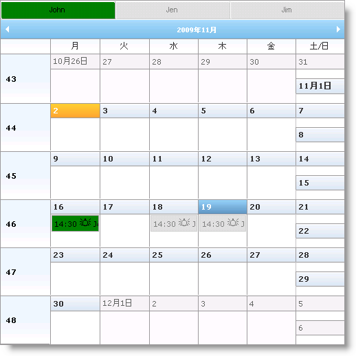

////

|metadata|
{
    "name": "webschedule-styling-active-and-inactive-resources",
    "controlName": ["WebSchedule"],
    "tags": ["How Do I","Scheduling","Styling"],
    "guid": "{B244334B-4379-4A20-9196-37A78260404D}",  
    "buildFlags": [],
    "createdOn": "0001-01-01T00:00:00Z"
}
|metadata|
////

= アクティブおよび非アクティブ リソースのスタイル

Multi Resource View は複数のリソースに複数のボタンを提供し、これによって使用できる異なるリソース間で切り替えることができます。これらのボタンのスタイルおよび予定のスタイルを変更できます。

以下のスタイル プロパティを使用して、Multi Resource View のリソースおよびアクティビティをスタイルすることができます。

* link:{ApiPlatform}webui.webschedule{ApiVersion}~infragistics.webui.webschedule.webscheduleviewbase~fadedappointmentstyle.html[FadedAppointmentStyle]– 非アクティブの予定および非アクティブのリソース ボタンをスタイルします。
* link:{ApiPlatform}webui.webschedule{ApiVersion}~infragistics.webui.webschedule.webscheduleviewbase~resourcebuttonactivestyle.html[ResourceButtonActiveStyle] – アクティブのリソース ボタンをスタイルします。
* link:{ApiPlatform}webui.webschedule{ApiVersion}~infragistics.webui.webschedule.webscheduleviewbase~resourcebuttonstyle.html[ResourceButtonStyle] – すべてのリソース ボタンをスタイルします。これを設定する場合は、上記のスタイルをオーバーライトします。

以下のコードは、アクティブなリソース ボタンとその予定を緑色、非アクティブなボタンとその予定を銀色に設定する方法を示します。

*HTML の場合:*

----

…
<igsch:WebMonthView ID="WebMonthView1" runat='server' WebScheduleInfoID="WebScheduleInfo1">
<%--アクティブ ボタンの色を設定します--%> 
    <ResourceButtonActiveStyle CssClass="activeResource">
    </ResourceButtonActiveStyle>
<%--非アクティブ ボタンおよび予定の色を設定します--%>
    <FadedAppointmentStyle CssClass="inactiveResource">
    </FadedAppointmentStyle>
<%--アクティブの予定の色を設定します--%>
    <AppointmentStyle CssClass="activeResource">
    </AppointmentStyle>
</igsch:WebMonthView>
----

== 関連トピック

link:webschedule-about-multi-resource-view.html[Multi Resource View について]

link:webschedule-set-visible-resources.html[表示可能なリソースを設定]