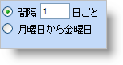
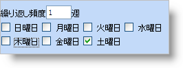
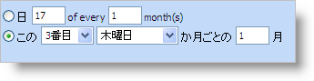
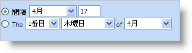

////

|metadata|
{
    "name": "webschedule-using-the-recurrence-pattern-dialog-box",
    "controlName": ["WebSchedule"],
    "tags": ["Design Environment","Patterns and Practices","Scheduling"],
    "guid": "{A1A8B8CA-9E97-4D5A-BC60-D8FD19F8B5F6}",  
    "buildFlags": [],
    "createdOn": "2006-10-04T00:00:00Z"
}
|metadata|
////

= 定期的なパターン ダイアログ ボックスの使用

繰り返しパターン ダイアログ ボックスは、複雑な繰り返し予定を設定するシンプルな方法です。このダイアログ ボックスを開くには、カレンダー ビューで任意の日をダブルクリックします。これによって、[予定] ダイアログ ボックスが開きます。[予定] ダイアログ ボックスの上に [繰り返し] というボタンがあります。このボタンをクリックすると、以下に示す [繰り返しパターン] ダイアログ ボックスが開きます。このダイアログ ボックスの各セクションについては、スクリーンショットの下でより詳細に説明します。

image::images/WebSchedule_Using_the_Recurrence_Pattern_Dialog_01.png[]

[start=1]
. 予定の開始時間 – このフィールドは、繰り返し予定が開始する日の時間を表示します。ドロップダウン矢印を繰り返しすると、30 分間隔で時間オプションが表示されます。
[start=2]
. 予定終了日 – 予定の終了日は繰り返し全体ではなくルート予定を参照します。たとえば、ルート予定は、月曜日から水曜日に指定できます。開始日の月曜日は、特定の日によってすでに分かっており、ダブルクリックして [予定] ダイアログ ボックスを開きます。終了日は 3 日後の水曜日にします。このダイアログ ボックスの [繰り返しパターン] セクションを使用して、最初の 3 日の予定が毎週、毎月、または毎年のいずれで発生するのかを設定します。
[start=3]
. 予定の終了時間 – このフィールドは、繰り返し予定が終了する日の時間です。ドロップダウン矢印を繰り返しすると、30 分間隔で時間オプションが表示されます。
[start=4]
. 繰り返しパターン – 繰り返し予定は毎日、週 1 回（毎週）、月 1 回（毎月）、または年 1 回（毎年）に発生できます。たとえば、部署の会合が毎週金曜日午前 9 時に開催される場合、エンド ユーザーは [毎週] を選択します。
[start=5]
. 繰り返しパターン詳細 – 繰り返し予定が日常的繰り返される場合、エンド ユーザーは予定が毎日、一日おき、またはその他の組み合わせのいずれで発生するかを選択できます。エンド ユーザーにはウィークディ（月曜日から金曜日）に繰り返される予定のオプションも提供されています。

繰り返し予定が毎週繰り返される場合、エンド ユーザーは予定が発生する日だけでなく、予定の間に存在する週の数を選択できます。

繰り返し予定が毎月繰り返される場合、エンド ユーザーは予定の発生の間の月の数だけでなく予定が発生する月の日を選択できます。毎月繰り返される予定を設定する代替えの方法は、月の週（第 1 週、第 2 週、最終週など）と曜日（月曜日、火曜日、水曜日など）を選択することです。

繰り返し予定が毎年繰り返される場合には、エンド ユーザーは特定の日（3 月 29 日など）と特定の月（3月の第 1 土曜日、1 月の最終月曜日など）のいずれかを選択できます。

[start=6]
. 繰り返しの範囲（開始） – 繰り返しの開始日は、[予定] ダイアログ ボックスを開くためにダブルクリックされた日が自動的に入力されます。ドロップダウン矢印をクリックするとカレンダーが開き、エンド ユーザーは繰り返しの開始を変更できます。
[start=7]
. 繰り返しの範囲（終了） – 繰り返しの最終日（ルート予定ではない）。繰り返しには終了日を指定しない、特定の発生回数後に終了する、または特定の日までに終了するのいずれかにすることができます。