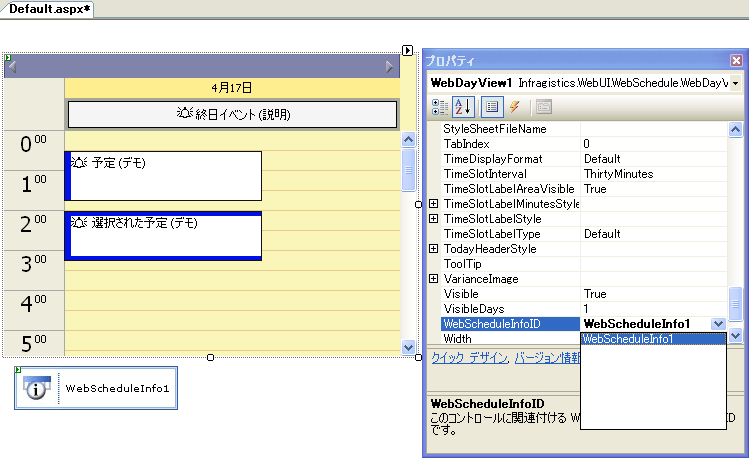

////

|metadata|
{
    "name": "webschedule-using-the-webschedule-controls-quick-design",
    "controlName": ["WebSchedule"],
    "tags": ["Design Environment","Getting Started","Scheduling"],
    "guid": "{1ECF14B6-398D-49F5-A447-F5190C421AE5}",  
    "buildFlags": [],
    "createdOn": "2005-06-09T00:00:00Z"
}
|metadata|
////

= WebSchedule コントロールのクイック デザインを使用

== 始める前に

この詳細なガイドは、アプリケーション開発者に WebSchedule コントロールについてよく知ってもらうことを目的としています。これらのコントロールで作業をするために必要な初期手順の概要を示します。

この詳細なガイドは、ユーザーが Visual Studio .NET を使用していることを前提とします。

== 以下の手順を実行します。

[start=1]
. *WebScheduleInfo コントロールを Web フォームに追加します。*

WebScheduleInfo オブジェクトが必要で、すべての WebSchedule コントロール操作の中心です。

Visual Studio .NET ツールボックスで Infragistics WebScheduleInfo コントロールを指定し、WebForm にドラッグします。

image::images/WebSchedule_Walk_Through_Quick_Start_Designers_01.png[]

[start=2]
. *WebScheduleDataProvider コントロールを WebForm に追加し、WebScheduleInfoID プロパティを設定します。*

WebSchedule コントロールは常にデータと接続する必要があります。WebScheduleInfoオブジェクトは WebSchedule データ プロバイダを使用して、WebSchedule データと接続します。この詳細なガイドは WebScheduleOleDbProvider を使用します。

Visual Studio .NET ツールボックスで Infragistics WebScheduleOleDbProvider コントロールを見つけて、WebForm にドラッグします。このコントロールを選択して、プロパティ グリッドで WebScheduleInfoID プロパティを WebScheduleInfo コントロールの ID に設定します。

デフォルトで、DataProvider は Infragistics のインストールで提供される Access のサンプル データベースにバインドされます。この詳細なガイドの目的にこれは適しています。異なる場所の Access データベースを使用する方法については、 link:webschedule-connecting-webschedule-to-a-database-in-visual-studio-2005.html[「Visual Studio 2005 で WebSchedule をデータベースに接続」] を参照してください。

*image::images/WebSchedule_Walk_Through_Quick_Start_Designers_07.png[]

[start=3]
. *WebSchedule コントロールを WebForm に追加し、WebScheduleInfoID プロパティを設定します。*

Visual Studio .NET ツールボックスを使用して、WebCalendarView、WebDayView、および WebMonthView を WebForm に追加します。追加された各コントロールに対して、手順1で追加された WebScheduleInfo コントロールの ID に WebScheduleInfoID プロパティを設定します。

[start=4]
. *プロジェクトを実行します。*
[start=5]
. 

ではプロジェクトをビルドしてページをブラウズします。すべての WebSchedule コントロールが表示され、互いに同期されます。以下の WebSchedule コントロールの動作を確認することができます。

** MonthView コントロールの日をクリックして、ページがサーバーにどのようにポストバックするのか、またすべてのコントロールが新しい Active Day に同期するのを確認します。
** WebDayView で日、またはタイムスロットをダブルクリックして、予定ダイアログが表示されたら、予定を追加します。
** この予定が WebSchedule データベースに書き込まれ、ページに今後アクセスすると表示されます。
** 予定ダイアログで [アラーム] オプションが選択された場合、予定時間の 15 分前にページにアクセスすると、アラーム ダイアログが適切な時に表示されます。
** 予定は、WebDayView でサイズを変更またはドラッグすることで延長またはスケジュール変更ができます。

== 復習

デフォルト設定ですべての WebSchedule コントロールを使用して、データ主導のスケジュール アプリケーションを作成しました。

WebSchedule コントロールを実行するために必要な手順がよくお分かりいただけたと思います。これらのコントロールの外観と動作のカスタマイズを開始する準備が整いました。

image::images/WebSchedule_Walk_Through_Quick_Start_Designers_06.png[]