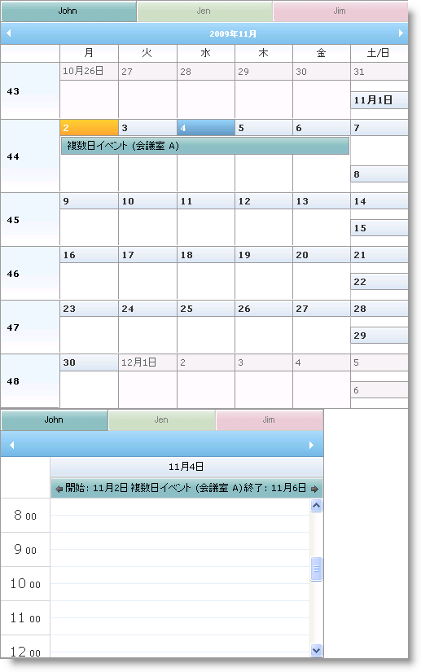

////

|metadata|
{
    "name": "webschedulegenericdataprovider-about-multi-day-event-banner",
    "controlName": [],
    "tags": ["How Do I"],
    "guid": "{F80ED2D8-D2CA-4496-B501-9E3BB145A047}",  
    "buildFlags": [],
    "createdOn": "0001-01-01T00:00:00Z"
}
|metadata|
////

= 複数日イベント バナーについて

WebDayView™、WebMonthView™ および WebSchedule コントロールは複数の日、週、月または年にまたがるイベントのために連続するバナーを表示できます。WebScheduleInfo™ コンポーネントの link:{ApiPlatform}webui.webschedule{ApiVersion}~infragistics.webui.webschedule.webscheduleinfo~enablemultidayeventbanner.html[EnableMultiDayEventBanner] プロパティはこの機能を制御し、デフォルトでは True です。EnableMultiDayEventBanner が False に設定されると、複数日イベントは複数日に渡る単一ブロックとして表示します。

link:{ApiPlatform}webui.webschedule{ApiVersion}~infragistics.webui.webschedule.webscheduleinfo~enablemultidayeventarrows.html[EnableMultiDayEventArrows] プロパティを設定することにより、そのイベントがまたがる開始日と終了日を示す矢印を表示することも可能です。このプロパティはデフォルトでは True です。

以下のコードは、複数日イベント バナーが不要の場合に無効にする方法を示します。

*HTML の場合:*

----
<igsch:webscheduleinfo runat="server" ID="WebScheduleInfo1" 
    EnableSmartCallbacks="True" 
    EnableMultiDayEventBanner=" EnableMultiDayEventArrows=">
</igsch:webscheduleinfo>
----

*Visual Basic の場合：*

----
Protected Sub Page_Init(ByVal sender As Object, ByVal e As EventArgs)
    If Not Page.IsPostBack Then
        Me.WebScheduleInfo1.EnableMultiDayEventBanner = False
    End If
End Sub
----

*C# の場合：*

----
protected void Page_Init(object sender, EventArgs e)
{
    if (!Page.IsPostBack)
    {
        this.WebScheduleInfo1.EnableMultiDayEventBanner = false;
    }
}
----

== 関連トピック

link:webschedulegenericdataprovider-localize-multi-day-event-banner-caption.html[複数日イベント バナー キャプションのローカライズ]

link:webschedulegenericdataprovider-style-multi-day-event-banner.html[複数日イベント バナーのスタイル]